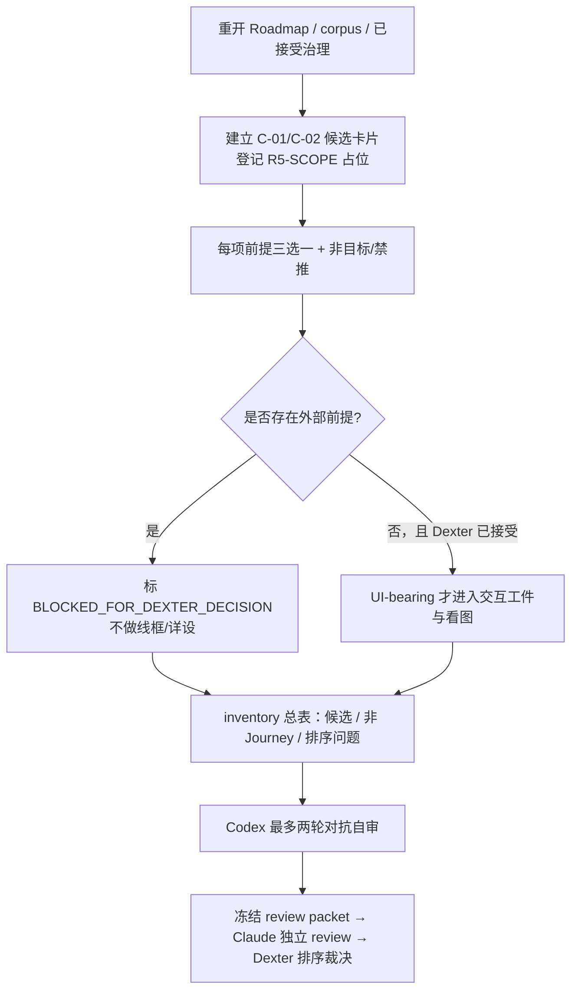

# R3–R6 未完成范围 Journey inventory（Batch 2）整体计划

## 1. 本批要解决的真实问题

Dexter 需要的是一份可以据以排序的、诚实的业务 Journey 候选清单：每个候选都能说明
谁要完成什么、成功长什么样、登录者和关键数据从何而来，以及缺口究竟是产品裁决还是
技术工作。它不是把 Roadmap 中出现的所有工作名词都改写成 Journey，更不是恢复旧
`R3-J02`、补一个测试账号，或用页面壳制造“两个后台都已登录”的假闭环。

现行授权仅为 `R3_R6_JOURNEY_INVENTORY_BATCH_2`：按已接受的 Journey 裁决模板建立
候选 inventory、逐项声明 actor 身份/数据前提来源，交 Dexter 排序。其依据是
`doc/roadmaps/platform/2026-07-24-v2s-execution-roadmap.md#0. Roadmap 身份与当前状态`。
本计划不授予 implementation-facing design、contract、数据库、应用、DEV、动态运行、
seed/reset 或 Git 权限。

## 2. 推荐方法与不选的替代

| 路径 | 结果 | 判断 |
| --- | --- | --- |
| 直接修补并恢复 R3-J02 | 把“运营端独立登录/session”再次当作已闭环，或暗中引入首用户 | 不选：与 G-05/G-07 和已暂停资产冲突 |
| 现在穷尽 V6 全域、为 R3–R6 预先列出全部业务功能 | 表面完整，实际替 Dexter 选择产品范围 | 不选：超过半小时评审量，且把 parked corpus 当成已批准范围 |
| 先把候选、前提、阻断原因和非 Journey 工作分开，交 Dexter 排序 | 暴露真正缺口；后续只对获选 Journey 做 UI/详设 | 推荐：最小、可审、不会越权 |

推荐方法以 `doc/decisions/templates/journey-decision-template.md#3. 逐 actor 前提链` 为
唯一候选卡片结构。每项身份、访问资格、入口数据、业务数据只能落在
`IN_SCOPE_PRODUCED`、`ESTABLISHED_SOURCE`、`EXTERNAL_PREREQUISITE_DEXTER_DECISION`
之一；第三类一出现即阻断 implementation-facing design。

## 3. 盘点边界

### 3.1 纳入本批的候选

| ID | 候选名称 | 面向的业务 actor / 用户任务 | 初始状态 | 为什么纳入 |
| --- | --- | --- | --- | --- |
| C-01 | 为既有集团空间显式初始化商业集团 | 系统服务提供者为一个符合条件的集团空间建立唯一商业集团并读回 | `BLOCKED_FOR_DEXTER_DECISION` | G-01 已确认任务语义；但平台管理员身份来源尚未由 Dexter 选择 |
| C-02 | 运营用户真实进入运营管理后台 | 商场运营方或店铺运营方以合法账号和生效任职进入其获准页面 | `BLOCKED_FOR_DEXTER_DECISION` | 它是 Roadmap “两个后台登录”主张的真实业务含义，但当前没有首位用户来源或获准首个任务 |
| R5-SCOPE | R5 业务范围占位（不是 Journey 卡片） | `UNSET` | `AWAITING_DEXTER_SCOPE` | R5 只允许迁移“当前批准范围”；目前没有 actor、任务或模块分母，不能先伪造一张 Journey 卡片 |

### 3.2 明确不伪装为 Journey 的工作

| Roadmap step | 工作性质 | 本批 disposition | 理由 |
| --- | --- | --- | --- |
| R4 / W2 | 机器门、`scripts/verify`、red fixture、静态/真库校验 | `NOT_A_BUSINESS_JOURNEY` | 它们是验证能力；没有业务 actor 的成功结果，不能编造用户路径 |
| R6 / W4 | 全量复验、证据聚合、移交 | `NOT_A_BUSINESS_JOURNEY` | 它是对已获批 Journey 的聚合验收，不是新的业务任务 |
| R3-TECH / W1 | GATE_0、反向代理、单库/单 Flyway、五命令分权与双 app 骨架 | `NOT_A_BUSINESS_JOURNEY` / `SUBSTRATE_FOR_SELECTED_JOURNEY` | 它是获选 Journey 的技术底座，随未来精确实现授权设计，不参与产品排序，也不证明任何用户已登录 |

这三行必须保留在 inventory 总表中，目的是向排序者说明“R3 技术底座、R4/R6 没有漏填”，
而不是为了让技术工作进入产品优先级队列。

### 3.3 明确排除

- 旧 `R3-J01`：历史 `NO_GO`，不重用。
- 旧 `R3-J02` selection/design/manifest/review/handoff：全部 `PENDING_RECOVERY`；只可作为
  C-01 的历史问题输入，不能作为新的裁决、交互或实现依据。
- G-11/G-12 及 V6 08–22：仍在 parked intake；除非 Dexter 因开发进度要求继续 grill，
  不作为本批“补齐全域”的候选。
- R4 的门细目、R5 的 module/owner/contract/schema 和 R6 的运行证据：属于获选 Journey
  之后的实现/验证设计，不能在 inventory 阶段预先展开。

## 4. 候选卡片的前提链设计

后续 inventory 只为 C-01、C-02 分别创建一份 Journey 裁决草稿。R5-SCOPE 只在总表中
保留为等待 Dexter 指定范围的占位；它没有 actor、用户任务或成功结果，不能提前套用
Journey 模板。本节只规定须被证明的前提与停下规则，不提前填成裁决结果。

| 候选 | 必须逐项对读的前提 | 已有事实 | 必须交 Dexter 的裁决 |
| --- | --- | --- | --- |
| C-01 | 系统服务提供者如何取得 platform-admin 身份；既有集团空间由何处产生并如何成为可选择输入；空间处于可初始化状态；独立的商业集团名称/编码 | G-01 证明空空间与显式初始化的语义；G-03 证明系统服务提供者使用运维管理后台 | platform-admin 身份是部署/外部受控前提，还是一个新的 R3 Journey；既有集团空间是受控外部初始事实还是另一个获批 Journey 的输出；两者未选定前不得称“已登录平台管理员”或“可初始化空间”已存在 |
| C-02 | 运营用户账号、运营角色、已接受任职、角色归属节点、页面准入、可视数据节点、登录后首个已批准任务 | G-05/G-07 定义合法访问链与邀请生效；G-10 定义运营端 URL 的集团空间编码规则 | R3 是否保留运营端真实登录；若保留，首位用户由谁在何种已批准前提下邀请、接受后进入什么首个业务任务；不得以 seed/default/匿名 session 代替 |
| R5-SCOPE（非 Journey） | R5 首个 actor、业务任务、owner 数据、前置 Journey 和失败恢复 | Roadmap 仅给出迁移波次原则 | Dexter 先选择实际业务范围；未选范围时不由技术遗产或 corpus 索引反推一个模块，也不创建空白 Journey 卡片 |

每份卡片还要以 confirmed corpus 逐条填写“非目标与禁推”。至少包含：

- C-01 不得由集团空间或商业集团存在推导组织树、账号、角色、任职、门店或运营端登录
  （`project-memory/decisions/confirmed-business-language-corpus.md#G-01`）。
- C-02 新增任职必须走邀请且受邀人接受；角色/服务节点的变化不是原地编辑；页面准入、
  动作能力和数据可见不能互相推导（同文件 `#G-05`、`#G-07`）。
- R5-SCOPE 未来被 Dexter 指定后，其术语才可在命中现有 G-01～G-12 时使用；索引未命中或 parked 域问题标
  `UNVERIFIED`，而不是补造定义。

## 5. 执行顺序与冻结点

1. **建立卡片，不填答案**：以模板复制 C-01、C-02 两份候选裁决草稿；每份头部必须写
   `SKILL_USED=cs-brainstorming@4a54a4858b99807f3155ed1614b2f116e35ea5c1b788e793f565dd837fd3891f`，
   状态统一为 `PROPOSED`，不能写 `DEXTER_ACCEPTED`。R5-SCOPE 只登记为非 Journey 占位，
   直到 Dexter 指定真实 actor 与任务。
2. **逐项来源对读**：C-01/C-02 的每个 actor 前提须可回到 corpus、Roadmap 或明确
   的 Dexter 决策问题；无来源即写外部前提，不得将 Heritage 先例升级为现行事实。
3. **形成总表和排序问题**：将两张卡片、R5-SCOPE 占位与 R4/R6 非 Journey disposition 汇为一页，列出
   Dexter 要选择的顺序、范围和阻断决策。
4. **冻结并审查**：仅在总评审量可于半小时内完成时交 Claude。Claude review 的 `GO`
   只能说明 inventory 对授权和已确认语料忠实；不能替 Dexter 选择 C-01/C-02 或 R5 范围，
   更不能解除任何 implementation 禁令。
5. **Dexter 排序后才分支**：Dexter 接受某一候选且其外部前提已裁决时，才可为该候选
   创建 UI interaction artifact（若 `UI_BEARING=true`）并请求看图；仍须另获
   implementation-facing design 授权。

## 6. 交付物、保留与不产生的文件

| 动作 | 计划路径 / 产物 | 目的 |
| --- | --- | --- |
| 新建 | `doc/decisions/2026-07-25-v2s-r3-r6-journey-inventory-c01-*.md`、`c02-*.md` | 两张候选 Journey 裁决草稿，逐项前提链；每份头部必须回写 `SKILL_USED=cs-brainstorming@4a54…3891f` |
| 新建 | `doc/decisions/2026-07-25-v2s-r3-r6-journey-inventory.md` | 一页总表、非 Journey disposition、Dexter 排序问题 |
| 新建 | `doc/review/platform/2026-07-25-v2s-r3-r6-journey-inventory-codex-self-review.md` | 独立方案合理性与前提链自审，最多两轮 |
| 新建 | `doc/review/platform/2026-07-25-v2s-r3-r6-journey-inventory-review-request.md` | 冻结后给 Claude 的可复制评审请求 |
| 保留不改 | 全部旧 R3-J02 资产 | 继续标 `PENDING_RECOVERY`，不修补、不发送旧 handoff |
| 不产生 | UI interaction artifact、线框、高保真 demo、implementation plan/manifest、contract、DB、app、DEV/evidence | 这些均须等待 Dexter 对具体候选和前提的后续裁决 |

文件日期和候选后缀可在实际创建时采用同日稳定命名；任何实质扩大本批候选范围的改动先
回到 Dexter，不用“补充盘点”绕过排序裁决。

## 7. 审查标准与完成条件

### 7.1 Codex 自审攻击面

- **假登录攻击**：逐字检查 C-02 是否把 app 独立存在、路由可达、`current-session`、测试
  用户或 seed 偷换为合法运营用户登录。
- **历史资产复活攻击**：检查 C-01 是否把旧 J02 的 accepted 字样、设计或 handoff 当作
  新的批准或前提来源。
- **技术伪 Journey 攻击**：检查 R4/R6 是否仍以 `NOT_A_BUSINESS_JOURNEY` 保留，且没有
  被赋予虚构 actor/成功结果。
- **语料越界攻击**：检查没有把 parked domain、技术映射或 Heritage 先例写成 confirmed
  current truth。
- **空白 Journey 攻击**：检查 R5-SCOPE 没有在缺 actor/用户任务/成功结果时被伪造为
  Journey 卡片。
- **批量失控攻击**：检查卡片、总表与 review request 合计仍能被审阅者在约半小时内核完；
  超量则按候选拆批，而不是增加审查轮数。

本批采用一个 `REVIEW_TARGET=DESIGN` cycle，最多两轮；第二轮必须由 Codex 自行给出
`GO / NO_GO / DEXTER_DECISION`，不会用第三个 Codex 审查拖延产品决定。

### 7.2 Claude 独立核验重点

1. C-01/C-02、R5-SCOPE 是否忠实区分“已有业务语义”“候选 Journey”“外部待裁决前提”与“尚无 Journey”；
2. platform-admin 身份缺口与 operations-admin 首用户缺口是否被分别呈现，未被合并或
   用一种默认身份掩盖；
3. R4/R6 被列为非 Journey 是否正确，R5 未被凭空指定业务模块；
4. corpus 禁推、J02 `PENDING_RECOVERY`、无 UI/implementation 产物的边界是否真实保留；
5. 推荐的“先排序、后逐 Journey UI/详设”是否足够小且没有把 R3 变成无期限研究项目。

### 7.3 本批完成定义

本批只在下列条件同时满足时可交 Dexter 排序：两张候选卡片的前提链无空白；所有
`EXTERNAL_PREREQUISITE_DEXTER_DECISION` 明确阻断详设；R4/R6 的非 Journey disposition
在总表可见；Codex 自审达成结论；Claude 给出对 inventory 的独立 verdict。即使 Claude
给出 `GO`，状态仍是 `WAITING_DEXTER_ORDERING`，不等于 R3/W1、J02 或任何业务实现获准。

## 8. 当前需要 Dexter 裁决的最小问题（供排序时使用）

1. **C-01 平台身份与输入**：系统服务提供者的 platform-admin 身份，以及可初始化的既有
   集团空间，是否各自作为部署/外部受控前提存在，还是必须先新增相应的 R3 内 Journey？
2. **C-02 运营端范围**：R3 是否仍要求一个运营用户真实登录？若是，首位用户的合法来源、
   接受任职后的首个任务分别是什么；若否，R3 应明确删除该业务验收主张，仅保留两个
   app 的架构独立性。
3. **C-01/C-02 与 R5 范围顺序**：在前两项裁决后，哪个候选是下一条获准进入交互设计的
   业务 Journey；R5 的具体业务范围由 Dexter 另行指定后才产生新的 Journey 卡片。

本计划推荐先裁决 1 与 2，再排序 3。因为 C-01/C-02 的身份与输入来源是是否存在合法
用户任务的前提；不解决它们，任何更细的线框、contract 或 R5 迁移拆分都会只是把不确定性
向后转移。

## 9. Claude review N 项处置与出处登记

| Finding | 复核结论 | 最小处置 | 状态 |
| --- | --- | --- | --- |
| N-1：R3 技术底座未在总表列 disposition | `CONFIRMED`：R3 仍有 GATE_0、代理、单库/单 Flyway、五命令与双 app 架构底座；它们没有业务 actor | §3.2 增 `R3-TECH / NOT_A_BUSINESS_JOURNEY / SUBSTRATE_FOR_SELECTED_JOURNEY` | 已关闭 |
| N-2：scope-gap Claude review 会话出处 | `UNVERIFIED_REQUIRES_DEXTER_CONFIRMATION`：文件内容已被本轮 Claude 亲验，但本会话没有可复核的创建会话标识 | 不改写旧评审 frontmatter；在最终 inventory 中保留此出处缺口，等待 Dexter 一句话确认后才可补 `sessionOrigin` | 待 Dexter 确认，不阻断当前内容复核或排序 |
| N-3：卡片未声明 brainstorming 回执 | `CONFIRMED`：Batch 1.5 要求 Journey 裁决前使用本仓适配壳并回写完整 hash | §5 与 §6 明定两张卡片的完整 `SKILL_USED` 回执 | 已关闭 |

Dexter 于 2026-07-25 已进一步裁定：C-01 的 platform-admin 身份与既有集团空间均为部署期
外部受控前提（v1/v2 内置 root 只作 Heritage 参照，不升级为 v2s 实现）；C-02 从 R3 删除
“运营用户真实登录”验收主张，只保留双 app 架构独立性。该裁定进入实际 inventory，仍不
授权 UI、implementation-facing design、contract、数据库、app、DEV 或 runtime。
