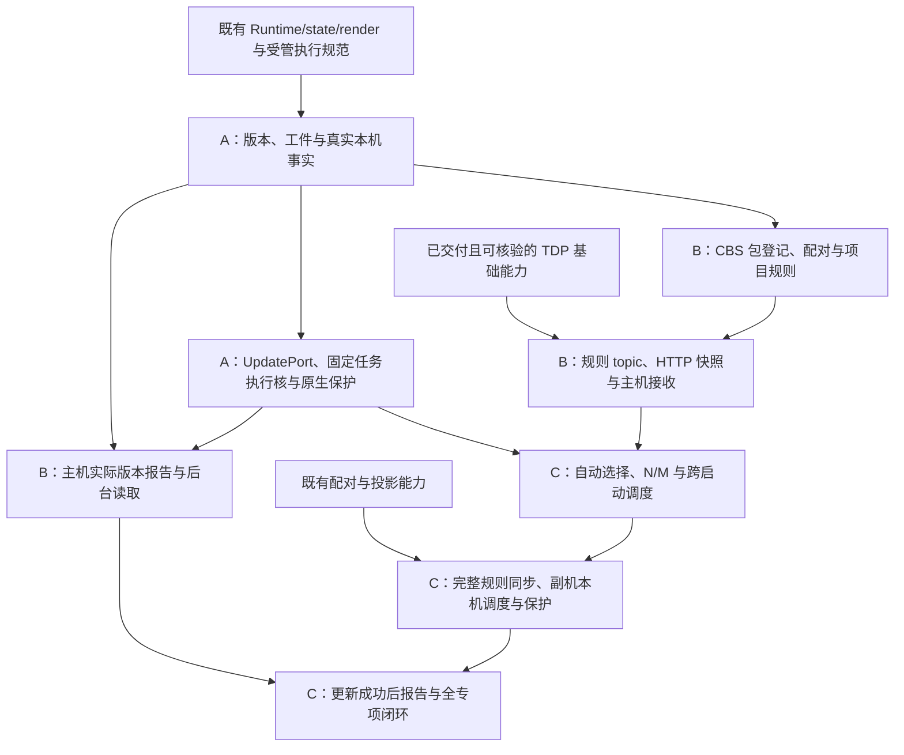

# TER 版本定义、完整更新与热更新正式需求

## 0. 目的、依据与授权

开发者从具体 TER application 产生可识别、可校验的发布工件；运维管理员登记更新包，运营管理员配置项目规则；终端自动取得规则、选择适用目标、下载并按策略应用，管理员能看到已激活终端最后上报的实际版本。原生 APK 更新与 Hermes JS 更新使用同一套规则及任务判断，保持主副机独立执行、业务持久状态可恢复，并避免坏 HOT 导致反复启动失败。

本文件是本专项正式需求正本；原话、裁决与技术论证来源为 `doc/plans/platform/2026-10-04-ter-version-and-js-apk-update-requirements-discussion-claude.md` §9、§19、§20。只在本专项范围内，以本文件收敛后的要求取代讨论稿中的候选和旧表述，不改变正在实施的 TDP 批次。

Dexter 首次授权原文：“那请生产完整的需求文档并且完成两轮对抗性review”。随后本次明确要求：“这个需求内容非常多而且前后有很多依赖，请仔细分析需求的依赖关系，后续我希望分成阶段A、B、C三个阶段来依次完成详设和实施，请你在需求文档中完成三个划分并充分证明其合理性”。当前只授权本需求的阶段划分与只读依赖分析；具体划分见§20。后续按A→B→C逐阶段详设、实施，不表示现在已授权任何阶段的详设编写、源码、依赖、生成、编译、测试、verify、DEV、reset/seed、L2、UAT、部署或设备运行；不联系或打扰正在工作的Codex。

首次 cycle 为 `TER_VERSION_JS_APK_UPDATE_FORMAL_REQUIREMENTS_2026-10-05`：批准对象从讨论稿成本复查扩展为完整正式需求、R/V验收分母及两轮审查，已按当轮字节完成并关闭。此前讨论稿的simplicity review不能替代该独立verdict；本次新增§20不重开原cycle，也不把原R2 GO当作修改后全文的独立GO。后续阶段设计的批准范围、输入与review按当前阶段实际指派和 `doc/decisions/2026-07-25-v2s-independent-subagent-adversarial-review-governance.md`确定，不借阶段名重置已关闭的review。

### 0.1 范围

本期包含三类打包、版本单源、CBS 两后台包/规则管理、项目规则 topic、终端更新 owner、Android update adapter、完整更新安装、HOT 加载及有限启动恢复、本机点击事实和主机版本报告。企业分发及允许自更新的渠道为适用前提；Google Play 分发不在本期。

本期不含用途/终端类型筛选、增量或逐 workspace 更新、跨规则依赖图、灰度/优先级引擎、双机协调升级/共享下载、自动 runtime 指纹、后台提醒服务、全系统输入监测、通用恢复队列、全量 state 备份或迁移框架、版本永久流水/任务看板、独立 HOT PKI/审批平台。

### 0.2 术语与产品边界

CBS=`apps/backend/catering-business-server`；TDP=TDS+TDC 长连接整体。运维管理后台=`platform-admin`；运营管理后台=`operations-admin`。语料库适用 G-01/G-02/G-05A：集团空间、组织项目/门店、读取范围与写 capability 不得混同；原文见 `project-memory/decisions/confirmed-business-language-corpus.md`。四层依赖、MMP/LMP/LMS/LSP、主副机与 TDP 术语遵循 `doc/platform/terminal-coding-standard.md`，不重新定义。

“重启”指更新后新 application/JS Runtime 启动，不要求重启 Android 操作系统。“热更新”为完整 application JS/Hermes bundle 加资源，按策略重建 Runtime；不是运行中逐模块替换或开发期 Fast Refresh。

配对副机是主机扩展，不独立激活、不连接 TDS，CBS/TDS 不知道副机存在。副机仍具有本机 APK/JS/native runtime；同步业务 state 不代表软件或本机版本被复制。

## 1. R-01：版本定义与发布单源

| 字段 | 唯一含义 | 比较/变化规则 |
| --- | --- | --- |
| nativeVersion | 实际 APK 的 Android versionName，可读版本 | 展示，不用其字符串判断升级 |
| nativeBuildNumber | 实际 APK 的 Android versionCode | 同 application 新 APK 发布严格增加；FULL 不主动降级 |
| bundleVersion | 完整 JS/资源发布版本 | 每次发布新 JS/资源内容必须变化；稳定 `major.minor.patch`，三个非负整数依次按整数比较；不引入预发布/build metadata 排序 |
| runtimeVersion | 原生 JS 兼容环境标识 | 本期显式字符串，精确匹配，不比较大小；原生兼容输入变化须审查并改变标识 |

每个 `apps/terminal/application/android/<application>/package.json` 是本产品发布输入唯一来源。顶层 `version` 表达 nativeVersion，其余发布字段由 application 声明；具体字段名由详设确定。app config、Gradle、JS 元数据和清单均派生消费该源，不手工维持多处相同值。

RN/Hermes、原生模块、共享 application/base/android 或 adapter 的兼容变化进入 runtime 标识审查；仅构建号增加不必改变 runtime。当前接受人工漏改风险，通过实际原生差异审查控制，不新增自动 fingerprint 前置。

application identity、平台、ABI、minSdk、签名关系是工件适用/安装事实，不是额外版本。不可变工件身份和摘要用于关联/完整性，也不是第五个可读版本。

同 application/平台/runtime 的不同 JS 发布不能沿用相同 bundleVersion；登记时对此冲突给明确拒绝，不让工件身份掩盖可读版本冲突。相同工件重复/跨空间登记、仅改变 native 而沿用相同 JS 内容，不因此被要求增加 JS 版本。本条恢复讨论稿的发布变化约束，不建立额外的全局版本序列；主动执行仍按 R-06 禁止降级。

## 2. R-02：三类工件与打包入口

每个可发布 application 的 package.json 提供安装包、完整更新和热更新三个公开脚本。共享打包逻辑复用仓内工具，路径输入遵守 D-41 仓根/符号链接检查；本文件不规定未经实现的脚本名称。

| 产物 | 内容 | 用途 |
| --- | --- | --- |
| 安装包 `.apk` | 签名 APK、native、内嵌 JS/资源及发布元数据 | 初次安装/企业分发；首个可更新基线必须含真实 native 更新能力 |
| FULL `.zip` | 更新清单＋完整签名 APK | CBS 登记，TER 下载校验后解出 APK 交系统 installer |
| HOT `.zip` | 更新清单＋完整 application JS/Hermes bundle＋全部必要资源/映射 | CBS 登记，TER 解包后加载精确工件 |

安装包与 FULL 内 APK 复用同一次构建的相同字节，不分别重建。HOT 不替换 native、Manifest、权限或 APK 中没有的原生模块；需要这些能力时发布 FULL。旧 APK 尚无更新接线时须先经外部分发安装到可更新基线，不能用 HOT 补原生能力。

## 3. R-03：清单、解析与完整性

清单至少表达格式版本、FULL/HOT 类型、不可变工件身份、application/平台、版本及原生条件、文件路径/长度/摘要。FULL 表达实际 APK 版本、安装后的 runtime 与内嵌 bundle；HOT 表达目标 bundle、要求的 runtime、完整资源入口及其固定最小 FULL 关联。

CBS 根据实际清单/内容识别类型及版本，不根据文件名猜测；检查清单与实际 APK/资源一致、同工件身份对应已校验字节。已登记工件内容不得原位替换，新内容登记新工件。HOT 登记需选择已登记的最小 FULL，固定关联，不因后续 FULL 上传自动改变。

TER 从获授权的规则/下载通路取得期望身份和摘要，下载、解包及应用时再次核验完整内容；ZIP 自带摘要不能自证来源。APK 使用系统认可的兼容签名关系，解析/验签复用成熟工具。禁止越界、绝对执行路径、符号链接逃逸、重复/冲突入口及不完整资源；磁盘、下载、解包和调用期限须有可解释的有限技术边界，详设给出依据及超限行为，不新增业务包数量配额。

ZIP 仅是描述与内容共同校验的封装；installer/Hermes 加载方法不必直接接受 ZIP。未完整准备不改变当前 active 工件，清理只能释放本动作拥有且非 active/非正在启动引用的资源。

## 4. R-04：CBS 更新包管理

platform-admin 在已验证集团空间中上传 ZIP，系统解析并显示 FULL/HOT、application、版本/兼容信息、校验结果及不可变身份；合规则登记可用，失败给结构化原因，不能将失败/尚未校验的包作为规则目标。

空间来自管理员验证上下文，不信清单自报。规则只引用同空间工件；同一开发工件可在不同空间分别登记，不能绕过空间授权。复用既有 asset 对象存储/上传生命周期，扩展具名 ZIP 能力，不建立第二资产平台；当前 asset 尚无 ZIP 通路不代表已可直接上传。

平台端遵循既有 platform session 和 owner 最终复核，不引入平台 capability。必要的管理页面/Journey、失败展示、列表/详情形态在后续设计声明，本文件不借旧页面反推新行为。

## 5. R-05：项目规则管理与授权

operations-admin 按项目维护多条规则，写操作要求项目终端版本管理 capability，并由真实 owner 重核实际项目、空间、目标及操作。读取遵循既有项目角色节点可读范围，不额外增加与写权限对称的 GET capability；主对象、关联包候选和写授权按 G-05A 分别核验。

规则内容至少包含所属项目、门店范围、由工件确定的 application/平台、FULL-only 或配对 FULL/HOT、HOT 生效策略、FULL 提醒 N、闲时 HOT 的 M、说明和服务端创建时间。门店范围为项目全部门店或明确指定 refs；空集合不暗指全选，不允许引用其他项目门店。

规则只能新建、启用、停用；范围、包、策略、N/M 等内容不可编辑，更改须新建。启停不改变创建时间。N/M 使用明确时间单位和正数校验；具体契约单位及技术上界在详设固定。FULL-only 不出现闲时 FULL 选项；含 FULL/HOT 的规则分别表达 FULL 提醒与 HOT 策略。

本期无用途/终端类型字段、控件或匹配逻辑，也不以 laptop/mobile、机型或功能配置代替。ABI/最低系统版本等安装兼容检查仍有效。管理列表不新增人为排序字段/拖拽优先级。

## 6. R-06：唯一规则选择、FULL/HOT 配对与禁止主动降级

终端先按当前项目、门店、application/平台取得启用且范围适用的规则，以服务端创建时间选择最新一条。相同时间必须用不可变规则身份形成稳定次序，详设明确算法；启停不重新排序，窄门店规则不暗中压过较新全项目规则。

选择范围规则时不提前以当前 runtime 不匹配排除可通过该规则 FULL 达到的 HOT。选定后只用该规则自带的完整目标，不从其他规则找前置，不按时间逐条执行历史规则；不兼容时报告明确原因，不暗选旧规则。

含 HOT 的规则必须携带其固定最小 FULL：CBS 登记/启用时校验同空间、同 application/平台、FULL 目标 runtime 满足 HOT，以及声明的目标闭包。声明需要续接却没有兼容 HOT，拒绝启用。允许 FULL-only；CBS 不取得副机版本或盘点全体设备以证明该规则人人可执行。

TER 首次平台动作前，以本机实际 nativeBuildNumber、bundleVersion、runtime 及安装事实补充准入：低于最小 FULL 则先 FULL、后 HOT；已满足构建下界和 HOT runtime 则跳过 FULL；APK 更高但 runtime 不满足则拒绝，不降 APK。构建下界不能代替兼容匹配。

| 本机 / 所选规则 | 要求 |
| --- | --- |
| APK1/JS3 → 最小 APK2 内嵌 JS4＋HOT JS5，runtime R2 | 固定同一规则，FULL → 新启动回读 → HOT → 新启动确认，最终 APK2/JS5 |
| APK2/JS4、R2 → 同规则 | 跳过 FULL，仅 HOT |
| APK3、兼容 R2 → 同规则 | 不降到 APK2，按目标 JS 是否需要更新决定 HOT |
| APK3、R3 不满足 R2 → 同规则 | 拒绝不兼容，不找旧规则或降 APK |
| FULL-only 内嵌 JS4，本机已有 JS5 | TER 拒绝主动降低运行 JS；主机旧报告 JS3 不能替副机 JS5 放行 |
| FULL 内嵌 JS4＋兼容 HOT JS6，本机 JS5且需升级 APK | 允许必要 FULL 中间阶段，必须续接固定 HOT；最终 JS6 不降级，不把暂时 JS4报最终目标成功 |
| 满足原生前提，已经达到同一目标工件或版本更高 | 不重复应用或主动降级，明确已达到/不需要更新事实 |

主动更新的最终目标 JS 不低于本机现有 bundleVersion；FULL 改变 runtime 后同样核对数值目标和兼容。FULL 内嵌 JS 较旧可以作为明确配对的中间阶段，但缺少可恢复至不低于原版本的兼容 HOT 时本机拒绝。必要续接不因中间启动/缓存看似达到旧版本而丢失。

安装后实际 JS 入口须服从固定目标：旧缓存不能未经判断覆盖 FULL/HOT。技术启动恢复是 R-14 的有界保护，与管理员主动降级分开；不回滚 APK。

## 7. R-07：TDP 规则快照与主副机分工

新增项目规则 topic，身份以项目为范围。复用 TDP 数据变化通知→业务 HTTP 查询→owner 持久 state→本地 topic 登记/具体通知接受流程；首次和重连取得/核对当前完整规则快照，不只等未来广播。查询到登记间的变化由既有 TDP 差异核对闭合，不新增事件缓存、MQ、outbox 或常态轮询。

HTTP/资产通路承载规则正文和文件，WebSocket 不传 ZIP、不突破既有 65,536 字节单消息边界。规则读取必须完整；分页/快照一致性由详设给出真实可执行方式，不能静默截断或用未约定的业务条数限制代替。

主机经更新 owner command 保存本项目完整快照并同步规则 state 给副机；不能先按主机 application/版本过滤。副机模块通过既有 Runtime state 订阅、owner selector 和本包 command 驱动本机任务，不依赖 React 页面挂载，不自行改主机规则。两端用相同本机判断逻辑，各自下载；不同 App 的副机仍能选择自己的规则。

先建立订阅，再检查已有 state；监听规则、空间/项目/门店、角色/配对和实际本机版本等必要准入事实，卸载受控退订。重复通知去重，actor 首次下发前重读当前事实。未固定候选遇上下文失效不可执行；固定任务遵循 R-09，不因断链暗换目标。

本机版本、点击时间、任务、prepared 内容路径及 native 加载记录不以主机投影覆盖副机本机事实。配对连接不兼容时保护双机业务，保留本机 admin、取消配对/地址恢复入口；不以 runtimeVersion 冒充 topology 协议版本，不增加双机共同提交机制。

## 8. R-08：唯一 owner 与平台边界

| 归属 | 责任与唯一事实 |
| --- | --- |
| CBS 终端更新业务 owner | 工件登记/解析结果、项目规则及最后主机版本报告；写 PostgreSQL，复用唯一 Flyway/asset/授权，不建第二业务 deployable |
| TER 更新 owner | 规则快照、选择/准入、固定本机任务及阶段、提醒/闲时判断、失败和实际版本 selector、报告触发 |
| Runtime/render | 本机启动生命周期和最后点击事实；统一呈现边界采集，通过 command 写 Runtime，不持第二份更新规则 |
| TDC/TDS/transport | TDP 通知/版本报告传递与既有连接职责，不解释门店/更新优先级；凭证继续仅由 TDC 拥有 |
| UpdatePort/Android adapter/application | 指定工件流式下载/校验/解包、实际 native/加载身份、原生选包、HOT 重载、系统安装及有限启动保护 |
| native 最小持久加载记录 | JS 执行前可读的已校验入口、工件/启动身份与必要恢复信息；不是第二规则/任务账本 |

跨包业务发指令只用 command，读数据/状态只用 owner selector；selector 纯读，外部事件在本包桥转换成 command，再由 actor 写 slice。复用 Runtime 资源/订阅、state 持久化/topology、网络配置/代理及对象存储生命周期。

在 `adapter/android` 增加具名 update 能力，application 装配现有 Expo/RN host。旧未消费的 HotUpdatePort 下载/marker 公共面替换为匹配 FULL/HOT 的 UpdatePort，不长期保留旧流程兼容层。能力须覆盖指定工件准备、应用/安装、实际回读、身份确认及必要资源释放；方法数量、类型和技术观察不在需求冻结。端口不自行选 latest，不向业务导出 marker 写法，沿用既有有类型的结果与 unavailable 默认。Web 无真实 native 能力，不用默认模拟器冒充安装成功。

owner 任务与 native 加载记录各司其职，恢复时用实际平台事实复核目标；技术观察先订阅再发动作，启动/回到应用回读，避免依赖已经退出的旧 JS callback。现有普通 appControl Runtime 控制保留；HOT 的“选定目标＋重载”由同一更新能力完成，避免业务写 marker后另发reset造成中间态。

## 9. R-09：固定任务、每次启动一条规则与跨启动续接

首次 port 准备前先成功持久化固定规则快照、不可变 FULL/HOT 身份、N/M 和阶段/必要动作关联；持久化失败不调用 port。下发后固定整条规则，较新规则、停用、角色改变或配对断链不抢占。权限失效不授予越权下载，无法继续时明确失败，不偷换目标。

一次 JS 启动至多执行一条规则，单机双屏共用一个名额，不按 surface/模块安装/角色变化重新领取。执行更新后必须重启；FULL 是安装后新应用启动（可手动），HOT 是新 JS Runtime。任务跨启动优先续接未终结固定规则，不借“最新规则”丢弃后半段。

必要过程事实至少能区分准备/校验、待应用、等待安装确认/手动启动、已受理尚未知、阶段成功、最终成功和失败；这是业务观察分母，不冻结代码枚举。download 完成、installer 接受或 reload accepted 不等于真实目标运行。

例：S1 固定 R并安装FULL → S2读回实际FULL并优先执行R的HOT → S3确认实际HOT及R最终成功，再允许选择新规则。S2不可抢占R；完成一条规则的旧启动不继续执行第二条。恢复既有结果的S3不是重复执行旧目标。

## 10. R-10：等待、失败与有限重试

暂时读取/下载故障允许有限重试，次数/期限在详设按实际边界确定；签名 URL 到期可重新取得同工件输入，不重新选择 latest。校验/兼容拒绝、明确安装失败、有限重试耗尽或 HOT 技术恢复后保留准确工件和原因，进入失败终态。

等待用户安装/手动启动或 HOT 无点击 M 仍为等待，不因慢而失败/换规则。调用超时/断链的未知结果不等于系统安装取消，需观察/回读同一动作，不能盲目重复提交。重启后回读身份以发现已完成阶段，避免重复安装/加载。

终态失败解除后继启动的任务占用，同一启动不执行另一规则。失败工件不因广播/启停自动再试；后继启动可选择不同修复工件。人工诊断后显式重试保留同一身份及受控准入，不新增恢复队列或任务看板。故障、进度、未知、实际结果与资源清理具备必要脱敏可关联日志；不记录代理秘密、凭证/Authorization、下载授权 URL 或 raw payload。

## 11. R-11：FULL 安装与 N 提醒

FULL 仅立即策略：下载校验完成后提示安装，未安装每 N 时间提醒。实际安装方式由 adapter 根据平台能力及最终 PackageInstaller 结果判断，始终处理需用户确认、拒绝/取消、失败及成功；不承诺所有设备静默，也不绕过系统授权。

系统安装已在处理/系统确认界面期间不重复提交或叠加弹窗。提醒仅在本应用可呈现时执行，回到应用核对实际状态和提醒期限；不建立后台闹钟或常驻提醒服务。安装后的人工启动时间不计为 HOT 启动失败期限。确认成功须后继启动读回实际 APK/native/runtime和阶段身份，不依赖旧进程回调；无需保证自动拉起应用。

FULL 已成功而 HOT 失败，如实保留已安装 APK、当前实际 JS和失败阶段；不报整个规则成功，不回填旧 APK。继续 HOT 前始终核验安装后的真实条件。

移交系统安装这一可受控边界前，同样遵循 R-12 的持久化 flush：核验需要恢复的已声明字段和任务落盘，失败不提交本次安装。此处不承诺 flush 后所有新输入或系统不可控终止都已持久化，不为等待安装增加全局业务锁；具体回调/安装边界在详设落地。

## 12. R-12：HOT 立即/闲时、点击事实与 state 恢复

HOT 完整准备后，立即策略受控重启 JS；闲时策略在本机界面连续 M 时间没有点击后重启，不额外要求店员登出、订单为空或业务 HTTP 完成。FULL→HOT 后半段仍遵循该规则 HOT 策略。

扩展既有 kernel/base/runtime 本机 isolated state 保存最后点击事实及 selector，ui/base/render 统一 surface 承载边界观察点击/触摸开始并发送 Runtime command。涵盖内容、overlay、admin、虚拟键盘，单机双屏任一屏更新同一事实；双机各自记录，不同步。不得吞掉原操作、记录坐标/输入正文或要求每个 feature 按钮重复接线。

本期不另外识别滚动/拖动/物理键盘/全系统输入或业务忙闲。新 JS 启动初始化当前时间，不沿用旧持久时间立即判闲；点击重设一次截止，到时 actor 重读 selector 复核竞态，不常态轮询。系统 installer 等非 React UI 的边界在详设记录。

FULL/HOT 的受控应用/重启边界前均调用既有持久化 flush 并核验结果；失败不声称可恢复，不提交本次 FULL 安装或继续受控 HOT 应用。任务必持久；需恢复的 UI/业务字段由原 owner 按已有 durable/ephemeral 声明和真实重启测试证明。React useState、request/Promise及旧 native callback 不自动跨启动；不复制 store、不root reset清凭证/业务数据、不承诺全部内存状态恢复。

## 13. R-13：精确 HOT 加载、资源与原生兼容

保留当前 Expo/RN/Hermes，优先复用已解析版本公开本地文件加载能力，由 update adapter承接已解包内容；不使用开发 reload或运行中eval替代生产加载。首次准备不改变active；应用时关联同一工件，持久选定实际入口，后继启动确实读取它并加载全部资源，冷启动/离线同样成立。

APK实际Hermes与编译器须按真实解析版本配对；HOT runtime及必要native条件匹配才应用。图片/字体等寻址、完整包原子发布、两屏共享Host、旧缓存选择、进程中断和磁盘失败必须验证。当前已有reload仅重载Host，不证明选包；文本HTTP也不证明二进制流式下载已存在。

不要求库直接导入ZIP，不修改私有更新数据库、不让库默认latest选择覆盖固定工件。expo-updates当前未安装，未证明精确本地导入闭包，不作为已选依赖；若后续找到公开可验证方式，先按第三方规范核实再收敛，不能新增第二分发协议以迁就选库。

## 14. R-14：有限 HOT 启动保护与数据边界

只判断本次 HOT 是否按期成功启动，不判断所有业务BUG。复用现有物理PRIMARY成功首屏链：实际工件/本次JS启动identity匹配、Runtime初始化及必要state hydration完成、首屏布局/启动必要条件满足且无contentFailure，再确认加载。不能依赖CBS/TDS在线或业务HTTP成功，也不能以下载/开始执行为成功。

失败页面仍可释放splash让错误可见，但不确认更新成功；单独splash已隐藏也不等同成功。原生在实际开始加载新HOT时建立有界期限T；T独立于FULL提醒N，不包含下载、用户安装/手动启动等待。即使同Activity reload且alreadyHidden，也建立新JS启动身份；旧Runtime迟到确认不能清除新等待。

启动失败/未获确认由坏JS之前可执行的原生保护处理；普通JS timer不是救援机制。只保留上一成功且当前native兼容、持久数据可读的恢复目标，有限恢复并重启，记录失败工件、防止自动再次加载。不会自动降APK，也不会在确认成功后因HTTP、断链或一般业务错误回退。

只对本次HOT从加载到确认窗口可能修改的持久字段证明指定恢复目标仍可读；首屏尚未显示不等于未写数据。不要求所有历史包/全部state兼容，不增全量备份。FULL更换runtime后旧HOT不自动成为可用恢复目标；内嵌包也须核验实际兼容与数据。没有安全恢复目标时不加载不兼容旧包，保留明确失败并向前修复。系统杀进程/断电只证明未确认，不武断认定代码BUG；详设区分可观察终止与原生恢复触发。

## 15. R-15：主机实际版本报告与后台查看

已激活终端在TDC认证ready后及本机实际更新成功后上报application/平台、四版本字段和可得实际工件身份；双机只报主机，不报副机、不主机代报，不新建服务端副机对象/委托认证。

installed native字段从Android真实安装事实读取，bundle/工件从当前加载上下文取得，runtime来自实际native；通过更新owner selector供TDC，不用下载目标、主机投影或激活时单一appVersion充当实际值。读取失败明确未知及原因，不默认阻断激活/连接；现有appVersion不被悄悄改语义，契约扩展方式留详设。

CBS关联terminalRef/deviceId/current binding身份，记录服务端接收时间，隔离旧binding/迟到报告，保存最后主机报告于PG业务owner，不写仅承载连接历史的Doris。platform-admin按空间、operations-admin按可读项目查看实际字段和最后报告时间；离线最后值不宣称当前实时值。不扩展任务进度/永久版本流水，既有必要日志与安全审计保留。

## 16. 真实能力、复用与技术 OPEN

| 当前静态事实/来源 | 必须在后续设计或运行补足，当前未证明 |
| --- | --- |
| `apps/terminal/kernel/base/platform-ports/src/types/hotUpdate.ts` 只有旧marker接口，Android默认不可用 | UpdatePort替换及实际native基线、各App接线；没有已完成更新器 |
| `apps/terminal/application/base/android/android/src/main/java/com/catering/v2s/terminal/application/base/android/TerminalAppControlModule.kt` 仅ReactHost.reload | 精确目标入口、资源、冷启动/重载、双屏生命周期 |
| `apps/terminal/application/base/android/android/src/main/java/com/catering/v2s/terminal/application/base/android/TerminalNetworkModule.kt` 当前限长UTF-8响应 | 复用网络配置/代理的流式文件下载、磁盘/中断/解包边界 |
| `apps/terminal/ui/base/integration-assembly/src/foundations/integrationAssembly.tsx` 区分primaryRealReady/contentFailure；失败也可结束视觉加载 | 工件/JS启动identity、native期限、有限恢复；不可把旧Activity token当新bootidentity |
| `apps/terminal/kernel/feature/sample-member-registry/src/application/module.ts` 已有Runtime订阅/selector/command及启动检查 | 更新owner复用同形常驻路径；实际副机任务持久隔离 |
| `apps/backend/catering-business-server/modules/asset/src/main/java/com/catering/v2s/platform/asset/application/PlatformAssetService.java` 当前只接图像/mp4 | 具名ZIP能力、APK实际解析/验签工具及版本、业务owner/权限/失败闭包 |

讨论稿§5/§16/§18记录的历史静态解析：Expo57.0.18、RN0.86.3、hermes-compiler250829098.0.17及官方提交源码，只作后续导航，不锁依赖、不当本轮解析或运行证明。详设必须重核当前实际版本与对应官方依据，native Hermes/SDK工具尚OPEN。

第三方一手入口：[Android版本](https://developer.android.com/studio/publish/versioning)、[签名](https://developer.android.com/studio/publish/app-signing)、[PackageInstaller](https://developer.android.com/reference/android/content/pm/PackageInstaller.SessionParams)、[Expo Hermes](https://docs.expo.dev/guides/using-hermes/)、讨论稿§5精确版本host/file-loader源码。这些不是本仓运行PASS。

后续实施准入前明确目标Android/API/设备管理与企业分发条件，选定可验证本地加载路线、资源映射、native保护及具体有限预算/T。当前不存在未决产品方案竞争；这些是工程输入/可行性OPEN，不靠实施前假装技术已完成来关闭。

## 17. 必测场景分母（详设必须包含，但不限于）

全部V当前`NOT_RUN`。表内“证明”指未来必须取得的证据，不是当前结果。F=focused真实owner路径；W=integration Expo Web用户行为；A=安装application的Android/native；B=真实CBS HTTP与业务owner/PG/资产；P=真实双屏/双机adapter。F不替代W/A/B；非adapter行为先W再设备同清单对照（TR-16），native行为在A/P证明。

| 场景 | 需求 | 操作/反例及必须断言 | 最低执行面 |
| --- | --- | --- | --- |
| V-01 | R-01/02 | 两App三脚本，逐字段核对package单源→Gradle/清单/实际APK；FULL内APK与安装产物同字节；JS1.0.9→1.0.10整数排序、新JS内容发布变化版本 | 打包检查+A |
| V-02 | R-02/13 | 无native基线旧APK拒绝HOT新增native；不同application/runtime包拒绝 | F+A |
| V-03 | R-01/03/04 | 合规FULL/HOT上传识别；伪类型/版本、同application/平台/runtime的相同JS版本不同内容、缺文件、坏摘要、APK不一致/签名拒绝不能入可用库；同工件跨空间登记不误作新JS发布 | B+A解析 |
| V-04 | R-03 | ZIP路径穿越/符号链接/冲突入口、下载截断/解包资源超限；active不变、仅清理本动作 | F+A+B |
| V-05 | R-04/05 | 跨空间包/项目门店拒绝；两后台正确session；无写capability拒绝写而合法范围GET仍读 | B+两后台UI |
| V-06 | R-05 | 新建/启停可行、编辑不存在；内容改变新建，启停不改createdAt；正N/M与非法参数 | B+两后台UI |
| V-07 | R-06 | 最新创建时间胜出、同时间稳定、全门店/指定门店、不同App过滤；无启用/适用规则时零准备/下载/安装/重载；不含用途维度 | F+W |
| V-08 | R-06/09 | APK1/JS3→FULL APK2/JS4→HOT JS5；两个阶段重启，真实最终身份 | F+W+A |
| V-09 | R-06 | 已满足最小FULL则跳过；更高APK兼容可HOT、不兼容拒绝且不降APK/暗选旧规则；同一目标或满足原生前提且本机JS更高时明确已达到/不需要并零更新动作 | F+W+A |
| V-10 | R-06 | CBS拒绝错误静态配对；FULL-only旧JS被本机拒绝；配对允许中间旧JS但最终不低于原JS | F+B+A |
| V-11 | R-07 | 首次、重连、查询到订阅间变化、重复/乱序通知；HTTP完整快照不漏末页，不在WS传ZIP | F+W+B/TDP |
| V-12 | R-07/08 | 无业务页面时副机订阅仍启动；重启已有规则、上下文改变、退订失败可观察；本机事实不被投影覆盖 | F+W+P |
| V-13 | R-07/15 | 主副不同App独立筛选/下载/升级；CBS仅收到主机报告，不产生副机对象；协议错开保护与本机admin | W+A+P+B |
| V-14 | R-09 | port前持久化失败不调用；排队时重读准入；固定后新规则/停用/断链不抢占；单机两屏仅一次 | F+W+A+P |
| V-15 | R-09/10 | FULL后的新boot优先HOT；每boot一条规则，旧boot不抢下一条；成功后新boot再选；失败后本boot不领第二条，后继boot可领取不同修复工件，不被失败任务永久占位 | F+W+A |
| V-16 | R-10/11 | FULL用户等待、手动启动、系统pending、未知/超时与明确拒绝分别断言；不重复install、不假报成功 | F+W+A |
| V-17 | R-10 | 暂时下载有限重试/耗尽、URL到期仍同工件、权限失效拒绝；失败后广播/启停不重试坏工件，人工重试有明确身份 | F+W+A+B |
| V-18 | R-11 | FULL下载后立即提示；未安装N提醒，后台/系统界面不叠提示，回前台核对；无闲时FULL | W+A |
| V-19 | R-12 | HOT立即/无点击M，内容/admin/虚拟键盘、两屏点击重设；到期同刻点击复核、不吞点击；双机点击隔离 | F+W+A+P |
| V-20 | R-09/11/12 | 新boot不恢复旧闲时时间；FULL/HOT受控应用前flush失败均零应用/安装提交；实际重启恢复已声明字段且不伪恢复临时Promise/本机他方任务 | F+W+A |
| V-21 | R-13 | 带真实图片/字体HOT精确加载，离线冷启动可用，旧缓存不盖目标；真实bytecode与nativeHermes匹配 | A+P |
| V-22 | R-09/13 | 下载/选包/重载/安装边界进程中断，后继boot按同identity回读续接，无重复提交或半包active | F+A |
| V-23 | R-14 | 正常PRIMARY/hydration确认；失败页能隐藏splash但不确认，T超时；不依赖网络/坏JS timer | F+A |
| V-24 | R-14 | 同Activity已隐藏splash的新boot仍有T；旧boot迟到确认不能确认新目标 | F+A |
| V-25 | R-14 | 同native且数据可读上一成功HOT有限恢复，失败身份不循环；native/数据不兼容则不加载旧包、无APK回退 | F+A |
| V-26 | R-14 | 已确认后普通HTTP/断链/业务页异常不回退；断电/系统退出不虚构代码BUG | F+A |
| V-27 | R-11/15 | FULL成功而HOT失败，实际APK/JS分别报告，整规则不成功，副机仅本地 | F+A+B+P |
| V-28 | R-15 | ready/成功后主机报告真实字段，下载目标不提前报告；未知不假值/不阻断；旧binding迟到拒绝 | F+W+A+B |
| V-29 | R-15 | 两后台只读最后主机版本/接收时间，跨空间项目拒绝，不以GET写capability限制读、不新增任务流水 | B+两后台UI |
| V-30 | R-03/08/10 | preparing/等待/退订/清理失败有脱敏关联日志；cleanup不删除active、未知installer或他run资源 | F+A+受管runner |

以上Android原生能力不能以ExpoWeb、ExpoGo、Metro开发reload、官方API存在或accepted结果替代。后续详设补每条场景fixture、command/selector、真实请求/持久化/可见断言、runner与cleanup，不为需求阶段建假运行证据。

## 18. 后续设计交付与证据边界

本文件负责需求与验收，不是Journey/IA/交互/详设/实施计划；四类模板不能要求需求阶段虚构屏幕、接口签名、CP或testId。后续依§20逐阶段形成完整设计包；本阶段涉及的两后台或终端安装提醒/失败恢复等UI，必须先交适用Journey、IA与交互工件，复用共享admin-ui-foundation和TER admin/render/input能力，避免重复生命周期/提示/输入实现；后台/终端规范与第三方版本依据均适用。

各阶段详设与实施计划必须闭合§20所列当阶段的R子条款、V子断言及阶段出口，明确真实owner路径、有限预算与失败语义、CP顺序、复用入口、Web→设备/原生验收分工、资源身份和cleanup；C结束时闭合本专项R-01～R-15和V-01～V-30全范围。未获后续实施授权前不得建立源码/依赖/契约/迁移或运行环境。

首次需求轮已取得：讨论稿裁决及对应仓内源码/规范的静态回读、正式条款、两轮独立审查的输入和结论（归档于同日review文件，按各自原SHA适用）。本次追加取得§20阶段划分、只读依赖分析与R/V覆盖核对，不把历史GO扩展到新字节。仍未取得：新增功能实现、当前依赖/native解析、三脚本产物、CBS解析/权限业务验收、UpdatePort真实接线、资源加载、installer、恢复、主副/双屏、所有V场景、编译/测试/verify、DEV/cleanup/L2/UAT；均`OPEN/NOT_RUN`。需求审查GO只评价规格，不代表这些通过，也不授权下一阶段。

## 19. 来源、覆盖与后续 review 导航

| 本文件 | 原话/收敛依据 |
| --- | --- |
| R-01～03 | 讨论稿§3/4/9/10/16；Dexter接受四字段单源、ZIP用途与完整应用更新 |
| R-04/05 | §9/10.3/11/19.1/19.6；两后台、空间项目、不可编辑与移除类型 |
| R-06 | §11.1/19.2/20.3；唯一最小FULL配对、禁止主动降级及两端校验 |
| R-07/08 | §12/17/18.4/19.6；主副本机selector统一判断、既有能力复用/端口替换 |
| R-09/10 | §19.1；固定任务、每启动一条规则、等待/未知与有限失败收敛 |
| R-11/12 | §19.2/19.3；N/M、简单点击事实、state恢复与flush |
| R-13/14 | §5/16/18.3/19.4/19.5/20.2；精确加载、splash成功链与有限兼容恢复 |
| R-15 | §14/19.6；只报主机实际版本、最后报告及授权范围 |

Dexter本次明确将后续交付范围划分为§20的A/B/C；每阶段包含其两个App及相关owner的完整范围，不再拆成各App、文件或单项gate独立产品交付。首次两轮报告保留当轮输入SHA及原始verdict；主agent逐条intake，旧verdict不追写成新字节GO，已关闭cycle不增第三轮或由作者代写独立结论。

## 20. A/B/C 阶段划分与依赖证明

### 20.1 划分原则与授权含义

三个阶段按能力依赖与可验收闭包划分，顺序为**A本机更新能力 → B后台供给与版本可见 → C自动更新及双机完整闭环**。这是Dexter明确改变后续交付边界后的范围定义，不是把同一个获授权批次偷偷拆成模块交付，也不是新的Roadmap、current-state registry或运行期阶段开关。A/B/C只用于本文件及后续设计/验收定位，不进入包、目录、command或类名。

后续节奏为：A完整详设/计划→A实施、验收与实施review→B完整详设/计划→B实施、验收与实施review→C完整详设/计划→C实施、全专项验收与实施review；每次进入仍须相应明确授权。每阶段内部遵守批次原子交付、CP独立三维对账、6b、逐代码对账及整阶段IMPLEMENTATION review；不为单个改动额外拆交付。

划分不删减R/V，不降低执行面。跨阶段需求以子条款/子断言承接：A/B的局部通过只能证明相应能力，不能提前宣称原整条跨阶段V已PASS。阶段C是全专项功能闭合点，阶段A/B是有明确真实成果的前置交付，不是完整自动更新产品。

### 20.2 依赖图：硬依赖与安排理由分开

| 依赖 | 为什么必须先成立 | 反例/延后代价 |
| --- | --- | --- |
| A工件格式/版本 → B包登记与配对 | CBS需要解析真实产物、核对实际APK/资源及runtime，而非先造另一清单 | B先猜字段或资源入口，A选定loader后重做解析/数据库/契约；相同版本不同内容无法一致拒绝 |
| A实际版本与加载identity → B版本报告 | 报告必须是实际安装/运行事实，不是package声明或目标 | 仅报告appVersion或prepared目标会在FULL成功/HOT失败时撒谎 |
| A原生执行/保护 → C自动调度 | 必须有可靠的执行者才能自动交付目标；下载完成、reload accepted不是完成 | 最后才发现无法加载资源或恢复坏HOT，前面的自动规则工作全部无法验收 |
| B包、规则、topic/HTTP → C自动选择 | C需要同空间已校验不可变工件、完整当前规则及合法下载通路 | 只靠本地静态规则验收会漏掉权限、启停、分页和通知空窗 |
| A持久固定任务 → C新规则/主副调度 | 后继启动只能续接同一任务，主副各有本机身份 | 先做单段FULL临时任务，后来加入HOT需另造状态机，或S2被新规则抢占 |
| 既有TDP → B真实投递验收 | 复用订阅、接受确认、当前绑定与失败语义，不另建消息机制 | 目录存在/旧GO不证明当前接线可用；不可用时该B入口OPEN，不能加轮询补洞 |
| 既有topology → C副机驱动 | 同步规则与本机执行是不同事实，必须验证方向/断链/身份 | 把主机已筛选规则或本机任务同步给副机，会漏不同App规则或覆盖真实状态 |

B的后台代码在技术上不要求A每个native测试都先结束；选择A先整阶段交付，是为了先消除Hermes加载/资源/安装/启动保护这一高风险工程未知，再建设依赖其工件语义的管理面。C同时硬依赖A执行闭包和B真实规则来源，因此不能仅因为两者分别编译就进入端到端验收。

图中的“已交付且可核验TDP”是未来B准入要求，不是本轮对正在建设的TDP作完成声明。本次只读源码支持上述顺序的具体依据如下，全部是静态事实而非动态PASS：

| 当前来源 | 对划分的直接约束 |
| --- | --- |
| `apps/terminal/application/base/android/src/foundations/androidPlatform.ts:54`；`apps/terminal/kernel/base/platform-ports/src/types/hotUpdate.ts:57` | 当前为不可用旧marker端口；A必须建设真实能力，不能只准备API给C再补实现 |
| `apps/terminal/application/base/android/android/src/main/java/com/catering/v2s/terminal/application/base/android/TerminalAppControlModule.kt:17` | 当前仅reload，不会选择工件；打包格式不能先独立于真实loader定完 |
| `apps/terminal/ui/base/integration-assembly/src/foundations/integrationAssembly.tsx:611`；同原生目录`TerminalNativeLoadingRegistry.kt:98` | realReady与failure不同，Activity gate不是新JS保护；A的第一次HOT应用必须同时交启动保护 |
| `apps/terminal/kernel/base/runtime/src/types/module.ts:68`；`apps/terminal/kernel/base/state/src/foundations/createStateRuntime.ts:137` | 已有flush/订阅/资源接口，自动flush为异步；A复用最终持久执行核，不在C另造恢复账本 |
| `apps/backend/catering-business-server/modules/asset/src/main/java/com/catering/v2s/platform/asset/application/PlatformAssetService.java:1115` | approved usage仍只接受图像，具名ZIP尚需B扩展；既有asset不能当作已完成更新包库 |
| `apps/terminal/kernel/base/terminal-data-client/src/features/commands/terminalDataClientCommands.ts:57`；`src/features/actors/terminalDataClientActor.ts:1151`（同包） | 当前有订阅/接受command及主机准入路径；B应重核并复用TDP，不另建订阅传输；源码存在不证明其当前交付验收已通过 |

### 20.3 阶段 A：发布与本机 FULL/HOT 更新能力

**交付目标：**两个application能生成三类真实工件；给定明确、合法的固定目标，本机能真实准备、安装/加载、跨启动回读并安全处理失败。先证明“包确实能更新设备”，不先建设管理员发布与自动选最新规则。

完整范围：

1. R-01/02的四版本单源、三脚本及两App实际产物；R-03中开发者/TER侧工件格式、入口/资源、身份/摘要、原生条件与有限准备/清理。格式与真实loader共同收敛，不能只打出ZIP便称完成。
2. 真实UpdatePort、Android adapter/application加载基线、流式文件准备与校验解包；FULL安装受理/系统确认/等待/拒绝/结果未知/新启动实际回读；HOT指定入口和完整资源、离线冷启动、单机双屏一个Host/boot。
3. 在**最终TER更新owner**内建设固定目标执行核：先落盘、同一boot占用、FULL→HOT续接、同一身份回读、有限读取/下载重试、准确失败与失败身份、flush和资源释放。不新建A临时更新owner、第二任务账本或以后改名迁移的单段FULL流程。
4. HOT原生启动identity、PRIMARY成功/必要hydration确认、T、同Activity新boot、迟到确认隔离、可读兼容的上一成功目标有限恢复；失败页仍可隐藏splash，但不能确认成功。保护与真实HOT第一次可执行**同时交付**。
5. 实际版本selector与更新成功/失败事实供后续报告使用；固定任务模型保留最终所需工件、参数及阶段，不提前做项目全量候选选择。N/M字段可以被任务保存，但按N提醒、按M自动判闲的调度完整义务归C，不把该保留字段冒称策略实现。

**进入A详设时必须收敛的工程输入：**目标Android/API/企业分发/签名与系统安装条件、实际Expo/RN/Hermes解析和官方依据、精确本地加载路线/资源映射、恢复可读字段、T及有限预算。详设不能把关键不可行假设丢给实施末尾；若当前公开能力不足，先如实留OPEN并给可验证方案，不改产品目标迁就库。

**A出口：**三工件/实际版本一致；真实Android证明FULL、HOT及固定FULL→HOT跨启动，真实资源离线加载和V-21～26保护闭包；持久化失败零提交、未知不重派、失败不循环、单机双屏不重复。非adapter状态/失败/呈现行为仍先Expo Web后设备。A尚未完成N/M自动调度、CBS上传/规则/TDP和主副同步，不能声称整条V-08/V-15或自动升级已通过。

A的固定目标验收采用声明的立即应用路径；未实现的M/N策略不会被默认为立即执行生产规则。B尚未接入前无生产规则自动触发，C负责策略准入与调度，不在A公开一个绕过策略的手工业务入口。

**验收输入边界：**可由受管验收fixture提供固定规则/工件及可信文件HTTP输入，走最终同一owner command和真实UpdatePort；具体来源、授权与资源身份写入A计划。它只替代尚未建设的CBS规则供给，不能替代Android、下载、持久化或loader；不新增面向用户的手工更新页/后门command，不建第二CBS/mock业务服务器，不将测试fixture变成生产默认规则或来源校验fallback。

### 20.4 阶段 B：CBS 包库、项目规则、真实投递与版本可见

**交付目标：**管理员能登记真实A产物、创建/启停合法项目规则；主机能取得真实完整规则快照并保存；两后台能看到主机当前安装/运行的最后报告。先闭合供给与观察，不宣称规则已自动应用。

完整范围：

1. 复用唯一asset与Flyway，建立CBS终端更新owner；具名ZIP上传、实际解析/验签、拒绝坏/冲突工件、集团空间隔离、HOT固定最小FULL关联，规则静态目标闭包核验。
2. platform-admin包库与operations-admin项目规则的完整Journey/IA/交互/实现；运营读范围和写capability分离；只能新建/启停、createdAt固定、门店范围、FULL-only/配对目标、N/M校验，无用途/机型字段。
3. 项目规则topic与合法终端HTTP完整快照/下载授权，复用已实际交付的TDP；主机更新owner通过command收取/持久化完整项目快照，登记/接受topic通知，首次/重连/读取到订阅空窗、启停和重复乱序均有真实链路验证。B不装配“收到快照便自动调用port”的候选调度，留C。
4. A真实版本selector → TDC ready/本机结果触发 → TDS → CBS owner PG → 两后台只读；真实绑定/迟到隔离、未知值不假报。成功更新后的报告可用A同一执行核完成真实更新来验证，不靠伪造版本；自动规则触发该报告的端到端证明及副机不上报归C补齐。

**B准入：**A工件/身份/版本/实际加载结果有已验收接口；当前TDP topic、terminal HTTP读取与认证/报告扩展入口在当前源码和相应验证面可核验。正在建设的TDP不会因本文件被追加任务；缺口在后续B详设标注准确前置，不在此重开TDP批次或抄写其恢复机制。

**B出口：**通过两后台真实操作上传/登记/拒绝、规则创建/启停/权限/范围；经真实CBS/TDS/TDC使主机规则selector变化，非截断快照；基线及真实A更新后报告准确、PG重启读回及后台最后值正确。B规则保存/投递并不意味着设备自动更新；自动更新尚未装配、不能冒称已交付或用于全专项生产放行，不为分阶段引入长期运行期功能开关。

### 20.5 阶段 C：自动执行、主副独立与全专项交付

**交付目标：**从两后台真实规则变更到主机/副机各自自动判断、准备和执行，再到主机实际版本可见，完整满足R-01～15。

完整范围：

1. 在B已有快照与A同一执行核上接入最新适用规则选择、比较/不降级/零动作、未固定候选失效、首次port前重读准入、固定后不抢占、每boot一规则与跨启动优先续接；不重新实现下载/installer/loader/任务或服务端配对逻辑。
2. FULL立即/N提醒与系统pending/后台/回前台处理；Runtime本机最后点击事实、render统一采集、HOT立即/M判闲、到期竞态与新boot初始化；原owner持久字段恢复，无全局忙闲/备份框架。
3. 主机完整项目规则投影给副机；副机先订阅后启动检查、统一selector/command本机判断、不同App独立匹配/下载、任务/版本/点击/路径不被投影覆盖；断链/角色/协议错开时业务保护及本机admin恢复。副机无TDS、独立激活或服务端版本对象。
4. 真实自动FULL→HOT成功、部分成功/失败/有限恢复后的报告，以及主机首次/重连/上下文变化、双屏/双机、下载权限失效和全部资源释放；两后台展示仍只保存最后主机实际版本，不新增任务看板。

**C准入：**A和B当阶段出口、实施review及相关OPEN均已按批准范围关闭；重开其当前字节与接口/证据适用范围，确认没有由后续改动破坏基础能力。没有原生安装/加载证明，不能以Web调度绿进入全专项通过；没有真实规则/认证通路，不能以本地fixture宣称CBS→TER闭环。

**C出口：**全部R子条款与V子断言均有真实生产链路和其规定执行面证明。Web先关闭非adapter行为，再用同清单证明设备一致；FULL/HOT、冷启动/恢复和主副真实adapter在安装application上证明；两后台、CBS/TDP、业务及cleanup分别报告。最后做全专项跨阶段依赖复核与交付review，未执行范围不写PASS。

### 20.6 前期须稳定的交接事实，不提前做三阶段详设

A详设必须按完整需求考虑后继consumer，明确**最小交接事实**：四版本及身份/比较、FULL/HOT清单和资源入口、最小FULL关联的可表达方式、固定目标/参数/阶段、实际结果/版本selector、启动确认及失败/释放语义。把已确定模型写在所属契约/owner正本中，B/C消费；A不提前生成B的全部HTTP operation、数据库或后台屏幕，也不冻结七方法端口。

B接着明确其真实登记身份如何对应A工件、规则HTTP完整性、topic接受及授权下载、实际报告身份与错误语义，C只消费。跨阶段修改既有接口必须列出受影响产物/消费者与focused回归，不能默默创建另一schema、事实副本或兼容fallback。后续前置若失效，先处理具体影响面再进入下一阶段，不用“阶段已结束”豁免真实缺陷。

### 20.7 R-01～R-15 的完整归属

“归C闭合”不表示A/B可忽略该项已经适用的安全/失败约束；已开始实现的路径当阶段必须正确。

| 需求 | A当阶段完成 | B当阶段完成 | C剩余闭合 |
| --- | --- | --- | --- |
| R-01 | 四字段、单源、实际facts与整数比较 | 登记同版本不同内容拒绝/空间例外 | 实际自动选择/报告集成 |
| R-02 | 两App三产物/原生基线/同字节 | 登记消费A产物 | 自动选择正确工件，零新打包链 |
| R-03 | 格式/TER校验/解包/准备/清理 | CBS实际解析、关联、来源/授权 | 真实规则下载与权限/身份全链 |
| R-04 | 不建后台，给真实可解析工件 | platform-admin包库完整实现 | 端到端引用保持正确 |
| R-05 | 固定任务能保留必要参数，不选项目规则 | operations-admin完整规则/授权 | 启停/范围变化对未固定/固定任务影响 |
| R-06 | 目标比较/兼容/不降级原语及固定FULL→HOT | 服务端静态配对与启用校验 | 最新规则选择、跳段/拒绝/零动作 |
| R-07 | 无TDP替代，owner接收事实边界明确 | 主机真实HTTP/topic/快照持久接收 | 自动触发及副机完整快照投影/常驻驱动 |
| R-08 | 更新owner/UpdatePort/native记录及本机事实 | CBS owner/TDP报告/规则消费 | composition全链/角色上下文与主副隔离 |
| R-09 | 固定任务执行核、持久化/boot/续接/回读 | 合法来源对应同一不可变identity | 自动选择/排队重读/不抢占与双机触发 |
| R-10 | 执行失败/未知/等待/有限重试及失败身份 | 读库/授权/报告失败边界 | 通知/启停/后继新规则不自动重试坏工件 |
| R-11 | 真实installer/结果/回读/flush | 报告已安装事实不伪整规则成功 | 自定义提示/N/回前台/自动FULL入口 |
| R-12 | FULL/HOT受控flush及声明持久恢复 | 不建第二store/恢复器 | 最后点击事实、M/立即策略及竞态 |
| R-13 | 精确HOT/Hermes/资源/离线/旧缓存 | 原样登记/提供A工件 | 自动规则途径消费，保留A真实能力 |
| R-14 | native T/PRIMARY/迟到/有限可读恢复完整闭包 | 不建服务端健康评分 | 自动更新触发同一保护/失败续接 |
| R-15 | 真实版本selector与结果事实 | 主机TDC/TDS/CBS报告/后台查询 | 自动结果闭环、部分成功与副机不上报 |

### 20.8 V-01～V-30 的阶段验收与最终闭合

本表是§17原场景的**子断言分配**，不新造三个相同场景分母。最右列是该原场景第一次具备全部最低执行面/断言的阶段；即使前两列已有局部证明，未到该列不能将原整行记PASS。所有当前状态均NOT_RUN。最低执行面仍按§17，不能用原生fixture结果替代两后台或真实CBS/TDP。

| V | A先证明 | B先证明 | 最终闭合阶段/剩余断言 |
| --- | --- | --- | --- |
| V-01 | 两App单源/三脚本/版本/同字节 | 消费不重建工件 | A |
| V-02 | 原生基线、错误App/runtime拒绝 | 登记入口不绕过 | A |
| V-03 | 真实字段/资源/签名可核验 | 上传识别、全部冲突/损坏拒绝、跨空间例外 | B |
| V-04 | TER越界/截断/超限/active不变/清理 | CBS同族ZIP拒绝/清理 | B |
| V-05 | — | 两后台session、跨空间项目/门店、读写授权 | B |
| V-06 | 参数可保存 | 新建/启停/无编辑/createdAt与非法N/M | B |
| V-07 | 比较原语 | 真实多条规则/快照 | C：最新适用、稳定次序、无规则零动作 |
| V-08 | 固定目标真实APK1→2→HOT5跨启动 | 对应真实包/规则 | C：真实后台规则触发全过程 |
| V-09 | 构建/runtime/JS比较及拒绝 | 合法目标来源 | C：自动跳FULL/不降级/同目标零动作 |
| V-10 | 本机FULL-only拒绝/合法中间旧JS续接 | 静态错误配对拒绝 | C：真实规则执行两端各据事实 |
| V-11 | — | 主机首次/重连/空窗/乱序/完整HTTP，无WS传ZIP | B |
| V-12 | owner生命周期接缝 | 主机快照持久接收 | C：副机无页面常驻/上下文/退订失败/投影隔离 |
| V-13 | 本机App/版本/Host事实 | 主机实际报告 | C：不同App两机独立更新/协议保护/无副机对象 |
| V-14 | port前持久失败零调用/单机共享任务 | 真实候选来源 | C：排队重读/角色上下文/固定不抢占及配对 |
| V-15 | 固定任务续接/同boot占用/失败身份 | — | C：自动新规则/失败本boot与后继boot释放 |
| V-16 | 系统等待/pending/未知/拒绝/实际结果及不重派 | — | A |
| V-17 | 下载有限重试/失败身份 | 同工件授权续取/权限失效 | C：通知启停不自动重试坏工件/受控人工准入 |
| V-18 | 真实安装与应用回前台事实 | N校验 | C：立即提示/N提醒/系统界面不叠提示 |
| V-19 | — | M校验 | C：点击全集/M竞态/双屏共享与双机隔离 |
| V-20 | 两类flush失败零提交/实际持久恢复 | — | C：新boot点击初始化/闲时及本机隔离组合 |
| V-21 | 精确资源/图片字体/离线/bytecode配对 | 原样登记/下载 | A |
| V-22 | 两类平台边界中断/同identity/无重复或半包active | — | A |
| V-23 | PRIMARY/hydration/失败hide非确认/native T | — | A |
| V-24 | 同Activity新boot及旧确认隔离 | — | A |
| V-25 | 兼容可读有限恢复/无安全目标拒绝/无APK回退 | — | A |
| V-26 | 确认后业务异常不回退/退出不虚构BUG | — | A |
| V-27 | 固定FULL成功/HOT失败真实facts | 主机真实部分结果报告 | C：自动规则与副机仅本地全链 |
| V-28 | 实际版本/未知与结果selector | ready和A真实更新后报告、旧binding拒绝 | B |
| V-29 | — | 两后台最后主机报告/时间/授权，不增流水 | B |
| V-30 | 原生/执行准备与清理失败诊断 | CBS/订阅/报告失败诊断 | C：全部owner/退订/资源身份及全链cleanup |

首次完整闭合集合：A={01,02,16,21,22,23,24,25,26}共9项；B={03,04,05,06,11,28,29}共7项；C={07,08,09,10,12,13,14,15,17,18,19,20,27,30}共14项。并集恰为V-01～30、无缺项；同一V的子断言可跨阶段，完整闭合阶段唯一。详设必须将这些子断言落实到真实场景/fixture/command/selector/请求与观察，不能只引用此表声称有测试。

### 20.9 为什么这个划分合理

1. **没有跨阶段反向前置。**A只需要现有Runtime/网络配置/平台装配及受管真实工件输入，不依赖B的新包库或C自动选择；B消费A格式/实际facts，主机保存快照不会触发尚未装配的C；C组合已成立的来源与执行者。B缺口不能用C未来实现来冒称B已通过，A最小执行核也不能等待C来修复其真实安装/加载错误。
2. **最不可逆、最可能返工的未知最先处理。**真实loader决定HOT入口/资源与清单；native能力不能由HOT补入；APK及HOT加载结果决定报告。A先验证这些，B的解析/规则/契约不用押注错误的工件格式，C无需再造更新基线。
3. **不能拆的失败闭包保留在同阶段。**HOT加载与native保护在A；固定任务与flush/后继回读在A；包登记与空间/签名/配对校验在B；自动选择与上下文/每boot占用/N/M竞态、双机投影与本机隔离在C。没有将“成功路径完成、失败以后补”作为阶段出口。
4. **每阶段有真实可验收结果。**A证明设备确实运行目标且能恢复，B证明管理员合法发布/通知/实际报告，C证明用户完整自动更新体验。A不只有空端口/B不只有表结构；前阶段替代的仅是尚未存在的上游输入，不替代本阶段真实owner或平台事实。
5. **共用事实与实现，减少重复。**同一工件格式、一个TER更新owner/持久任务、一个UpdatePort/native记录、一个CBS owner/asset与一套TDP通路贯穿；C增加触发和策略，不新建下载/任务/版本复制。A没有手动更新业务入口，不产生以后需长期兼容的第二产品流程。

| 未采用拆法 | 不采用的具体理由 |
| --- | --- |
| A只版本/打包、B只FULL、C才HOT | 可作阶段内部步骤，但A格式要等C loader，B可更新基线缺HOT原生能力则C再发APK；单段任务后来改成FULL→HOT，易返工。此处提前一次做真实两类执行核而非第二次补基线 |
| A纯后端、B纯UI、C终端 | 按目录而非用户事实拆；后台先猜清单，B无法证明发布到终端，核心原生风险到最后才暴露 |
| 一开始同时写完三阶段详设再实施 | 与Dexter逐阶段完成意图不符；A真实能力未知时过早冻结B/C字段/行为会放大返工。A只确定必要交接事实，B/C在前阶段完成后以当前源码详设 |
| A做主机、B做副机、C补安全恢复 | 将同一逻辑复制为两套，将坏HOT保护留最后会让前阶段不可安全交付；违反本机统一判断与单一owner |

没有依靠未经测量的工期/成本百分比证明划分；这里证明的是依赖方向、失效反例、返工影响和可验收闭包，实际阶段工作量由后续详设确定。

### 20.10 复用前阶段证据与最终复核

已经MATCHED的CP/对账及未受影响的验收，不因进入B/C而整批原样重跑或重写。后继详设必须列清引用证据的源码/契约/依赖/拓扑适用范围，标明本次新增/受影响断言；前提未变时复用，变化时只补受影响路径的对账与focused proof。保留原始首败和历史结果，不把引用的旧run命名成当前run。

这不免除**当前阶段**完整CP、6b、13c和整阶段review，也不免除C对跨阶段事实的独立全范围依赖复核：后者检查组合后仍成立的owner、身份、任务、权限/同步及用户链路，不是抄各阶段结论。C仍必须取得真实“后台规则→主副实际更新→主机报告”的端到端证据；未受影响的A原生底层反例和B权限反例可按上述条件引用，不强迫无差别重跑全部30项。

本次新增的是需求划分、依赖论证与R/V分配，依据原需求和当前源码作静态分析；没有实际实现、动态验收或资源操作。历史R2的需求GO只属于其原SHA，本次划分未借此宣称新的独立GO；A/B/C未来实施、设备/DEV/L2/reset/seed等仍需实际授权，全部新增能力当前OPEN/NOT_RUN。
