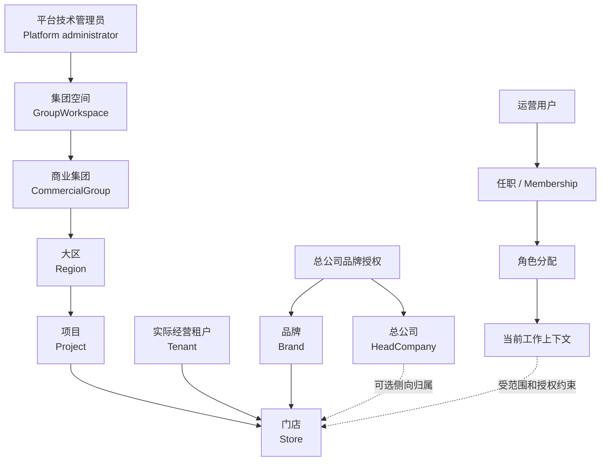

# catering-v2s 跨代业务语料库草稿

## 0. 状态、目的与硬边界

这是一个供 Dexter 与 Claude 共同审阅的**业务语言草稿**。它从 `requirement-doc/design-v6`、`catering-server-v4`、`catering-all-v1` 和 `catering-all-v2` 的文档中恢复同一业务事实的不同表述，目的是先统一“人、对象、关系、用户任务”再继续任何 R3 设计。

它不是实现规格、不是 API/数据库模型、不是对任一旧仓实现的背书，也不授予 R3/W1 implementation、动态运行、数据库或 Git 写入。

在 Dexter 与 Claude 明确确认前：

- 不把本文件任何条目写入 `project-memory/`；
- 不把任何历史路径、接口、数据表、对象名或旧实现行为当作 v2s 当前真相；
- R3 的 `R3-J01` “按已知 workspaceKey 核验登记状态”候选无业务来源，保持无效，不能作为 Journey、页面或 contract 的输入；
- 未确认的冲突必须保留为冲突，不能由 Codex 用技术实现便利性裁决。

## 1. 证据取法与优先级（草案）

| 层级 | 用途 | 不可做的推论 |
| --- | --- | --- |
| all-v2 现行裁决、业务语言标准、现行模块规范与 30 场景基线 | 当前产品裁决、面向用户的术语、已批准的页面任务与跨域关系；07-21 术语裁决覆盖 07-15 基线中相反的界面用语 | 文件自身不授权实现；跨层冲突只能登记给 Dexter，不能由 Codex 选边 |
| V6 冻结术语表、领域 owner 文档、跨域契约 | 业务语言主来源、业务对象边界与禁止混同 | 不能直接决定 v2s 的部署、API 版本或实现路径；与上层冲突时保持待裁决 |
| v4 / all-v1 领域设计与 active decision | 交叉印证“为什么改名/为什么否决”、暴露演进、漂移和被否决的旧模型 | 不能把旧接口、路由、生命周期、权限细节或代码状态带入 v2s，也不作现行真相 |
| 源码、契约、测试 | 仅可核对某代实现过什么 | 不可从实现反推产品语义 |

本草案的“共识”表示多份来源对同一事实有一致或可解释的一致表述；它不等于产品接受。最终真相仍以 Dexter/Claude 对本草案的明确审阅结论为准。

## 2. 先给业务用户看的总图（待确认）



这张图表达的是业务边界，不是数据库 ER 图：

- “集团空间”解决的是平台隔离和运营后台入口；
- “商业集团—大区—项目”解决的是经营组织坐标；
- 门店是发生经营的实例，依赖项目、实际经营租户和品牌；
- 总公司是品牌侧管理与可见性主体，不是租户的别名，也不是组织树父节点；
- 运营用户的“是谁”“在哪任职”“拥有什么角色”“此刻以什么工作上下文做事”是不同事实。

## 3. 语料库应该记录什么（条目格式草案）

业务语料库不是“中英文字典”。每个概念都必须能回答：它为什么存在、谁会在什么任务里关心它、它与谁不同、何时成立或失效、哪些动作可以改变它，以及什么看似相近但绝不能从它推导出来。

### 3.1 对象词条模板

```text
TERM_ID=<稳定业务词条 ID，例如 BUSINESS.GROUP_WORKSPACE>
中文主叫法=<唯一推荐的业务名称>
英文主叫法=<唯一推荐的英文业务名称>
历史别名=<只用于识别旧资料，不能生成新命名>
禁用词=<会造成业务混同的词>

一句话定义=<业务用户也能理解的定义>
存在目的=<它解决的业务问题>
业务边界=<它拥有的事实、它不拥有的事实>
身份与编码=<人能看见的编码、内部稳定 ID、各自用途；不把字段名当业务定义>
生命周期=<创建前提、合法状态、关键状态转换、终止/保留规则；未知则明确未知>

上游关系=<由什么事实建立；是否可缺省；基数是否已确认>
下游关系=<它允许、阻断或影响什么；不得把影响误写为所有权>
不可推导=<不能从本对象自动得到的对象、权限、状态或业务结果>
业务动作=<谁在什么条件下可以创建/查看/维护/停用/恢复；未裁决动作标注待定>
用户任务=<真实用户的起点、意图、成功结果、readback；不是接口清单>
界面语言=<菜单、标题、字段、空态、错误与帮助文案可用词；禁止暴露的技术词>
反例=<最容易犯的误解，以及为什么错>

跨代映射=<V6 / v4 / v1 / v2 的名字、语义是否等价、差异与弃用原因>
证据=<来源路径、标题/行、SHA-256、证据类别>
置信度=<CONFIRMED / PARTIALLY_CONFIRMED / CONFLICT / UNVERIFIED>
待裁决=<只列会改变产品语义、范围或实现前提的问题>
```

### 3.2 关系、动作、状态和角色也必须成为独立词条

仅给名词建档仍不足以防止设计漂移。本草案建议正式语料库至少再有四类记录：

| 词条种类 | 必填内容 | 示例 | 防止的错误 |
| --- | --- | --- | --- |
| 关系词条 | 主体、宾体、关系动词、方向、已确认基数、建立/解除条件、不可反推项 | “门店由实际经营租户经营”；“门店可选关联总公司” | 把品牌授权误写成总公司可见所有门店；把总公司塞进组织树 |
| 动作词条 | actor、前提、输入来源、可见结果、owner readback、失败和恢复、明确非目标 | “初始化商业集团” | 把创建集团空间偷换成自动建集团、账号或角色 |
| 状态词条 | 对象、状态含义、允许转换、状态影响范围、不得借用的其他状态 | “集团空间已停用” | 把空间停用说成门店未营业，或把合同资格说成组织状态 |
| 角色/上下文词条 | 人是谁、任职在哪里、角色授予什么、页面/动作/数据范围的区别、切换行为 | “当前工作上下文” | 把登录成功等同有权限；把页面可见等同可写 |

### 3.3 完整示例：集团空间（待审阅，不是最终结论）

```text
TERM_ID=BUSINESS.GROUP_WORKSPACE
中文主叫法=集团空间
英文主叫法=GroupWorkspace
历史别名=workspace、Group Workspace、group_workspace；跨代技术写法统一为 groupWorkspaceKey；现行 all-v2 的 workspaceKey 为历史别名，物化契约时统一迁移
禁用词=租户、商业集团、商户、门店、Sandbox

一句话定义=平台为一组彼此隔离的餐饮经营事实建立的顶层空间，也是运营后台识别目标空间的入口。
存在目的=让平台能够把不同集团的组织、门店、账号、权限与经营事实隔离开，并让运营人员进入正确的运营后台。
业务边界=它承载隔离与入口事实；不承载商业集团、大区、项目、门店、品牌、租户、首个运营用户或角色的自动创建。
身份与编码=集团空间编码是给人和外部入口使用的稳定编码；内部稳定 ID 供事实关联使用。技术拼写统一为 groupWorkspaceKey，现行 all-v2 的 workspaceKey 是历史别名；本轮只定业务命名，拼写迁移随 R3 contract 物化另批处理。
生命周期=创建时可以为空，空态是合法长期状态；之后可由平台显式初始化商业集团：每个集团空间至多一个，初始化成功后恰有一个，重复初始化必须拒绝（`COMMERCIAL_GROUP_ALREADY_INITIALIZED`）。

上游关系=由平台技术管理员创建；创建不要求已有商业集团。
下游关系=可作为商业集团初始化、运营登录入口和空间内事实隔离的前提；不因空间存在而自动产生组织、账号、角色或门店。
不可推导=不能从集团空间名称或集团空间编码推出商业集团名称/编码；不能因选中集团空间就成为该空间运营用户；不能据此获得任何业务写权限。
业务动作=平台技术管理员可在已批准的“集团空间管理”任务中创建、查看、维护展示资料和管理状态；具体动作及授权仍需以被批准 Journey 为准。
用户任务=平台技术管理员维护集团空间这一平台隔离/入口事实；不是“凭一个编码查登记状态”的临时查询页。
界面语言=“集团空间”“集团空间编码”“运营管理后台标题名称”；避免把内部 workspaceId、schema、tenant 或诊断术语展示给用户。
反例=“集团空间就是商业集团”错误，因为商业集团需要单独录入集团编码/名称并显式初始化；“集团空间就是租户”错误，因为 Tenant 是门店的实际经营主体。

跨代映射=V6 的 GroupWorkspace 是主术语；all-v2 把 UI 文案固定为“集团空间”；v4 与 all-v1 共同佐证其隔离根语义，但旧对象名、路由和生命周期不能直接继承。
证据=V6 术语表/平台隔离域；all-v2 四域 Atlas、D01-S02/D01-S05；v4/v1 隔离与 IAM 设计，精确 hash 见 §9。
置信度=CONFIRMED（2026-07-24 Dexter grill 已共识）
待裁决=初始化后的解绑、替换或重建行为在四代材料中均未定义；不得默认永久绑定，也不得在设计中擅自实现。
```

### 3.4 V6 全量覆盖地图（不是只覆盖当前 v2 四域）

“全量”以 V6 领域地图和统一术语表的 20 个 canonical source domain 为最低分母，并补充打印规则、到店服务和产品入口/Actor 等横向语料。每一行最终都要形成对象、关系、动作、状态、角色、禁用词和证据，而不是只有一句领域简介。

| 分册 | V6 领域 | 计划恢复的核心业务语料 | 当前提取状态 |
| --- | --- | --- | --- |
| A | 01 平台运行与隔离 | 集团空间、空间编码、平台技术管理员、隔离、平台入口 | 基础词条已起草 |
| A | 02 组织与经营主体 | 商业集团、大区、项目、门店、租户、总公司、品牌、组织范围 | 基础词条已起草 |
| B | 03 商业关系与合同 | 合同、责任方、项目分期、经营资格、门店合同关系 | 第一层档案已提取 |
| C | 04 账号与权限契约 | 账号、Principal、运营用户、任职、角色、页面准入、能力、数据范围、工作上下文、邀请 | 基础词条已起草 |
| D | 05 商品目录 | 商品目录、商品壳、目录条目、规格、选项、物料/BOM、计量与用途能力 | 第一层档案已提取 |
| D | 06 销售集合与发布 | 销售集合、销售项、菜单、销售发布、入口能力、可售展示 | 第一层档案已提取 |
| D | 07 销售库存与物料扣减 | 销售库存、物料、扣减、沽清、可售与库存提示 | 第一层档案已提取 |
| E | 08 顾客与会员身份 | 顾客、身份系统、身份凭据、身份绑定、公域/私域、会员资格 | 第一层档案已提取 |
| F | 09 权益账本 | 数值账户、卡券/次卡/购物卡实例、余额、流水、过期、转赠、迁移 | 第一层档案已提取 |
| G | 10 营销权益与忠诚度 | 权益模板、活动、忠诚度、规则结果、权益动作计划、叠加/排他 | 第一层档案已提取 |
| H | 11 交易订单 | 购物车、主订单、门店子订单、商品行、订单来源、金额与状态 | 第一层档案已提取 |
| I | 12 支付中心 | 支付方式、支付执行、支付核销行、支付结果构成、退款、支付未知 | 第一层档案已提取 |
| J | 13 履约与生产 | 履约单、生产、工位、KDS、厨打、叫号、出餐、异常 | 第一层档案已提取 |
| K | 14 结算对账与外部财务输出 | 结算、对账、财务输出、发票、ERP、责任与差异解释 | 第一层档案已提取 |
| L | 15 经营渠道 | 经营渠道、门店渠道绑定、渠道配置、渠道入口、门店渠道状态 | 第一层档案已提取 |
| M | 16 外部协作与防腐 | 外部系统、外部对象映射、集成能力、同步、迁移、外部强一致动作 | 第一层档案已提取 |
| N | 17 终端数据平面 | 终端投影、下发、ACK、应用状态、TDP 诊断 | 第一层档案已提取 |
| O | 18 终端控制平面 | 终端、激活、绑定、版本、能力、远程控制、控制审计 | 第一层档案已提取 |
| P | 19 经营分析 | 经营指标、分析口径、异常解释、报告、可见性 | 第一层档案已提取 |
| Q | 20 运营治理 | 巡店、整改、风险、治理任务、运营闭环 | 第一层档案已提取 |
| R | 21 打印规则 | 打印规则、打印任务、打印设备/外设、业务打印边界 | 第一层档案已提取 |
| S | 22 到店服务 | 到店服务、排队、预点餐、预约、保桌等服务入口与生命周期 | 第一层档案已提取 |
| T | 横向产品语料 | Actor、产品入口、用户任务、UI 术语、错误/恢复、跨域事实与禁用词 | 基础框架已起草 |

每一个分册都必须在正式推广前完成“业务对象档案 + 关系词条 + 动作词条 + 状态词条 + Actor/上下文词条”五类内容；没有写完的领域只能标 `UNEXTRACTED`，不能被误读为“不在 V6 范围”。

### 3.5 V6 分域业务档案（第一层提取，仍待跨代核验）

此处不是把二十二份设计文档缩成技术名词清单；每档先固定“业务上要解决什么、谁拥有事实、什么不能因相邻事实而成立”。词条的更细状态机、动作前提和 UI 文案将按 §3.1–3.2 的格式继续补齐。

#### 01 平台运行与隔离：让独立经营集团在同一平台中互不混同

- **对象与目的：** `GroupWorkspace`、稳定的对外编码、平台技术管理员和空间级运行治理，回答平台如何识别一组隔离的餐饮经营事实并让运营人员进入正确后台。
- **关键边界：** 集团空间不是商业集团、门店、租户、品牌或组织树节点；创建空间不会自动创建组织、账号、角色或门店。内部稳定 ID 与给人/URL 使用的编码必须区分；技术拼写固定为 `groupWorkspaceKey`，现行 `workspaceKey` 仅为待迁移历史别名。
- **状态与禁用：** 该域只固定隔离和入口语义；空间状态不能借作门店营业、合同资格或人员权限状态，`tenantId`/Sandbox 不能替代集团空间。

#### 02 组织与经营主体：谁在何项目、以何品牌经营哪间门店

- **对象与目的：** `CommercialGroup`、`Region`、`Project`、`Store`、`Tenant`、`HeadCompany`、`Brand` 与总公司品牌授权，描述商场运营方的固定三层组织树及门店经营主体。
- **关键边界：** 组织/组织树只指“商业集团→大区→项目”三层；大区单级，项目分期只是项目属性，项目不能再建组织下级。商业集团不是集团空间；门店由实际经营租户经营，可按规则关联总公司与品牌，但 Store、HeadCompany 不会因此成为组织树节点。Tenant、HeadCompany、Brand 三者绝不能以 `TenantCompany/companyType` 混合模型代替。
- **状态与未决：** 大区层级已由 Dexter 2026-07-24 grill 裁决为单级；门店状态轴与集团空间/商业集团解绑、替换或重建仍按 §6 保留为待裁决。

#### 04 账号与权限契约：谁能以什么身份、在什么范围内做什么

- **对象与目的：** `Account`、`Principal`、运营用户、`UserNodeMembership`、`UserNodeRoleAssignment`、页面准入、能力、数据范围、`WorkContext` 与邀请，分离认证、任职、授权和当前工作身份。
- **关键边界：** 登录成功不是有权限；账号不是任职，任职不是角色，页面可见不是写权限，URL 参数不是工作上下文。平台技术管理员与运营用户是不同用户系统和后台消费面，不能共用 session 或 CRUD 事实。
- **状态与未决：** 邀请、接受、凭据准备与角色变化形成独立生命周期；v4 的直接改角色与 all-v2 的邀请制冲突，物理账号是否跨集团空间复用亦未裁决。

#### 05 商品目录：可复用的商品事实，不是菜单或库存

- **对象与目的：** `ProductCatalog` 容纳目录，`CatalogItem` 是统一商品根，`ProductSku`、选项、组合品、标签/属性与标识符描述商品本身；它回答“卖的是什么”，不回答此刻是否已上架、可卖或有货。
- **关键边界：** `SELLABLE` 不是已发布、可售或有库存；称重属于 `measureMode`，物料角色属于 `materialRole`，不应被伪装成不同商品种类。门店从总部复制目录后是本地快照，不能偷换为强继承或自动合并。
- **状态与禁用：** 生命周期 `DRAFT/ACTIVE/INACTIVE/ARCHIVED` 与治理状态分离；禁用 `WEIGHED_ITEM`、`BENEFIT_PRODUCT`、`OPTION_ITEM`、`MATERIAL_ITEM` 作为 `itemKind`。

#### 06 销售集合与发布：把商品组织为某入口可消费的销售视图

- **对象与目的：** `SalesCollection`、版本、`SalesSection`、`SalesItem`、挂牌价、销售能力、可售控制、下单约束、`SalesCollectionActivation` 与 `SalesPublication`，共同回答“某门店渠道在某时刻展示/销售什么”。
- **关键边界：** 菜单落点是 `businessChannelBindingRef`，项目级 `businessChannelRef` 只能作分类冗余；发布成功只说明不可变销售快照已形成，不能推出 TDP ACK、POS 展示或外部平台同步成功。动态沽清通过独立可售控制进入，不改写菜单事实。
- **状态与禁用：** 销售集合、版本、发布分别有独立生命周期；禁用 `SalesSurface*`、`SalesCollectionAssignment` 以及“多菜单自动 merge”模型。

#### 07 销售库存与物料扣减：门店轻库存和可解释的扣减事实

- **对象与目的：** `StockTarget`、`StockBalance`、不可变 `StockChangeLedger`、`ProductBom`、扣减/恢复计划与执行、`SalesStockView`。它只处理服务销售的轻库存，不建立采购、仓储或供应链系统。
- **关键边界：** 账本才是库存真相；库存提示不能直接改菜单、订单或可售，必须由 06 域显式转成可售控制。无 BOM 不应阻断销售，选项值也不单独建立库存目标。
- **状态与禁用：** 余额可为 `IN_STOCK/LOW_STOCK/OUT_OF_STOCK/NEGATIVE/UNKNOWN`；禁入仓库、批次、采购、调拨、预占和 `SupplyChainItem` 等重供应链概念。

#### 08 顾客与会员身份：识别顾客和资格，不管理资产或优惠

- **对象与目的：** `CustomerProfile`、`ConsumerIdentitySystem`、`CustomerIdentity`、`IdentityCredential`、`IdentityBinding`、`MembershipProgram/Level/Account`、同意、标签与解析快照，回答“这位顾客是谁、用什么识别、当前有什么会员资格”。
- **关键边界：** 凭证不是会员账户；身份绑定可使交易看到多个独立身份，不能静默合并为全局顾客。余额、券、次数、储值、积分均不属于本域；营销、订单、支付不得直查本域/外部 CRM 原始表。
- **状态与禁用：** 顾客、身份、会员关系各有 `ACTIVE/FROZEN/MERGED/...` 生命周期；消费侧统一用“顾客”，禁把 `LoyaltySystem` 另立实体。

#### 09 权益账本：权益资产、占用和不可变流水的真相层

- **对象与目的：** `BenefitAssetSystem`、`LedgerHolder`、账户模板/账户、来源批次、`BenefitLedgerEntry`、`BenefitReservation`、权益实例、转赠、迁移和可见性快照，管理积分、储值、券、次卡等内部资产。
- **关键边界：** 身份绑定可带来可见性，不合并资产；占用不等于扣减，扣减不等于支付成功，扣回冻结不等于退款完成。规则为何发放/可用属 10 域，支付执行属 12 域，订单退款案件属 11 域。
- **状态与禁用：** 账户、实例、占用、扣回冻结分别演进；券/卡/次数不是营销活动自有状态，`BenefitGrantTrace` 不能绕开计划行直接入账。

#### 10 营销权益与忠诚度：规则计算与动作计划，不直接改别域事实

- **对象与目的：** `BenefitTemplate`、排他标签、`PromotionCampaign`、后置规则、忠诚度规则、评估记录、`BenefitActionPlan/Line`。活动只是模板的组织者，模板才是计算单元。
- **关键边界：** 候选、可用、已选、已应用、已支付、已核销、已履约、已入账是不同事实。价格影响写为 11 域的 `PriceBenefitLine`；支付抵扣写为 12 域的 `PaymentSettlementLine`；本域只能用冻结计划行请求目标域执行。
- **状态与禁用：** 模板、活动、计划行各有独立状态；排他以 exclusion tags 为主模型，`LoyaltyActionPlanView` 只是解释视图，不可派发或持有执行状态。

#### 11 交易订单：结账和历史冻结的主权事实

- **对象与目的：** `MasterOrder`、`StoreSubOrder`、`OrderItem`、金额快照/调整、`PriceBenefitLine`、支付核销引用、两类分摊、退货/改单/异常支付案件、订单来源快照与预点餐草稿。
- **关键边界：** 一次 checkout 在支付前只有一个主订单；子订单确认后只能减少，支付后加菜必须新开主订单。订单冻结销售、身份、权益、合同货号、来源等历史；退款读原分摊而非按现行规则重算。合单支付批次不是订单。
- **状态与禁用：** 退货、改单、合单、异常支付有各自状态；`PreOrderDraft` 不是订单，不能触发支付、履约、库存或结算。

#### 12 支付中心：是否接受、怎么路由、实际执行和外部结果

- **对象与目的：** 支付方式、收单机构/产品、接受配置、场景收单配置、路由策略、`PaymentSettlementPlanSnapshot`、`PaymentSettlementLine`、核销、结果构成、退款、通道账单和支付对账状态。
- **关键边界：** acceptance 回答“能不能用”，routing 回答“钱走哪个收单产品/商户号”，二者都不说明最终收入归属。成功支付行参与订单覆盖，商品行分摊仍由订单域拥有；自建二维码/手工记账不等于真实通道到账。
- **状态与禁用：** 原支付行和结果构成不可改，撤销/退款必须产生反向事实；`PaymentPlan`、`PaymentExecutionLine` 只作旧兼容名，支付机构优惠不得误叫营销券。

#### 14 结算对账与外部财务输出：对经营事实作财务解释，不取代财务系统

- **对象与目的：** `SettlementParty`、协议快照、结算/退款结算行、递延释放、结算周期/账单、对账匹配/差异/调整、出账候选、开票协作与 ERP/会计输出快照。
- **关键边界：** 只消费各域发布的结算输入和外部标准化账单，不得直读 owner 内部表或为对平账回写订单、支付、权益、履约。支付成功、对账匹配、账单确认、出账候选均不等于已结算、到账或开票。
- **状态与禁用：** 已出账/锁账不能静默改写，只能在后续周期冲正、调整或补差；`PayoutInstruction` 是候选，不是实际划拨，发票/总账/税务仍属外部主权。

#### 15 经营渠道：项目支持什么入口，门店在哪里部署

- **对象与目的：** `ChannelKindDefinition`、项目级 `BusinessChannel`、项目级 provider 配置和门店级 `BusinessChannelBinding`，表达堂食、自助、外卖等经营入口及接入方式。
- **关键边界：** 渠道启用/门店绑定启用只代表入口或部署可用，不推出合同、支付、菜单、履约、同步成功；订单要自带 `OrderSourceSnapshot`。团购权益来源不是订单入口。
- **状态与禁用：** 项目渠道与门店绑定有独立状态；禁用 `BusinessChannelType`、`BusinessChannelActivation`、`StoreBusinessChannelActivation` 等旧模型。

#### 17 终端数据平面：把已有业务投影可靠送给终端，不拥有业务真相

- **对象与目的：** topic 定义、投影、源事件幂等账、游标、快照传输、终端可见性、会话/订阅与诊断快照，服务于已激活终端取得当前工作集。
- **关键边界：** ACK 仅确认终端数据平面游标，不能推出业务解析、页面刷新、硬件执行或业务成功；投影删除/tombstone 只影响终端可见性，不是源事实删除。
- **状态与禁用：** scope 仅限集团空间、商业集团、大区、项目、门店、终端组、终端；不可将 Brand/Tenant/HeadCompany 伪作 TDP 节点，不得轮询回源或把投影当写接口。

#### 18 终端控制平面：终端资产、激活、能力和健康的控制事实

- **对象与目的：** `TerminalInstance`、绑定、终端凭证、类型/profile/template/capability、项目终端配置、外设/打印机配置、健康、控制任务、日志与升级发布，回答“终端是谁、能否接入、能做什么、是否健康”。
- **关键边界：** POS/KDS/叫号机等主机设备才可激活；打印机、扫码枪、秤、支付盒只是外设配置。激活不替代员工授权，控制任务成功不替代订单、支付、履约或打印业务成功。
- **状态与禁用：** 终端和凭证有独立生命周期；`ProjectTerminalTypeGrant` 仅迁移兼容，目标概念为 `ProjectTerminalConfig`。

#### 21 打印规则：决定何时、按何模板打印，不等于设备下发或业务成功

- **对象与目的：** `PrintConfigLibrary`、场景治理、`PrintTemplate`、资源 manifest、`PrintRule`、门店有效打印配置快照，管理业务打印规则和模板。
- **关键边界：** 规则不得绑定具体打印机/IP/SN 或 `TerminalPrinterConfig`；打印机不是终端或 TDP 目标，也不能用 `command_outbox` 伪装业务打印。`failurePolicy` 只是本地处置策略，不拥有业务失败事实。
- **状态与禁用：** 同门店同打印场景最终仅一条有效规则，可多纸型模板；打印结果回源业务 owner、遥测或治理。

#### 22 到店服务：门店现场服务规则和运行会话，不接管交易事实

- **对象与目的：** `StoreServiceModel`、`StoreServiceFlow`、空间/身份/通知/交接/生产启动策略、区域/桌台/取餐点/自助码、`TableVisitSession` 与 `ScanEntrySession`，管理堂食等现场服务规则与会话。
- **关键边界：** 配置发布不能改写运行历史；`TableVisitSession` 可关联多订单但不拥有金额、商品行、支付、退款或优惠。生产启动是多个 gate 的组合，取餐/叫号/已取餐仍属履约。
- **状态与禁用：** 服务模型、流程各有发布/启停状态；`DiningSession` 是历史/UI 别名，禁止把“桌码点餐堂食”混为渠道枚举。17 域遗留的 `ScanEntryDefinition` 与本域废止结论冲突，登记为源文档漂移，不能自行选一边当正式模型。

#### 03 商业关系与合同：门店凭什么经营、应冻结哪份责任依据

- **对象与目的：** 项目管理/业主关系与分期、`StoreLeaseContract`、铺位线、合同货号候选、营销参与协议、可接受权益类型、商业责任规则与责任快照，回答门店经营资格以及订单、核销、结算的责任依据。
- **关键边界：** 项目管理方、业主方、业主分期是商业关系，不是组织树；一间门店可有多份合同，换经营者必须新建门店。合同货号只是候选，不能挂回商品目录或自动成为门店当前货号；合同有效更不能推导可以收款、退款或接单。
- **状态与未决：** 合同资格由 `valid + startAt/endAt` 表达，预生效只允许准备动作；`AUTO_SYNC` 与人工维护互斥。货号候选命名、权益字典 owner 与预生效可做哪些准备动作仍待产品决定。

#### 13 履约与生产：现场实际要做什么、交给谁做、发生了什么

- **对象与目的：** 核心链为 `StoreSubOrder → FulfillmentLine → WorkUnit → FulfillmentActionLine`，配合生产计划/执行快照和轻量异常，服务后厨、KDS、打包、叫号、交接、骑手与现场运营。
- **关键边界：** `WorkUnit` 不是设备命令、KDS 消息或外部任务；TDP ACK、KDS ACK、支付完成、外部已接单均不等于履约完成。进度摘要只能由追加的动作线推导，纠错也要追加反向/修正事实；规则变化不得改写旧单。
- **状态与禁用：** 已废弃独立 `FulfillmentOrder`、`PickupCall`、`HandoffTask`、`DeliveryTask`、独立 gate 等重模型；服务/次卡履约 owner、库存扣减默认时点、外部状态映射与终端契约仍未定。

#### 16 外部协作与防腐：把外部世界翻译成可被业务域接受的输入

- **对象与目的：** 外部系统、连接器、凭据/授权、协作配置、对象映射、入站 raw/标准化载荷/处理案件、出站任务/尝试、回调/账单、游标、幂等记录、翻译规则与诊断审计。
- **关键边界：** raw、回调、出站任务和外部成功都不是内部业务事实，目标 owner 可拒绝它们；授权有效不等于渠道启用，映射只表示身份对应，不能承载价格、库存、权益或结算规则。`IntegrationManifestRef` 是协议能力清单，不是经营入口或外部实例。
- **状态与禁用：** 外部系统、连接器、授权、入站、出站、游标都各有生命周期，出站显式保留 `UNKNOWN`、重试和人工接管；禁新设 `ExternalBenefitSystem`，`ExternalIntegration` 只作历史兼容摘要。

#### 19 经营分析：解释数字、口径和差异，不重写经营事实

- **对象与目的：** 指标定义、分析对象/时间范围、数据集、指标快照、报表定义/发布快照、差异解释、目标、预警、发现、诊断、建议与管理简报，服务经营者、财务分析和运营复盘。
- **关键边界：** 只消费 owner 发布的快照、水位和证据，不能直查源表或回写源事实；报表口径不是业务事实，指标差异不是事实错误，分析发现不是治理案件，建议不是命令，AI 解释不是证据。
- **状态与禁用：** 定义版本化，数据集标记 watermark/schema/滞后，发布报告不可变；本域不是数仓、任意 SQL BI、AI 训练平台、总账或结算主账。

#### 20 运营治理：把经营异常转为可分派、可验证的治理闭环

- **对象与目的：** `GovernanceSignal → GovernanceCase → GovernanceTask`，外加审批、补偿、巡店、整改、SLA、升级、审计与诊断，服务项目运营、店长、审批人、督导、客服、财务与技术支持。
- **关键边界：** 信号不是案件，案件不是源事实；审批通过不是业务成功，补偿任务不是补偿执行，整改提交不是整改通过，人工确认也不是外部强一致成功。需改变源事实时只能发 owner command request，由源域执行并回报。
- **状态与禁用：** 信号可去重/忽略/过期/立案，案件和任务各有处理/验证/关闭/升级状态；本域不是万能人工改数后台、通用 OA/审批、客服 CRM、法务、设施、HR、风控或缺陷系统。

#### 横向不变量：同一业务事实只能有一个 owner，历史必须可回放

- 任何非 owner 只能引用 `Ref`、消费 `Snapshot/Event` 或发起 `Command`，不能直拉源表、拼源事实或越权修复。
- 可配置的门店类型、流程、营销、履约、审批等一旦进入订单、支付、履约、结算、分析或治理，必须冻结当时策略与展示语义，后续配置只影响未来业务。
- `Terminal`（POS/KDS 等业务终端）、`Device/Peripheral`（打印机/秤/扫码枪等外设）、`Station`（档口/工作站）必须严格区分；目标后台只有 `platform-admin` 与 `catering-operations`，旧 `mall-admin`、`tenant-admin` 只可出现在历史/迁移语境。

## 4. 高置信业务词条（跨代一致，仍待正式接受）

| 中文主叫法 | 英文 / 技术名 | 对业务的解释 | 明确不是什么 | 主要证据 |
| --- | --- | --- | --- | --- |
| 集团空间 | `GroupWorkspace` | 平台用于隔离一组业务事实、识别运营入口的最高空间。可先创建空空间，再显式初始化商业集团。 | 不是商业集团，不是门店、租户、品牌或组织树节点。 | V6 平台隔离域；all-v2 D01 基线；v4/v1 一致。 |
| 集团空间编码 | `groupWorkspaceKey`；`workspaceKey` 为历史别名 | 集团空间对外稳定、可交给运营人员使用的识别码。运营管理后台全部路由的第一段携带它（登录、公开邀请、业务页）；运维管理后台 URL 不携带它，选定集团空间是端内会话上下文。 | 不是商业集团编码，不应由名称替代，也不等于 `tenantId`；URL 中的编码只定位空间，不构成授权事实，不得回退默认空间或由显示名反查。 | **已裁决（Dexter grill 2026-07-25）**；v4 route 实况；all-v2 routing decision；技术迁移另批。 |
| 商业集团 | `CommercialGroup` | 商场运营方组织树的根；组织主干固定为“商业集团→大区→项目”。 | 不是集团空间；创建集团空间不会自动产生它。 | **Dexter grill 裁决 2026-07-24**；all-v2 `organization-hierarchy.md` §4（行 29）；V6 组织域。 |
| 大区 | `Region` | 商业集团下的单级管理、统计和授权组织坐标。 | 不是项目、门店、租户或泛化“数据范围”；不再支持多级大区。 | **Dexter grill 裁决 2026-07-24**；all-v2 `organization-hierarchy.md` §4（行 29）；V6 多级大区为未采纳历史设计。 |
| 项目 | `Project` | 购物中心项目等经营坐标；门店、经营入口和多项经营事实以它为上下文。项目分期是项目聚合内的属性，不是组织节点。 | 不是项目管理方、业主法人，也不应以 `Mall` 作为目标模型名；项目之下不能再建组织下级。 | **Dexter grill 裁决 2026-07-24**；all-v2 `organization-hierarchy.md` §3–4（行 25、29）。 |
| 门店 | `Store` | 在项目（购物中心/商场）里开店的业务叫法：由实际经营租户以某品牌经营的门店实例；可进入授权和工作范围，但不等于组织树节点。它可对应商场 ERP 中的一条外部记录，经外部编码/上报协作，但本系统不镜像该 ERP 主数据。其“已启用／已停用”是主数据候选状态：决定能否作为新业务操作候选。 | 不是合同、铺位、外部门店，也不是“正在营业”、合同有效性、经营资格、订单或 POS 可用性本身。 | **已共识（Dexter grill 2026-07-25）**；V6 组织域 §3.2、§4.11；all-v2 `store-management.md` §4。 |
| 实际经营租户 | `Tenant` / `operatingTenantRef` | 实际经营门店的业务主体，以公司或个体工商户形式存在，承载统一社会信用代码、注册地等公司属性。每个门店必须且只能引用一个实际经营租户；租户变更时必须新建门店，不能改绑既有门店。 | 不同于店铺运营方（用户分类，指人）、总公司（品牌侧管理主体）和品牌（名册条目）；不是 SaaS 隔离租户，不是集团空间；不得以“商户”代称。 | **已共识 / CONFIRMED（Dexter grill 2026-07-24）**；V6 02 域 §4.5/§4.11（行 291–326、457、1215–1217）；术语表 §4（行 90–103）；v4 `tenant_registry`；all-v2 `business-entity-management.md`、`store-management.md`。 |
| 总公司 | `HeadCompany` | 品牌侧管理与可见性主体，可被门店可选关联；关联时要符合该总公司的品牌授权。**职责仅有两项（Dexter grill 裁决 2026-07-24）**：发布商品信息（品牌侧商品/资料模板，对应未来商品目录域的总部库）及查看门店经营结果（未来分析/报表类能力）。它仍是 IAM 访问节点，保留总公司用户管理。 | 不干涉门店经营；不是实际经营租户、品牌或组织树节点；不凭品牌授权推导门店可见范围，不进入门店基础资料页或写入门店事实。 | **Dexter grill 裁决 2026-07-24**；V6 组织域不变量 10、24–25（行 1216、1230–1231、1255–1256）；all-v2 D02-S07（行 16、54、76）。 |
| 品牌 | `Brand` | 商业集团内唯一的餐饮品牌名册条目；门店创建时锁定一个品牌。同一品牌可由不同实际经营租户经营，也可授权给多个总公司。 | 不是商业集团的展示品牌（如“华润万象生活”）；不是总公司、实际经营租户或门店。 | **已共识（Dexter grill 2026-07-25）**；V6 术语表 §13（行 237–244）；all-v2 `business-entity-management.md` §1/§4、`store-management.md` §4。 |
| 总公司品牌授权 | `HeadCompanyBrandAuthorization` | 一个总公司具备维护某品牌侧资料（模板／商品信息）资格的明确授权，也是门店可选关联总公司的前提之一。 | 不是门店范围推导器：不产生该品牌全部门店可见范围、门店资料写权限或总公司与门店的组织上下级关系；门店范围只来自 `Store.headCompanyRef`。 | **已共识（Dexter grill 2026-07-25）**；V6 术语表 §13（行 239–244）；all-v2 `business-entity-management.md` §1/§4、`store-management.md` §4。 |
| 系统服务提供者（运维管理员） | `PlatformAdminUser` / `PLATFORM_SUPER_ADMIN` | 三类用户之一；使用运维管理后台治理集团空间与平台规则。 | 不是某个集团空间的运营用户；不能与运营用户共用 session、CRUD 或角色事实。 | **Dexter grill 裁决 2026-07-24**；V6 IAM/产品边界；all-v2 Q01-Q12 §2.1。 |
| 商场运营方 | 集团 / 大区 / 项目节点的运营用户 | 三类用户之一；在商场运营方的组织树节点上处理组织和经营管理任务。`商场管理方用户`只作为 Q01-Q12 历史别名。 | 不是系统服务提供者、店铺运营方、实际经营租户或顾客。 | **Dexter grill 裁决 2026-07-24**；all-v2 Q01-Q12 §2.2（行 77–81）为历史对照。 |
| 店铺运营方 | 门店节点的运营用户；可为“仅门店”或“门店+总公司” | 三类用户之一；以门店节点运营为基础，一部分还具有总公司这一独立 IAM 访问节点。`商户用户`只作为 Q01-Q12 历史别名；“商户”仍禁止用于指代实际经营租户。 | 不是实际经营租户、总公司实体本身或组织树节点。 | **Dexter grill 裁决 2026-07-24**；V6 组织域不变量 10、23–25（行 1216、1229–1231）。 |
| 运营用户 | 跨代技术对照：`Account` / `Principal` / `WorkspaceUser` | 商场运营方与店铺运营方中实际使用运营管理后台的**个人**；每人先在某一集团空间内使用后台。账号用于登录，关联唯一手机号，支持“登录名+密码”与“手机号验证码”两种登录。登录只证明认证，业务权限来自任职、角色和当前上下文。技术名之间的实体/契约映射仍为**待裁决**。 | 不是系统服务提供者、顾客、会员或“客户”；账号存在不等于能进入业务页或执行动作；不得据“同手机号不同集团空间可有不同账号”反推物理账号一定跨空间复用。 | **已共识（Dexter grill 2026-07-25）**；V6 IAM 域 §4.1；all-v2 `workspace-session-context.md` §3（两种登录）、`workspace-account-administration.md` §3–4；技术映射待裁决。 |
| 运营角色 | 跨代技术对照：`RoleTemplate` / `WorkspaceRole` / `RoleDefinition` | 可命名的岗位／工作权限定义，四要素为：归属节点（集团/大区/项目/总公司/门店之一）、可访问的界面（页面准入，代表只读功能面）、可操作的权限（动作能力，代表写功能面）、名称。 | 不是账号、具体任职、可视数据节点、HR 岗位或可配置范围表达式。页面准入不产生写权限；数据可见不产生页面准入。 | **已共识（Dexter grill 2026-07-25）**；结构参考 all-v2 `workspace-role-administration.md` §1/§4，页面语义见 `workspace-page-access.md` §1/§9；与 07-21“page grant 独立于运营角色”口径的变化登记于 §6。 |
| 运营角色任职（历史对照：任职） | 跨代技术对照：`UserNodeMembership` / `UserNodeRoleAssignment` / `RoleAssignment` / `roleAssignmentRef` | 某运营用户以某一运营角色服务于一个**具体节点**的事实；一个账号可有多个任职，在后台右上角的角色切换器中切换，切换即切换可进入页面与可执行权限。 | 不是账号本身，不等于运营角色、可视数据节点或集团空间切换；不能由任职推导任意数据范围。各代技术名之间映射仍为**待裁决**。 | **已共识（Dexter grill 2026-07-25）**；all-v2 四域裁决 §3.0（行 92–93）、`workspace-membership.md` §1/§4、`workspace-session-context.md` §3–5；V6 IAM 域。 |
| 可视数据节点 | 跨代技术对照：`selectedDataNode` / V6 `WorkContext` 的数据范围部分 | 与当前运营角色**分别选择**的功能页数据范围：只有需要范围的页面才要求选择；商品管理等门店操作先定到具体门店才能进行。选择按“大区→项目→门店”三级逐层级联；每页设计时必须声明所需最高节点级别或声明不需要。候选节点由角色归属节点固定推导，例如东北大区角色可选择该大区下项目和门店；不设可配置范围表达式。 | 不是运营角色、页面准入、动作能力、页面内普通筛选或 URL 参数；数据可见不产生页面准入。 | **已共识（Dexter grill 2026-07-25）**；all-v2 四域裁决 §3.0–§3.3、`workspace-page-access.md` §1/§9、`workspace-session-context.md` §3–6；技术映射待裁决。 |
| 当前运营上下文（技术对照） | V6 `WorkContext`；all-v2 session context | 已登录运营人员此刻选定的运营角色任职和可视数据节点，用于完成页面、动作和数据范围判断。业务界面必须分别显示“当前运营角色”与“可视数据节点”；旧“当前身份 / 查看范围”仅作历史对照。 | 不是登录凭证，不是 URL 中任意可伪造参数，也不能由前端猜选；不因页面、数据节点或动作任一维成立而推导其他维。 | **已共识（Dexter grill 2026-07-25）**；all-v2 四域裁决 §3.0–§3.4 与业务语言标准 §2；技术绑定待裁决。 |
| 商品 | `CatalogItem` | 可复用的“商品壳”，回答“卖的是什么”：名称、分类、标签、描述属性、SKU、点单选项、物料/BOM、识别码和制作提示。 | 不是菜单、销售项、价格、库存或已可售事实；`SELLABLE` 只是可被编入销售的用途能力，不是已发布或可售；称重是 `measureMode=WEIGHED`，不是商品种类。 | **已共识（Dexter grill 2026-07-25）**；V6 05 域；V6 术语表 §13。 |
| 商品目录 | `ProductCatalog` | 商品的容器；可为总公司品牌资料模板库或门店库。门店从总部复制后进入本地独立生命周期，不强继承、不同步合并回总部。 | 不是 `CatalogCategory`（商品管理分类），也不是 `SalesSection`（菜单展示分区）。 | **已共识（Dexter grill 2026-07-25）**；V6 05 域。 |
| 菜单／销售集合 | `SalesCollection` | 面向某一门店渠道绑定的销售视图：商品经销售项、版本、发布和渠道启用后，才成为该入口可售内容。 | 不是商品目录、库存、价格表或终端／外部平台同步成功。 | **已共识（Dexter grill 2026-07-25）**；V6 06 域；V6 术语表 §13。 |
| 门店轻库存 | `StockTarget` / `StockChangeLedger` / `SalesStockView` | 只管理门店范围的库存对象、真实余额、BOM 扣减/恢复、不可变库存流水和库存提示；库存对象按商品或 SKU，作用域固定到门店。流水是唯一真相，余额是由追加式流水重建的读模型。 | 不是仓库、批次、采购、供应商、调拨、入/出库、预占或完整供应链；不直接改菜单、订单或可售。库存提示须由销售集合域显式转成可售控制。 | **已共识 / CONFIRMED（Dexter grill 2026-07-25）**；V6 07 域 §4.1–§4.9；V6 06 域 §4.12；v4 `V016__sales_inventory_material_deduction.sql` 仅作历史交叉印证。 |

### 4.1 关系词条：门店—总公司可选关联

```text
RELATION_ID=BUSINESS.STORE_OPTIONAL_HEAD_COMPANY
STATUS=已裁决（Dexter grill 2026-07-24）
主体=门店（Store）
关系=可选关联总公司（HeadCompany）
基数=每个门店为 0..1 个总公司：因此店铺运营方存在“仅门店”与“门店+总公司”两种形态。
成立条件=选择总公司时，必须满足其对门店品牌的有效授权。
不可推导=品牌授权不等于总公司可见该品牌全部门店；总公司不是门店的管理上级，不干涉门店经营，也不获得门店基础资料、门店用户、角色或任何门店事实的写权限。
证据=Dexter grill 裁决 2026-07-24；V6 `02-组织与经营主体域.md` 不变量 10、23–25（行 1216、1229–1231、1255–1256）；all-v2 D02-S04/D02-S07 的既有边界。精确 SHA-256 见 §9。
```

### 4.2 属性词条：租户与总公司的法律形态

```text
TERM_ID=BUSINESS.LEGAL_PROFILE
STATUS=已裁决（Dexter grill 2026-07-24）
定义=租户与总公司同为公司或个体工商户形态，可承载法人相关属性；这些属性组成实体自身的 legalProfile。
边界=法人信息不是独立法人实体或法人名册；不得把法人属性直接当成合同责任、结算责任、开票资格、授权范围或业务裁决。
证据=Dexter grill 裁决 2026-07-24；V6 `02-组织与经营主体域.md` §4.4（行 261–289）和 §4.5（行 314–317）。精确 SHA-256 见 §9。
```

### 4.3 关系词条：门店租赁合同

```text
RELATION_ID=BUSINESS.STORE_LEASE_CONTRACT
STATUS=已裁决（Dexter grill 2026-07-24）
定义=租赁合同以门店为签署和资格落点，双方是实际经营租户（承租方）与项目分期所代表的业主方。
核心关系=门店 + 项目分期名称快照 + 门店实际经营租户，三者缺一不可。
边界=本系统不是合同系统；合同的完整业主方、责任与法务事实不回流为组织树、法人名册或门店主数据。
证据=Dexter grill 裁决 2026-07-24；V6 `03-商业关系与合同域.md` §1（行 17–30）、§4.4（行 241–272）、命令约束（行 766–771）。精确 SHA-256 见 §9。
```

### 4.4 业务含义词条：项目分期

```text
TERM_ID=BUSINESS.PROJECT_PHASE_NAME
STATUS=已裁决（Dexter grill 2026-07-24）
定义=项目分期代表业主方分界，例如一期对应一个业主、二期对应另一个业主。
本系统表达=项目只保留分期名称；分期是项目聚合内名称数组，不建立分期或业主方主数据。合同保存项目分期名称快照，项目分期改名或删除不回写历史合同。
历史处置=V6 03 域的 `ProjectOwnerPhase` 只作为上述业务含义与合同责任来源，不得在本系统落成主数据实体。
证据=Dexter grill 裁决 2026-07-24；all-v2 `organization-hierarchy.md` §4（行 29）；V6 `03-商业关系与合同域.md` §4.2（行 167–191）只作含义出处。精确 SHA-256 见 §9。
```

### 4.5 关系与上下文词条：运营用户、角色与可视数据节点

```text
TERM_ID=BUSINESS.OPERATIONS_ACCOUNT_AND_ACCESS_CONTEXT
STATUS=已共识（Dexter grill 2026-07-25；技术映射待裁决）
运营用户=个人，在某个集团空间内使用运营管理后台。
账号与认证=账号用于登录，关联唯一手机号；支持登录名+密码、手机号验证码两种登录。同一手机号在不同集团空间可对应不同账号；物理账号是否跨空间复用仍为 §6 待裁决，不能从前一句推出任一实现方式。
运营角色=可命名的岗位/工作权限定义，四要素是归属节点（集团/大区/项目/总公司/门店之一）、可访问的界面（页面准入、只读功能面）、可操作的权限（动作能力、写功能面）和名称。
运营角色任职=某人以某角色服务于某个具体节点的事实；一个账号可有多个任职，在后台右上角切换；切换即切换页面与权限。
可视数据节点=与当前运营角色分别选择，只限定功能页面内的数据范围；按大区→项目→门店三级级联。每个功能页面必须在设计时声明需要哪一级可视节点或不需要；可选范围只由角色归属节点固定推导，不设可配置范围表达式。
页面与能力=页面准入≈只读功能，动作能力≈写功能；数据可见不产生页面准入，页面准入不产生写权限。
技术边界=`Account`、`Principal`、`WorkspaceUser`、`RoleAssignment`、`UserNode*`、`WorkContext` 仅作为跨代技术称呼，业务文案一律使用本词条中的业务词；这些技术名之间的映射继续待裁决，留待 contract 物化时确定。
未来意图（非当前范围）=账号未来可能关联 LDAP（商场组织内）或商场原有商户服务平台账号，以减少门店/总公司人员记忆账号数；这只对应 V6 `ExternalIdentityBinding` 的问题空间，业务叫法与实现方式均待裁决，当前任何设计不得预置。
证据=Dexter grill 裁决 2026-07-25；all-v2 07-21 术语裁决 §3.0–§3.4、`workspace-role-administration.md` §1/§4、`workspace-page-access.md` §1/§9、`workspace-session-context.md` §3–6；V6 `04-账号与权限契约域.md` §4.1/§4.4、§9.13。精确 SHA-256 见 §9。
```

### 4.6 关系词条：品牌与总公司品牌授权

```text
RELATION_ID=BUSINESS.HEAD_COMPANY_BRAND_AUTHORIZATION
STATUS=已共识（Dexter grill 2026-07-25）
品牌=商业集团内唯一的餐饮品牌名册条目。门店创建时锁定一个品牌；同一品牌可由不同租户经营，也可授权给多个总公司。
品牌边界=品牌不是总公司、实际经营租户、门店，也不是商业集团自身的展示品牌；商业集团展示品牌是商业集团属性，与餐饮品牌名册无关。
授权含义=总公司品牌授权只表示“该总公司具备维护该品牌侧资料（模板/商品信息）的资格”。
不可推导=①不得据此推导总公司可见该品牌全部门店：总公司可见门店范围只来自 `Store.headCompanyRef`；②不得据此推导总公司可写门店资料：总公司不干涉门店经营；③不得据此形成总公司与门店的组织上下级关系：总公司不是组织树节点。
证据=Dexter grill 裁决 2026-07-25；V6 术语表 §13（行 237–244）和 §4（行 90–103）；all-v2 `business-entity-management.md` §1/§4/§9、`store-management.md` §4。精确 SHA-256 见 §9。
```

### 4.7 动作词条：运营角色任职与角色定义变更

```text
TERM_ID=BUSINESS.OPERATIONS_ROLE_ASSIGNMENT_ACTIONS
STATUS=已共识（Dexter grill 2026-07-25）
新增任职=必须走邀请；受邀人接受后才生效。
撤销任职=独立直接操作，无需邀请；可由运维管理员，或在该归属节点拥有相应用户管理权限的运营用户执行。
变更/替换任职=不存在“直接编辑任职”。角色或服务节点变化一律为“撤销旧任职 + 发起新邀请”的组合，管理员不得原地改写。
角色定义维护=运营角色由运维管理员定义与维护；可修改名称、页面准入、动作能力；归属节点类型在创建后不可修改，例如大区角色不能改为项目角色。
角色定义生效=修改即时作用于后端授权；不要求已登录用户的前端即时刷新，也不追求极致实时生效。用户注销并重新登录后取得新权限；修改后既有会话的接口调用受限可接受。
未来意图（非当前范围）=后续可能接入外部系统直接推送“用户+角色”的同步能力；当前不得为此预置结构。
显式修订=all-v2 `workspace-account-administration.md` 原“运维不直接创建账号、不编辑 RoleAssignment”修订为：运维管理员可撤销任职，但仍不可直接新增或编辑任职；新增只走邀请。本项只登记产品裁决，不能静默改写 Heritage 原文或授权实现。
证据=Dexter grill 裁决 2026-07-25；all-v2 Q01（行 143–148）、`workspace-membership.md` §1/§4（撤销）、`workspace-role-administration.md` §3–4（节点类型创建后锁定）；V6 IAM 域 `UpdateRoleTemplate`/`RevokeUserNodeRoleAssignment` 作为交叉印证。精确 SHA-256 见 §9。
```

### 4.8 状态词条：门店启用／停用

```text
TERM_ID=BUSINESS.STORE_MASTER_DATA_STATUS
STATUS=已共识（Dexter grill 2026-07-25）
状态=“已启用／已停用”是门店主数据候选状态，只表示该门店能否作为新业务操作的候选；停用是管理员手动强制动作。
非语义=不表示实际营业、合同有效性、经营资格、订单或 POS 可用性；门店停用不使合同失效。
历史保留=停用后历史门店资料、合同、订单与审计一律保留，不删除、不隐藏历史。
已裁决状态影响=以该门店节点的任职进入运营后台被阻断：不能登录或切换到该门店角色；账号本身及该人在其他节点的任职不受影响。
待裁决状态影响=停用还应阻断哪些新操作（例如新建合同、新邀请、渠道绑定、菜单发布等）逐项留待后续裁决，当前不得自行推断。
不可推导=不得由“已启用”推导正在营业、有合同或有经营资格；不得由“已停用”推导合同失效或历史数据不可见。
跨代映射=v4 `operatingStatus(NOT_OPEN/PENDING_OPEN/OPEN)`/`isValid` 三轴，以及 V6“门店不设关闭/暂停状态”，均只作历史对照，不进入现行语义；未来若引入营业状态必须另起新词，不能复用“启用/停用”。
证据=Dexter grill 裁决 2026-07-25；all-v2 `store-management.md` §4/§12/§13、Q01-Q12 §3（门店角色 `fixedStoreRef`）；V6 `02-组织与经营主体域.md` §4.11；v4 `store_registry`。精确 SHA-256 见 §9。
```

### 4.9 词条：门店租赁合同、合同货号与合同衍生状态

```text
TERM_ID=BUSINESS.STORE_LEASE_CONTRACT_AND_ELIGIBILITY
STATUS=已共识（Dexter grill 2026-07-25）
合同定位=门店租赁合同是轻量经营关系档案/资格依据：基于门店，记录承租租户与项目分期名称快照；本系统不建设完整合同系统、业主方主数据、法务责任或结算责任主数据。
存在边界=没有合同、合同未生效或已失效时，门店资料仍可存在。具体阻断哪些经营操作由“合同状态/经营资格”逐项另行裁决；不得由门店启用/停用状态推导，也不得由合同状态反推门店主数据状态。
货号=合同的关键信息，用于订单上报商场 ERP 时的映射；一个货号由编码和名称构成。一份合同可有多个货号，合同内货号编码唯一。货号只属合同；上报映射语义属于未来 ERP 对接范围。
合同数量=一个门店可有多份合同，时间是否重叠不限制。
合同衍生状态=门店级派生视图，按优先序判定：存在一份当前生效合同→“经营中”；不存在当前生效合同但存在未来生效合同→“待开业”；两者皆无→“未经营”。衍生状态只依赖“是否存在”的判断，不指定哪份是唯一当前合同。
派生状态边界=当前不得据此阻断或驱动任何操作；“经营中”不推导门店已启用或有 POS，“未经营”不推导合同数据可删。衍生状态可以存在，但仍不得选出一份唯一“当前合同”用于业务写操作。
跨代映射=v4 `operatingStatus(OPEN/PENDING_OPEN/NOT_OPEN)` 与 all-v1“合同派生开放状态”是相同业务直觉的历史形态；本轮以合同衍生状态回归，归属合同域派生视图，而非门店主数据字段。用词固定为“经营中/待开业/未经营”，不用“已停业”。
显式修订①=all-v2 `light-contract.md` 的 `itemCodes` 纯编码字符串数组修订为货号“编码+名称”二元结构；唯一性由“规范化去重”精化为“合同内编码唯一”。
显式修订②=all-v2 “不推导唯一 current contract”仍有效；本轮只引入派生状态，不引入当前合同指针。多份生效合同并存时，订单上报的货号映射如何选择仍待裁决；V6“门店销售项货号分配”只登记为未来候选方案，不采纳。
禁用词=“未经营”是主叫法；“已停业”禁止使用，以免误读为曾经营业。
证据=Dexter grill 裁决 2026-07-25；all-v2 `light-contract.md` §1/§3/§4、Q01-Q12 §4；V6 `03-商业关系与合同域.md` §1、§3、`ContractGoodsCodeCandidate`（历史对照）；all-v1 域地图“货号=合同属性”（历史对照，旧单值模型已被取代）。精确 SHA-256 见 §9。
```

### 4.10 词条：商品目录、销售集合、发布与可售控制

```text
TERM_ID=BUSINESS.CATALOG_TO_SALES_COLLECTION
STATUS=已共识（Dexter grill 2026-07-25；商品/菜单均属未来范围）
商品=CatalogItem 是可复用的商品事实/“商品壳”，包含名称、分类、标签、描述属性、规格（SKU）、点单选项、物料/BOM 关系、识别码（条码/PLU/店内编码）和制作提示，回答“卖的是什么”。
商品边界=不回答此刻是否上架、可售、什么价格、有没有货。SELLABLE 等只是用途能力声明（能否被编入销售），不等于已发布或可售；称重是计量方式 `measureMode=WEIGHED`，不是商品种类。
商品目录=ProductCatalog 是商品容器，owner 是总公司品牌库或门店库；总部库是资料模板/候选来源，对应总公司发布商品信息职责。门店从总部复制后即为本地独立生命周期，不强继承、不自动合并回总部。
菜单=SalesCollection，是面向某个门店渠道绑定的销售视图。
可售链条=商品被显式编入销售项（每行引用一个商品，建后不换绑）→形成版本（草稿可改，发布版本冻结）→发布→启用到具体门店渠道绑定；只有完成链条才成为该入口可售内容。
发布边界=发布成功只表示不可变销售快照已形成，不等于终端已收到（TDP ACK）、POS 已展示或外部平台同步成功。沽清/限售等动态可售走独立可售控制，不改写菜单事实。
价格与库存=价格和库存均不在商品上：挂牌价属于销售集合层，价格分层为“标准价→集合挂牌价→SKU 挂牌价→营销权益价→支付实付”；库存属于库存域，库存提示影响可售必须显式转为可售控制。
目录三义=ProductCatalog（商品目录容器）/CatalogCategory（商品管理分类）/SalesSection（菜单展示分区）是三个不同概念，后两者也不相等。
术语纪律=禁用 `WEIGHED_ITEM`、`BENEFIT_PRODUCT`、`OPTION_ITEM`、`MATERIAL_ITEM`、`SEMI_FINISHED_ITEM`、`PACKAGING_ITEM`、`product_kind` 与 `menu_release`；发布统一为 `SalesPublication`。
SKU与选项=SKU 回答“哪个规格单元”（如大杯/中杯），点单选项回答“怎么做/加什么”（如温度/甜度/加料）；强 SKU 矩阵模式与选项互斥，细则留未来设计。
跨代映射=v4 将“模板”改名为商品形态 `shapeKey`，表达用户选择形态而非勾选底层能力；仅保留 v4 历史映射，v2s 是否采用待未来商品域设计裁决。
证据=Dexter grill 裁决 2026-07-25；V6 05 域 §4.1–§4.14（含行 674）、06 域 §4.1–§4.16；V6 术语表 §13；v4 catalog-items rebuild（V009）和 sales-channel-menu（V013）仅作交叉印证。精确 SHA-256 见 §9。
```

### 4.11 词条：门店轻库存、物料扣减与可售控制边界

```text
TERM_ID=BUSINESS.STORE_LIGHT_INVENTORY
STATUS=已共识 / CONFIRMED（Dexter grill 2026-07-25；库存属未来范围）
库存范围=库存域只管理门店级轻库存：库存对象按商品或 SKU，作用域固定到门店；管理真实余额、物料/BOM 扣减与恢复、不可变库存流水和库存提示。
唯一真相=库存流水账本是库存唯一真相；余额是由追加式流水重建的读模型，库存状态为“在库/低库存/缺货/负库存/未知”五态，不存在“系统悄悄重算”这种流水来源。负库存是否允许是库存对象上的显式开关。
扣减与外部覆盖=扣减和恢复均走“计划→执行”两段，每步保留执行行；超卖导致无法履约走退款，不做复杂自动补偿。外部 ERP 可作为库存权威覆盖当前余额，但必须保留调用审计和流水，不得静默改写。
明确不建=仓库、批次、采购、供应商、调拨、入库/出库、预占及重供应链模型均归外部 ERP/专业供应链系统，不进入本系统。
销售边界=库存不足、沽清提示和库存状态只是库存域的销售库存视图；要影响某门店渠道的展示、加购或提交，必须由销售集合域显式转成可售控制。`INVENTORY_SOLD_OUT_HINT` 只是可售控制的一个来源，与人工上下架、限售并列。已成立订单不因库存变化被改写；退菜后沽清不自动恢复，恢复是显式动作。
BOM=物料清单可挂在商品、SKU 或点单选项值上；SKU 级 BOM 可表达不同配方，选项耗料是正式模型（如加珍珠扣珍珠库存）。没有 BOM 不阻断销售，轻库存是可选能力而非售卖前提。
单位纪律=消耗单位是库存真相单位；盘点单位只是录入便利，不得形成双真相。
不可推导=不得由“有库存”推导可售；不得由“缺货”推导菜单已下架；不得由库存流水推导订单或结算事实。
跨代映射=v4 的 `isolation_context_ref` 与其余域的 `group_workspace_id` 是同义不同名，v2s 未来统一且不得两个并用；v4 `is_key_material_for_sales_stock_view` 只保留为历史设计参考。
证据=Dexter grill 裁决 2026-07-25；V6 07 域 §4.1–§4.9、06 域 §4.12；v4 `V016__sales_inventory_material_deduction.sql` 与销售库存/物料扣减设计仅作交叉印证。精确 SHA-256 见 §9。
```

## 5. 已观察到的关键业务路径（不是 R3 选择）

all-v2 四域基线把当前业务脉络写为：

```text
平台登录
  → 创建集团空间
  → 显式初始化商业集团
  → 定义角色与能力
  → 配置页面准入
  → 按角色邀请
  → 受邀人确认并自行准备凭证
  → 以集团空间编码登录运营后台
  → 选择当前运营角色与可视数据节点
  → 开展组织、门店、合同等日常工作
```

这说明“按一个已知编码查登记状态”不是已识别的首要用户任务。若未来需要选择最小 walking skeleton，必须从上述已确认的业务链中挑选一个可独立验收的真实结果，并先确认它是否仍是 v2s 当前范围；不能反过来由某个查询接口决定页面。

## 6. 重要冲突、历史漂移与禁止擅自继承项

| 主题 | 观察到的分歧 | 本草案的处置 | 需要谁裁决 |
| --- | --- | --- | --- |
| 集团空间与商业集团的基数 | V6/all-v2 表述为“可先无集团、随后初始化唯一根”；all-v1 只保存已初始化摘要，未建立可泛化永久 `1:1` 引用。 | **已共识（2026-07-24 Dexter grill）**：空态可长期存在；每个集团空间至多一个商业集团，初始化成功后恰有一个，重复初始化拒绝。初始化后的解绑、替换或重建均未定义，标为待裁决；不默认永久绑定。 | Dexter（仅剩解绑/替换/重建） |
| 集团空间编码的 URL 语义 | V6/v4 的 `groupWorkspaceKey` 与 all-v2 的 `workspaceKey` 拼写不同；运维端和运营端的空间选择方式也不同。 | **已裁决（Dexter，2026-07-25）**：技术拼写统一 `groupWorkspaceKey`；运营管理后台的登录、公开邀请和全部业务页均以它为 URL 第一段（如 `/{groupWorkspaceKey}/console`）；运维管理后台 URL 不携带它，选定空间是端内会话上下文，仅在生成运营端链接时使用。URL key 只定位空间，不构成授权、不回退默认空间、不由显示名反查。`workspaceKey`→`groupWorkspaceKey` 的 contract/实现迁移留待 R3 contract 物化另批。 | 无（业务命名/URL 规则）；迁移时机另批 |
| 运营账号模型 | V6 以 `Account/Principal` 为主语言；all-v1 采用每空间独立 `WorkspaceUser`；all-v2 采用“同手机号/登录名可跨空间并存”的用户体验表述。 | **已共识（Dexter，2026-07-25）**：运营用户为个人，账号关联唯一手机号，支持登录名+密码与手机号验证码；同一手机号可在不同集团空间对应不同账号。认证与授权分离、运营身份受集团空间约束。物理账号究竟是否跨空间复用仍待裁决，不能由体验表述反推实现。 | Dexter + Claude（仅物理复用） |
| 运营角色与页面准入 | 07-21 现行裁决把“运营角色”定义为角色节点类型+动作集合，并明确 page grant 独立；本轮 Dexter 定稿把归属节点、页面准入、动作能力、名称合并为运营角色四要素。 | **已共识（Dexter，2026-07-25）**：以四要素作为业务语料定义；页面准入≈只读功能、动作能力≈写功能，且数据可见不产生页面准入、页面准入不产生写权限。此处只裁决业务表达，未授权重构 all-v2 的 role/page 技术模型；技术映射及实现形态继续待裁决。 | Dexter + Claude（技术物化） |
| 任职新增、撤销与变更 | v4 允许已任职用户直接调整角色；all-v2 Q01 要求新增与角色变化走邀请；`workspace-account-administration.md` 又写运维不编辑 `RoleAssignment`、只读投影。 | **已共识（Dexter，2026-07-25）**：新增任职只走邀请、接受后生效；撤销任职为无需邀请的独立直接操作；不存在直接编辑，角色/节点替换必须“撤销旧任职+新邀请”。运维管理员可撤销任职，但不可直接新增或编辑。 | 无（产品语义）；实现物化仍待后续授权 |
| all-v2 账号管理 Pack 的任职操作边界 | `workspace-account-administration.md` §1 原文为“运维不直接创建账号、不编辑 RoleAssignment”，§11 又称 `RoleAssignment` 只读投影；本轮 Dexter 明确授权运维管理员直接撤销任职。 | **已裁决（Dexter，2026-07-25）**：上述原文作显式产品修订——可撤销任职，仍不可直接新增或编辑任职，新增只走邀请。保留原文和本修订的对照；不得静默改写 Heritage，也不由本草案授权调整模块、contract 或 UI。 | 无（产品语义）；后续 materialization 另行授权 |
| Region 层级 | V6 允许多级大区；all-v1 文档写单级大区；all-v2 现行模块规范固定商业集团→大区→项目。 | **已裁决（Dexter，2026-07-24）**：组织主干固定为“商业集团→大区→项目”三层，大区单级，项目之下不能再建组织下级；项目分期只是项目聚合内属性，不是组织节点。V6 多级大区为未采纳的历史设计。 | 无 |
| 项目分期与业主方 | V6 03 域以 `ProjectOwnerPhase` 表达业主分期及业主责任；当前草稿与 all-v2 组织模块只保留项目内分期名称数组。 | **已裁决（Dexter，2026-07-24）**：分期表示业主方分界，但本系统不建分期或业主方主数据；项目只存分期名称，合同存名称快照，改名/删除不回写历史合同。`ProjectOwnerPhase` 仅保留为业务含义出处。 | 无 |
| 合同货号结构 | all-v2 `light-contract.md` 使用 `itemCodes` 纯编码字符串数组并做规范化去重；本轮要求货号由编码+名称组成。 | **已裁决（Dexter，2026-07-25）**：货号是合同内“编码+名称”二元结构；合同内编码唯一。旧 `itemCodes` 表述保留为 Heritage 对照，不静默改写，也不由本草案授权 contract 物化。 | 无（产品语义）；后续 materialization 另行授权 |
| 合同衍生状态与“当前合同” | all-v2 明确不推导唯一 current contract 或通用经营资格；v4/all-v1 以门店经营/开放状态表达相近业务直觉。 | **已共识（Dexter，2026-07-25）**：可按“是否存在当前/未来生效合同”派生门店级“经营中/待开业/未经营”，但它只是合同域派生视图，不选出唯一当前合同，不得驱动或阻断操作。多份生效合同并存时的订单上报货号映射待裁决；V6 销售项货号分配仅为未来候选。 | Dexter + Claude（未来状态用途与货号映射） |
| 商品价格归属 | V6 05 仍允许严格受限的 `standardSalePrice` 作为普通标价/默认价；本轮 Dexter 定稿要求价格不在商品上。 | **已共识（Dexter，2026-07-25）**：价格属于销售集合层，分为标准价→集合挂牌价→SKU 挂牌价→营销权益价→支付实付；商品壳不承载价格。本条作为高层业务裁决保留，V6 相反措辞仅作历史对照。 | 无（产品语义）；未来商品/销售域物化须据此设计 |
| 销售库存隔离键命名 | v4 销售库存域使用 `isolation_context_ref`，其余域使用 `group_workspace_id`。 | **已共识（Dexter，2026-07-25）**：两者是同义不同名的历史实现；未来 v2s 必须统一，不得两个并用。该条只记录命名系谱，不授权 schema 或 contract 选择。 | 后续库存域设计（统一技术名） |
| 门店状态 | v4 有 `operatingStatus(NOT_OPEN/PENDING_OPEN/OPEN)`/`isValid` 三轴；V6 不设门店关闭/暂停状态；all-v2 使用“已启用/已停用”，且声明不表示营业或经营资格。 | **已共识（Dexter，2026-07-25）**：现行仅有“已启用/已停用”主数据候选状态，不等同营业、合同有效性、经营资格、订单或 POS 可用性。唯一已裁决影响是：停用阻断以该门店节点任职进入／切换后台，账号和其他节点任职不受影响。其余新操作的阻断逐项待裁决；历史三轴仅作对照，未来营业状态必须另起词。 | Dexter + Claude（仅其余操作影响） |
| 总公司用户管理 | v4 已有“总公司是访问节点”与用户动作，但页面准入清单存在遗漏。 | 保留总公司作为业务概念，不声称其用户管理页面已经闭环。 | Claude review |
| 平台管理员业务写 | all-v1 对“平台只治理”与“超级管理员持所有能力”存在张力。 | 不以 UI 隐藏当作后端授权结论；必须在平台治理设计中另行裁决。 | Dexter + Claude |
| `TenantCompany` / `companyType` 等旧模型 | V6 冻结术语表与 v4 拆分设计均已否定把租户与总公司合为一类公司。 | 作为历史禁用词登记，禁止进入 v2s 新文档、接口或 UI。 | 无需重新裁决，除非 Dexter 改变产品模型 |
| 03 域把 Tenant/HeadCompany 称为“仅历史迁移语义” | 03 域个别文字与统一术语表、02 组织域的目标态实体结论冲突。 | Tenant、HeadCompany 仍保留为正式组织模型；只登记 03 域文字需修正，不因该残留废弃实体。 | 文档维护者 + Claude |
| 13/16/19 域仍引用旧履约对象 | 16 域仍出现 `DeliveryTask`、`ExternalFulfillmentActionGateSnapshot`；19 域仍消费 `PickupCallSnapshot`，但 13 域修订已删除独立对象。 | 以 13 域“动作线为唯一履约事实”的最新裁决为准；旧引用仅登记为 source drift，不重新引入对象。 | 文档维护者 + Claude |
| 17 与 22 对 `ScanEntryDefinition` 的口径 | 22 域已废止 `ScanEntryDefinition/ScanEntryCodeBinding`，17 域仍将其列为引用对象。 | 先标为未同步漂移；任何新实现不得任选一个名字落地，须先形成统一替代引用。 | Dexter + Claude |

## 7. 需要 Dexter 与 Claude 共同审阅的问题

1. 是否接受“集团空间 / `GroupWorkspace`”作为唯一中文主叫法，并将泛称“工作区”、`tenantId`、`Sandbox` 作为当前业务文档禁用表达？
2. **已裁决（Dexter，2026-07-25）**：业务主叫法为“集团空间编码”，技术拼写统一为 `groupWorkspaceKey`，`workspaceKey` 为历史别名；运营管理后台全部路由第一段携带该编码，运维管理后台以端内会话选择空间且 URL 不携带编码。
3. **已共识（2026-07-24 Dexter grill）**：集团空间是隔离/入口事实，商业集团是经营组织根，两者不得互相代填；空态合法长期存在，初始化后一个集团空间恰有一个商业集团。仅解绑、替换或重建行为待裁决。
4. **已裁决（Dexter，2026-07-24）**：组织/组织树专指商场运营方的“商业集团→大区→项目”三层树；大区单级，项目无组织下级，项目分期不是节点；门店与总公司不是组织树节点。
5. **已共识（Dexter，2026-07-24/25）**：实际经营租户、总公司、品牌严格拆分；实际经营租户是门店的唯一经营主体且变更必须新建门店。品牌是集团内唯一名册条目，门店创建时锁定品牌；总公司品牌授权不产生门店范围、门店写权或组织上下级。禁止 `TenantCompany`、`companyType` 和“商户”代称。
6. **已共识（Dexter，2026-07-25）**：运营用户、账号、运营角色、运营角色任职、可视数据节点与当前运营上下文使用本草案 §4.5 的业务定义；技术映射与物理账号是否跨集团空间复用继续待裁决。
7. **已共识（Dexter，2026-07-25）**：任职新增只走邀请，撤销为独立直接操作；不存在直接编辑，角色或服务节点变化须“撤销旧任职 + 发起新邀请”。角色定义由运维管理员维护，归属节点类型创建后锁定。
8. **已共识（Dexter，2026-07-25）**：门店“已启用／已停用”仅为主数据候选状态；停用唯一已裁决影响是阻断该门店节点任职的登录／切换，其余新操作影响待逐项裁决，历史状态模型不继承。
9. **已共识（Dexter，2026-07-25）**：门店租赁合同是轻量经营关系档案/资格依据；合同货号是编码+名称二元结构；可派生“经营中／待开业／未经营”，但不推导唯一当前合同、不驱动操作；合同状态和门店主数据状态不得互推。
10. **已共识（Dexter，2026-07-25）**：商品壳、商品目录与菜单/销售集合严格分离；销售项—版本—发布—门店渠道启用才构成可售链条，价格/库存/送达结果不回流为商品或发布事实。
11. **已共识（Dexter，2026-07-25）**：库存域只管理门店级轻库存；不可变流水是唯一真相，余额是读模型；库存提示必须经销售集合显式转为可售控制，不能直接改菜单或订单；重供应链模型不建设。
12. 是否接受本草案的证据优先级与“只在共同确认后写入 project-memory”的推广门？

### 7.1 Grill 结论 G-01：集团空间与商业集团初始化

```text
STATUS=已共识
DECIDED_BY=Dexter
DATE=2026-07-24
CONSENSUS=集团空间是平台为一组经营事实划出的隔离与入口,创建时可以为空,空态是合法长期状态。之后可由平台显式初始化商业集团:每个集团空间至多一个,初始化成功后恰有一个,重复初始化必须拒绝(COMMERCIAL_GROUP_ALREADY_INITIALIZED)。商业集团有自己的名称和编码,必须单独录入,不得借用、复制或回写集团空间的名称和编码。
DO_NOT_INFER=①不得因空间存在推导集团存在;②不得因初始化集团推导任何组织树、账号、角色或门店的自动创建;③初始化后的解绑、替换或重建行为在四代材料中均未定义,标记“待裁决”,不得默认永久绑定,也不得在设计中擅自实现。
EVIDENCE=all-v2 `commercial-group-root.md` §1（行 14）、§3（行 24）、§4（行 28）；V6 `01-平台运行与隔离域.md` §6.1（行 381、386）和 §9.1（行 558）。精确 SHA-256 见 §9。
```

### 7.2 Grill 结论 G-02：商场运营方组织树

```text
STATUS=已裁决
DECIDED_BY=Dexter
DATE=2026-07-24
CONSENSUS=组织主干固定为“商业集团 → 大区 → 项目”三层,大区单级,项目之下不能再建组织下级(项目分期是项目聚合内的属性,不是组织节点)。业务语境中说“组织/组织树”,专指商场运营方的这棵三层树;门店与总公司不是组织树节点。
HISTORICAL_DISPOSITION=V6 的多级大区为未采纳的历史设计。
EVIDENCE=Dexter grill 裁决 2026-07-24；all-v2 `organization-hierarchy.md` §3–4（行 25、29）；V6 `02-组织与经营主体域.md`（行 220–223）。精确 SHA-256 见 §9。
```

### 7.3 Grill 结论 G-03：三类用户、总公司职责与门店可选关联

```text
STATUS=已裁决
DECIDED_BY=Dexter
DATE=2026-07-24
CONSENSUS=三类用户：①系统服务提供者（=运维管理员，用运维管理后台）；②商场运营方（集团/大区/项目节点的运营用户）；③店铺运营方（门店节点的运营用户；其中一部分只有门店，一部分另设总公司）。“商场运营方/店铺运营方”为业务主叫法，Q01-Q12 中“商场管理方用户/商户用户”降为历史别名；“商户”继续禁止用于指代经营租户。
HEAD_COMPANY_BOUNDARY=总公司不干涉门店经营；职责只有两项——发布商品信息（品牌侧商品/资料模板，对应未来商品目录域的总部库）与查看门店经营结果（未来分析/报表类能力；可见门店范围仍只来自 Store.headCompanyRef，不得从品牌授权反推）。总公司仍是 IAM 访问节点（总公司用户管理）；当前四域内总公司不进入门店基础资料页（D02-S07 既有裁决不变）。
RELATION=门店的总公司关联可选；每个门店为 0..1 个总公司，对应“仅门店 / 门店+总公司”两种店铺运营方形态。
EVIDENCE=Dexter grill 裁决 2026-07-24；V6 `02-组织与经营主体域.md` 不变量 10、23–25（行 1216、1229–1231、1255–1256）；all-v2 Q01-Q12 §2.2（行 77–81）与 D02-S07（行 16、54、76）。精确 SHA-256 见 §9。
```

### 7.4 Grill 结论 G-04：实际经营租户、法律属性、门店与合同分期

```text
STATUS=已共识 / CONFIRMED
DECIDED_BY=Dexter
DATE=2026-07-24
TENANT=实际经营租户是实际经营门店的业务主体,以公司或个体工商户形式存在,承载统一社会信用代码、注册地等公司属性。每个门店必须且只能引用一个实际经营租户。租户不同于店铺运营方(那是用户分类,指人)、总公司(品牌侧管理主体)和品牌(名册条目);不得以“商户”代称。实际经营租户变更时必须新建门店,不得把既有门店改绑给另一经营租户(门店的“项目+经营租户+品牌”创建后锁定)。
LEGAL_FORM=租户与总公司同为公司/个体工商户形态，法人信息只作为实体上的 legalProfile 属性组；不建独立法人实体或法人名册。
STORE_EXTERNAL_CONTEXT=“门店”是在项目（购物中心/商场）里开店的叫法；它会对应商场 ERP 中的一条记录，但这只属于外部系统对接语境，经外部编码/上报协作，不要求本系统镜像 ERP 主数据。
LEASE_CONTRACT=租赁合同双方是租户（承租方）×项目分期所代表的业主方，且基于门店签署；轻合同的核心关系是“门店+项目分期名称快照+门店经营租户”。
PROJECT_PHASE=项目分期代表业主方分界；本系统只记录名称，不建分期或业主方主数据。V6 `ProjectOwnerPhase` 仅为业务含义出处，项目分期改名不回写合同快照。
EVIDENCE=Dexter grill 裁决 2026-07-24；V6 02 域 §4.4/§4.5/§4.11（行 261–326、454–460、1215–1217）；术语表 §4（行 90–103）；V6 03 域 §4.2/§4.4（行 167–191、241–272）；v4 `tenant_registry` V001（行 98–107、152–156）与 tenant-head-company 拆分设计；all-v2 `business-entity-management.md`、`store-management.md`。精确 SHA-256 见 §9。
```

### 7.5 Grill 结论 G-05：运营用户、运营角色、任职与可视数据节点

```text
STATUS=已共识（业务语言）/ 待裁决（技术映射）
DECIDED_BY=Dexter
DATE=2026-07-25
OPERATIONS_USER=运营用户是个人，在某个集团空间内使用运营管理后台。账号用于登录：账号关联唯一手机号，支持登录名+密码与手机号验证码两种登录。
ROLE=运营角色是可命名的岗位/工作权限定义，四要素为归属节点（集团/大区/项目/总公司/门店之一）、可访问的界面（页面准入，代表只读功能面）、可操作的权限（动作能力，代表写功能面）、名称——结构参考 v2 现行 WorkspaceRole。
ASSIGNMENT=运营角色任职是某人以某角色服务于某个具体节点的事实；一个账号可有多个任职，在后台右上角切换，切换即切换页面与权限。
VISIBLE_DATA_NODE=可视数据节点与当前运营角色分别选择：它只限定功能页面内的数据范围，按大区→项目→门店三级逐层级联；每个功能页面在设计时必须声明需要哪一级可视节点或不需要；可选范围由角色归属节点固定推导，不设可配置范围表达式。
PAGE_AND_CAPABILITY=页面准入≈只读功能，动作能力≈写功能；数据可见不产生页面准入、页面准入不产生写权限。
EXTERNAL_IDENTITY_INTENT=未来可能关联 LDAP（商场组织内）或商场原有商户服务平台账号，以减少门店/总公司人员要记的账号数；仅登记为 V6 `ExternalIdentityBinding` 问题空间，业务叫法与实现方式均待裁决，当前任何设计不得预置。
MOBILE_BOUNDARY=一个账号关联唯一手机号；同一手机号在不同集团空间是不同账号的既有表述继续成立；物理账号是否跨空间复用仍为 §6 待裁决项，本轮不裁。
TECHNICAL_BOUNDARY=`Account`、`Principal`、`WorkspaceUser`、`RoleAssignment`、`UserNode*` 仅保留为跨代技术称呼，业务文案一律用上述业务词；各代技术名之间的映射继续待裁决，留到 contract 物化时定。
EVIDENCE=Dexter grill 裁决 2026-07-25；all-v2 07-21 术语裁决 §3.0/§3.1/§3.2/§3.3（当前运营角色、可视数据节点、固定推导与五类节点）、`workspace-role-administration.md` §1/§4（四要素结构对照）、`workspace-page-access.md` §1/§9（页面四维）、`workspace-session-context.md` §3（两种登录、范围层级）；V6 04 域 §4.1/§4.4（`Account`）与 §9.13（`ExternalIdentityBinding`）。精确 SHA-256 见 §9。
```

### 7.6 Grill 结论 G-06：品牌与总公司品牌授权

```text
STATUS=已共识
DECIDED_BY=Dexter
DATE=2026-07-25
BRAND=品牌是商业集团内的餐饮品牌名册条目，集团内唯一。门店创建时锁定一个品牌；同一品牌可由不同租户经营，也可授权给多个总公司。品牌不是总公司、不是实际经营租户、不是门店，也不是商业集团的展示品牌（集团展示品牌如“华润万象生活”是商业集团自身属性，与餐饮品牌名册无关）。
HEAD_COMPANY_BRAND_AUTHORIZATION=总公司品牌授权仅表示“该总公司具备维护该品牌侧资料（模板/商品信息）的资格”。
DO_NOT_INFER=①不得据此推导总公司可见该品牌全部门店——总公司可见门店范围只来自 `Store.headCompanyRef`；②不得据此推导总公司可写门店资料——总公司不干涉门店经营（G-02/G-03 裁决）；③不得据此形成总公司与门店的组织上下级关系——总公司不是组织树节点。
EVIDENCE=Dexter grill 裁决 2026-07-25；V6 术语表 §13（行 237–244）和 §4（行 90–103）；all-v2 `business-entity-management.md` §1/§4/§9、`store-management.md` §4。精确 SHA-256 见 §9。
```

### 7.7 Grill 结论 G-07：运营角色任职的新增、撤销与变更

```text
STATUS=已共识 / CONFIRMED
DECIDED_BY=Dexter
DATE=2026-07-25
ASSIGNMENT_ACTIONS=任职的三种操作是三个不同业务动作：①新增任职必须走邀请，受邀人接受后生效；②撤销任职是独立的直接操作，无需邀请，可由运维管理员、或在该归属节点拥有相应用户管理权限的运营用户执行；③不存在“直接编辑任职”——角色或服务节点的变更/替换一律等于“撤销旧任职 + 发起新邀请”的组合，管理员不得原地改写。
ROLE_DEFINITION=运营角色由运维管理员定义与维护；可修改名称、页面准入、动作能力，归属节点类型创建后不可修改（大区角色不能改成项目角色）。
EFFECTIVE_SEMANTICS=角色定义修改后即时生效于后端授权；不要求已登录用户的前端即时刷新，不追求极致实时生效；用户注销重登录后取得新权限即可，修改导致既有会话接口调用受限属可接受行为。
FUTURE_INTENT=后续可能有外部系统直接推送“用户+角色”的同步能力；仅登记，本期不做，当前任何设计不得为此预置结构。
EXPLICIT_REVISION=all-v2 `workspace-account-administration.md` 原“运维不直接创建账号、不编辑 RoleAssignment”修订为：运维管理员可撤销任职，但仍不可直接新增或编辑任职（新增只走邀请）。旧新对照登记于 §6，不静默改写原表述。
EVIDENCE=Dexter grill 裁决 2026-07-25；all-v2 Q01（行 143–148）和 `workspace-role-administration.md` §3–4（`organizationType` 创建后锁定、能力 bundle）；V6 IAM 域的 `UpdateRoleTemplate` / `RevokeUserNodeRoleAssignment` 仅作交叉印证。精确 SHA-256 见 §9。
```

### 7.8 Grill 结论 G-08：门店启用／停用状态

```text
STATUS=已共识 / CONFIRMED
DECIDED_BY=Dexter
DATE=2026-07-25
STATUS_SEMANTICS=门店的“已启用/已停用”是主数据候选状态：只表示该门店能否作为新业务操作的候选，不表示实际营业、合同有效性、经营资格、订单或 POS 可用性；门店停用不使合同失效。停用是管理员的手动强制动作。
HISTORY=停用后所有数据一律保留——历史门店资料、合同、订单、审计不删除、不隐藏历史。
DECIDED_STATUS_IMPACT=停用阻断以该门店节点的任职进入运营后台：不能登录/切换到该门店角色；账号本身及该人在其他节点的任职不受影响。
PENDING_STATUS_IMPACT=停用还应阻断哪些新操作（例如新建合同、新邀请、渠道绑定、菜单发布等）逐项留待后续裁决，当前设计不得自行推断。
DO_NOT_INFER=不得由“已启用”推导正在营业、有合同、有经营资格；不得由“已停用”推导合同失效或历史数据不可见。
HISTORICAL_MAPPING=v4 `operatingStatus(NOT_OPEN/PENDING_OPEN/OPEN)`/`isValid` 三轴及 V6“门店不设关闭/暂停状态”仅作历史对照，不进现行语义；未来引入营业状态必须另起新词，不得复用“启用/停用”。
EVIDENCE=Dexter grill 裁决 2026-07-25；all-v2 `store-management.md` §4（行 28）、§12（行 60）、§13（行 64）及 Q01-Q12 §3（门店 `fixedStoreRef`）；V6 02 域 §4.11；v4 `store_registry`。精确 SHA-256 见 §9。
```

### 7.9 Grill 结论 G-09：门店租赁合同、货号与合同衍生状态

```text
STATUS=已共识 / CONFIRMED
DECIDED_BY=Dexter
DATE=2026-07-25
CONTRACT=门店租赁合同是轻量经营关系档案/资格依据：基于门店，记录承租租户与项目分期名称快照；本系统不建设完整合同系统、业主方主数据、法务责任或结算责任主数据。没有合同、合同未生效或已失效时，门店资料仍可存在。
STATUS_BOUNDARY=具体阻断哪些经营操作由“合同状态/经营资格”逐项另行裁决；不得由门店启用/停用状态推导，也不得由合同状态反推门店主数据状态。
ITEM_CODE=货号是合同关键信息，用于订单上报商场 ERP 时映射；由货号编码和货号名称构成；一份合同可有多个货号，合同内货号编码唯一。
MULTIPLE_CONTRACTS=一个门店可以有多份合同，时间是否重叠不限制。
DERIVED_STATUS=门店级合同衍生状态按优先序判定：门店存在一份当前生效合同→经营中；不存在当前生效合同但存在未来生效合同→待开业；两者皆无→未经营（不用“已停业”）。该状态只依赖“是否存在”的判断，不指定哪份是唯一当前合同；其使用留待后续裁决，当前不得据此阻断或驱动任何操作。
CURRENT_CONTRACT_BOUNDARY=衍生状态可存在，但仍不得选出一份唯一“当前合同”用于业务写操作；不得将两者偷换。
HISTORICAL_MAPPING=v4 `operatingStatus(OPEN/PENDING_OPEN/NOT_OPEN)` 与 all-v1“合同派生开放状态”同属历史业务直觉；现回归为合同域衍生视图，不是门店主数据字段。用词固定“经营中/待开业/未经营”，不用“已停业”。
DO_NOT_INFER=不得由“经营中”推导门店已启用或有 POS；不得由“未经营”推导合同数据可删；货号只属合同，上报映射语义属未来 ERP 对接范围。
PENDING=多份生效合同并存时，订单上报的货号映射如何选择待裁决；V6“门店销售项货号分配”仅登记为未来候选方案，不采纳。
EXPLICIT_REVISION=①all-v2 `light-contract.md` 的 `itemCodes`（纯编码数组）修订为“编码+名称”二元货号，唯一性精化为合同内编码唯一；②“不推导唯一 current contract”仍有效，本轮只新增派生状态。旧新对照登记于 §6，不静默改写 Heritage 原文。
EVIDENCE=Dexter grill 裁决 2026-07-25；all-v2 `light-contract.md` §1/§3/§4、Q01-Q12 §4；V6 03 域（合同为资格输入）、`ContractGoodsCodeCandidate`（历史对照）；all-v1 域地图“货号=合同属性”（历史对照，单值模型已取代）。精确 SHA-256 见 §9。
```

### 7.10 Grill 结论 G-10：集团空间编码与双后台 URL

```text
STATUS=已裁决
DECIDED_BY=Dexter
DATE=2026-07-25
NAME_AND_TECHNICAL_SPELLING=业务主叫法为“集团空间编码”，技术拼写统一为 `groupWorkspaceKey`；现行 all-v2 契约中的 `workspaceKey` 降为历史别名，物化契约时统一迁移。
BUSINESS_SEMANTICS=它是集团空间对外稳定、可交给运营人员使用的识别码。
OPERATIONS_URL=运营管理后台的全部路由第一段携带 `groupWorkspaceKey`：登录、公开邀请和每个业务页（如 `/{groupWorkspaceKey}/console`）。
PLATFORM_URL=运维管理后台 URL 不携带该编码；“选定集团空间”是后台内的会话上下文，在右上角切换，不进入 URL。运维端仅在生成运营端链接（控制台入口、邀请链接）时使用该编码。
DO_NOT_INFER=URL 中编码只定位空间，不构成任何授权事实；不得回退默认空间，不得由显示名反查。
MIGRATION_BOUNDARY=`workspaceKey`→`groupWorkspaceKey` 的拼写迁移属于 contract/实现层动作，本轮只定业务命名；迁移时机随 R3 contract 物化另批。
CONFLICT_CLOSURE=本裁决关闭 §6“集团空间编码的 URL 语义”与 §7 第 2 项的待裁决内容。
EVIDENCE=Dexter grill 裁决 2026-07-25；v4 `platform-admin/config/routes.tsx`（运维端无 key）与 operations 路由 `/:groupWorkspaceKey/*` 实况；all-v2 `admin-routing-and-tab-query-state-must-follow-v4-style.md`。精确 SHA-256 见 §9。
```

### 7.11 Grill 结论 G-11：商品目录、销售集合与菜单

```text
STATUS=已共识（未来范围的业务语言）/ CONFIRMED
DECIDED_BY=Dexter
DATE=2026-07-25
CATALOG_ITEM=商品（CatalogItem）只是可复用的商品事实/商品壳：名称、分类、标签、描述属性、规格（SKU）、点单选项、物料/BOM 关系、识别码（条码/PLU/店内编码）、制作提示。它回答“卖的是什么”，不回答此刻是否上架、可售、什么价格、有没有货；SELLABLE 只是用途能力声明，称重是 measureMode=WEIGHED，不是商品种类。
PRODUCT_CATALOG=商品目录（ProductCatalog）是商品容器，owner 是总公司品牌库或门店库；总部库是资料模板/候选来源，门店从总部复制后即本地独立生命周期，不强继承、不自动合并回总部。
SALES_COLLECTION=菜单=销售集合（SalesCollection），是面向某个门店渠道绑定的销售视图。可售链条为：商品显式编入销售项（每行引用一个商品，建后不换绑）→形成版本（草稿可改、发布版本冻结）→发布→启用到具体门店渠道绑定。
PUBLICATION_BOUNDARY=发布成功只表示不可变销售快照已形成，不等于 TDP ACK、POS 已展示或外部平台同步成功；沽清/限售等动态可售走独立可售控制，不改写菜单事实。
PRICE_AND_INVENTORY=价格与库存都不在商品上：挂牌价属于销售集合层，分层为标准价→集合挂牌价→SKU 挂牌价→营销权益价→支付实付；库存属于库存域，库存提示影响可售必须显式转为可售控制。
TERM_DISCIPLINE=ProductCatalog/CatalogCategory/SalesSection 三义严格区分；禁用 WEIGHED_ITEM、BENEFIT_PRODUCT、OPTION_ITEM、MATERIAL_ITEM、SEMI_FINISHED_ITEM、PACKAGING_ITEM、product_kind、menu_release；发布统一为 SalesPublication。
SKU_OPTION=SKU 回答“哪个规格单元”（大杯/中杯），选项回答“怎么做/加什么”（温度/甜度/加料）；强 SKU 矩阵与选项互斥，细则留未来设计。
HISTORICAL_MAPPING=v4 `shapeKey`（商品形态）只作历史映射，v2s 是否采用留未来商品域设计裁决。
EVIDENCE=Dexter grill 裁决 2026-07-25；V6 05 域 §4.1–§4.14（含行 674）、06 域 §4.1–§4.16（集合/版本/发布/启用/可售控制、发布≠送达）；v4 catalog-items-rebuild V009、sales-channel-menu V013 交叉印证。精确 SHA-256 见 §9。
```

### 7.12 Grill 结论 G-12：门店轻库存、BOM 与可售控制边界

```text
STATUS=已共识 / CONFIRMED（未来范围的业务语言）
DECIDED_BY=Dexter
DATE=2026-07-25
LIGHT_INVENTORY=库存域只管理门店级轻库存：库存对象按商品或 SKU，作用域固定到门店；管理真实余额、物料/BOM 扣减与恢复、不可变库存流水和库存提示。
LEDGER_TRUTH=库存流水账本是库存唯一真相；余额由追加式流水重建为读模型，状态为在库/低库存/缺货/负库存/未知五态；不得存在“系统悄悄重算”这种流水来源。负库存是否允许是库存对象上的显式开关。
PLAN_EXECUTE=扣减与恢复均走计划→执行两段，每步保留执行行；超卖导致无法履约走退款，不做复杂自动补偿。外部 ERP 可作为库存权威覆盖当前余额，但必须留调用审计和流水，不得静默改写。
EXPLICITLY_OUT_OF_SCOPE=不建设仓库、批次、采购、供应商、调拨、入库/出库、预占或重供应链模型；它们归外部 ERP/专业供应链系统。
SALES_BOUNDARY=库存不足、沽清提示和库存状态只是库存域提示投影（销售库存视图）；要影响某门店渠道的展示、加购或提交，必须由销售集合域显式转为可售控制。`INVENTORY_SOLD_OUT_HINT` 只是一个来源，与人工上下架、限售并列。已成立订单不因库存变化被改写；退菜后沽清不自动恢复，恢复是显式动作。
BOM=物料清单可挂在商品、SKU、点单选项值上；选项耗料是正式模型，SKU 级 BOM 可表达不同配方。没有 BOM 不阻断销售，轻库存是可选能力而非售卖前提。
UNIT_DISCIPLINE=消耗单位是库存真相单位；盘点单位只是录入便利，不得形成双真相。
DO_NOT_INFER=不得由有库存推导可售；不得由缺货推导菜单已下架；不得由库存流水推导订单/结算事实。
HISTORICAL_MAPPING=v4 `isolation_context_ref` 与其余域 `group_workspace_id` 是同义不同名；v2s 未来统一，不能两个并用。v4 `is_key_material_for_sales_stock_view` 仅保留历史设计参考。
EVIDENCE=Dexter grill 裁决 2026-07-25；V6 07 域 §4.1–§4.9、06 域 §4.12；v4 `V016__sales_inventory_material_deduction.sql`、sales-inventory-material-deduction 设计作为交叉印证。精确 SHA-256 见 §9。
```

## 8. 供 Claude 的独立评审要求

Claude 不应只检查术语表是否完整，而应独立回答：

1. 这些对象和关系是否真的描述同一个餐饮运营业务，而不是把实现、接口或数据隔离概念误写成产品概念；
2. 是否存在遗漏的高风险同义词、被错误合并的对象，或从历史代码倒推的虚假业务规则；
3. 对每个冲突，草案是否保留了不确定性并拒绝过早裁决；
4. 术语库若被写入项目记忆，是否足以阻止“集团空间 = 商业集团 = 租户 = 门店”等低级混淆；
5. 是否应增加、删除或降级任何词条、关系或禁用词。

Claude 输出必须把结论区分为 `CONFIRMED`、`PARTIALLY_CONFIRMED`、`REJECTED_WITH_EVIDENCE`、`UNVERIFIED_REQUIRES_EVIDENCE` 或 `DEXTER_DECISION`；不得因某代实现存在就默认接受。

## 9. Source ledger（本轮已回读的只读来源）

| 来源 | 当前回读 SHA-256 | 本草案中的用途 |
| --- | --- | --- |
| `requirement-doc/design-v6/00.V6统一术语与废弃词表.md` | `c2ae3acb2afc5848eb6bd8dbe67de8ca352f815badabd8bdcf15dd3731957764` | 主叫法、废弃词与高风险混同 |
| `requirement-doc/design-v6/01.领域设计/01-平台运行与隔离域.md` | `dae4a6a9dbd43831ef304fa618e9f154814c58ee9f7bdfaad557807e0ee0ac0d` | GroupWorkspace 隔离与创建边界 |
| `requirement-doc/design-v6/01.领域设计/02-组织与经营主体域.md` | `f2e2d9e48ab97cf61c56670284a4a55b9acf3da0ecc07961ec722849d35f79ea` | 组织、门店、租户、总公司、品牌边界 |
| `requirement-doc/design-v6/01.领域设计/04-账号与权限契约域.md` | `4f2b79e488e8f4bfd1a6186bf592eedd5f65750b2f7d4b26d2eed2b378f875ca` | 账号、认证、邀请、任职、角色、工作上下文 |
| `requirement-doc/design-v6/00.产品说明导读.md` | `6b9737864e8bb8a3385ea8e4fa6d309fac8a9fbe8294ed04309ac0cbef67a18c` | 产品定位、直接用户和场景优先原则 |
| `requirement-doc/design-v6/01.领域设计/00-V6领域地图与外部系统边界.md` | `c1c0dd56e15b66a6ce1ebac294b996f63cc8326b02ce174685ab23918bffda86` | 全域 owner、冻结、外部边界与协作原则 |
| `requirement-doc/design-v6/01.领域设计/03-商业关系与合同域.md` | `0dbf8c36f958dfc554b5f09037e03499de814fd734a7e0436976c27d61ed4c2f` | 合同、资格、商业责任与快照 |
| `requirement-doc/design-v6/01.领域设计/05-商品目录域.md` | `8c29d94ab78d8403e079cea3ea6dcbdbcb7635b637d3400535bfe365e5353e5d` | 商品目录、规格、选项、目录治理 |
| `requirement-doc/design-v6/01.领域设计/06-销售集合与发布域.md` | `715a99efbbba5c9b46a1b958cdd463e4a8360b13ac48b7c5e998b5520ebc8d12` | 销售集合、可售控制与发布 |
| `requirement-doc/design-v6/01.领域设计/07-销售库存与物料扣减域.md` | `9d05dce5f61a570c7e21411f239391986f72a106e23257767fc9063423464058` | 门店轻库存、BOM、扣减/恢复 |
| `catering-server-v4/backend/edge-bff-service/src/main/resources/db/migration/V016__sales_inventory_material_deduction.sql` | `b63a370ecf1d00c1ece84bdd3b4d72a20066df349316a824de1c6cd4ed62a04a` | 库存流水、计划—执行、负库存开关与历史隔离键命名的交叉印证 |
| `requirement-doc/design-v6/01.领域设计/08-顾客与会员身份域.md` | `21d5705521d43600b47d1203e536d08f7d660b9e3fc2b2ea2235a49bb994480d` | 顾客、身份、会员资格 |
| `requirement-doc/design-v6/01.领域设计/09-权益账本域.md` | `9f0425dbfceec93e4220a75595a5ab5975ec863a8c5c9729d7dd12751addb44a` | 权益资产、流水、占用、实例 |
| `requirement-doc/design-v6/01.领域设计/10-营销权益与忠诚度域.md` | `525d3766b229e59b9b79d78d67431252783e96143448ee87b0214389778077ce` | 权益模板、活动、规则与动作计划 |
| `requirement-doc/design-v6/01.领域设计/11-交易订单域.md` | `bf1444849b171c8b59db095bcd28fc92cd4ae9af342d2f7e4361aeb577dac2c3` | 主子订单、冻结、退款与分摊 |
| `requirement-doc/design-v6/01.领域设计/12-支付中心域.md` | `7f7db761c9d6a99e2859f15f0a27985eeebeddf4bd6c0ed1be0bceb29f947282` | 支付接受、路由、执行、退款与对账 |
| `requirement-doc/design-v6/01.领域设计/13-履约与生产域.md` | `0e7323a62d05654729bff4c2d0a918547f4f76accc5a64b8226329cfb26198e7` | 履约线、工作单元、动作事实 |
| `requirement-doc/design-v6/01.领域设计/14-结算对账与外部财务输出域.md` | `7f01a817ceaef30e4979306562606a2c72c1c45f8b01f1f6c7c1384528f5067d` | 结算解释、对账与财务输出 |
| `requirement-doc/design-v6/01.领域设计/15-经营渠道域.md` | `aa5b675ce7b584d240e7e586d2cf36d4b23a7ed2f869e034ccdefb72d3a8e736` | 项目渠道、provider、门店渠道绑定 |
| `requirement-doc/design-v6/01.领域设计/16-外部协作与防腐域.md` | `dcc30d094d4d9cbcaad000f0af6fd139eb11fe77e9d351556c1d13cf719d93cb` | 外部系统、翻译、调用与诊断 |
| `requirement-doc/design-v6/01.领域设计/17-终端数据平面域.md` | `9654db15dc24fdfcd144252afce32e5cea767800f2bd49b921fc2a3e8c39537c` | 终端投影、游标、ACK 与诊断 |
| `requirement-doc/design-v6/01.领域设计/18-终端控制平面域.md` | `c26fa2267068f3769d1b01af919ef67f4f0a66540d14975e4e5aa16532c00aa8` | 终端资产、激活、能力和控制 |
| `requirement-doc/design-v6/01.领域设计/19-经营分析域.md` | `f7713b273608002d051b1cb688dd32ed24cd055c288108825ef37473f4463b3a` | 指标、报表、差异、发现和建议 |
| `requirement-doc/design-v6/01.领域设计/20-运营治理域.md` | `ad1040b270977f333e0470bc6c30b08a02a96ea44223a76c02d1322093908645` | 信号、案件、任务、审批、整改 |
| `requirement-doc/design-v6/01.领域设计/21-打印规则域.md` | `d095b02b00e9597b0a53d720c3e6c3ac7ac430df4ccbd0a48a69389a3840dcc3` | 打印模板、规则与有效配置 |
| `requirement-doc/design-v6/01.领域设计/22-到店服务域.md` | `efce56969551c96ea2a44946b0dd5751a1d9ae7c0087da252e2e7c9f0044aeb2` | 现场服务模型、流程与会话 |
| `catering-server-v4/docs/design/2026-05-22-catering-server-v4-iam2-foundation-design.md` | `72dcfa16d78fa7ecbaba19a0b586353a7eb00368540d2577e3b881653a92be37` | 身份/权限分层与访问节点交叉印证 |
| `catering-server-v4/docs/design/2026-05-24-catering-server-v4-tenant-head-company-split-refactor-design.md` | `3db417cb5c4a424d6886b442f26a4b9ad3a5ad788b58b3289ae292c0fc8b7928` | Tenant 与 HeadCompany 拆分及禁止推导 |
| `catering-server-v4/docs/design/2026-05-26-catering-server-v4-catalog-items-rebuild-design.md` | `46aa5b0dd6db38ea6058ece6271e6f80c529337f7a398649f424b4c14f6e9153` | 商品壳、商品形态（V009）与目录边界的历史交叉印证 |
| `catering-server-v4/docs/design/2026-05-28-catering-server-v4-sales-channel-menu-implementation-design.md` | `9c55c9808056996e6b39e595b75c1297bf9f8d1fe1ba0b33e87b1fa05eedeb5b` | 集合—版本—分区—销售项—发布链（V013）的历史交叉印证 |
| `catering-server-v4/backend/edge-bff-service/src/main/resources/db/migration/V001__clean_v4_foundation.sql` | `6266121ca2a4bf9680d25c19e76e298ea028e6fbbe5ff4d99afcfe68a8c83580` | `tenant_registry` 的法人属性与 `store_registry.operating_tenant_id` 必填，仅作历史实现交叉印证 |
| `catering-server-v4/frontend/apps/platform-admin/config/routes.tsx` | `bb8c4b27f6e72e76469ceadb03118dad65bd93f07b0a86c033c3f8a0099ab3b0` | v4 交叉印证：运维管理后台路由不含集团空间编码 |
| `catering-server-v4/frontend/apps/catering-operations-admin/src/app.tsx` | `dbe4731644db0143e484f93a187d6a2c97d3361e37ca0681937ae1aec1d35b63` | v4 交叉印证：运营端以路径第一段解析 groupWorkspaceKey 并以 `/{groupWorkspaceKey}/console` 作为入口 |
| `catering-all-v1/doc/specs/domain/01-platform-isolation/2026-07-03-group-workspace-formalization-round2-spec.md` | `1a704642646b5659909991860764386fdc2d46a73b673b3ecd2c4eca67bf2cb3` | GroupWorkspace/key 的历史收敛与冲突发现 |
| `catering-all-v1/doc/specs/domain/02-org/2026-07-02-domain-02-org-round2-detailed-spec.md` | `87f8f5299a70acad2ae7fcb6f87ef28aa38fb65a7d43170f1a1c02424d7052c4` | 组织、Store、Tenant、HeadCompany 的交叉印证 |
| `catering-all-v1/doc/specs/domain/04-iam/2026-07-10-workspace-owned-iam-user-isolation-spec.md` | `d15406bd0736f2afecc2e6daf4a34141d05770d0dac57098a475d20eeeaeea8b` | WorkspaceUser/membership 的历史差异与风险 |
| `catering-all-v2/doc/specs/platform/modules/commercial-group-root.md` | `84aa55d0b381b7bf8291dad53727b430159a3ae782c0d2d67cac1af2856425da` | **现行模块规范（最高层）**：空集团空间、显式初始化、每空间唯一商业集团根、独立名称/编码和重复初始化拒绝 |
| `catering-all-v2/project-memory/decisions/four-domain-user-journey-actor-access-and-q01-q12-rulings.md` | `0276357be454f6fb42700aaa8c3167d1694d1203eb784b3f53ac5da71e1a8a38` | **现行裁决（最高层）**：两类后台与用户体系、Q01–Q12，以及 2026-07-21 的运营角色/运营角色任职/可视数据节点用户语言裁决 |
| `catering-all-v2/project-memory/decisions/business-user-facing-language-standard.md` | `087b537d57c1839315f886bc9e3bb294ed10ed719b53b590e39cadfa9374b6bb` | **现行裁决（最高层）**：业务面向用户的语言标准；运营后台必须采用上述 07-21 专用术语 |
| `catering-all-v2/project-memory/decisions/admin-routing-and-tab-query-state-must-follow-v4-style.md` | `4dfb2aa61d27944bf721a2dae1825dec8fb85e138ce612e0a5eb58f48aa93912` | **现行裁决（最高层）**：继承 v4 双后台路由边界；operations keyed path 只定位空间，platform 空间选择不进 URL |
| `catering-all-v2/doc/specs/platform/modules/README.md` | `a57849a0c543a4f0d13df24c56d84911c51583c251752d8db4c3b8427a78cc0e` | **现行模块规范目录（最高层）**：模块规范入口与适用范围；以下列出本轮 IAM/空间术语直接命中的模块 |
| `catering-all-v2/doc/specs/platform/modules/platform-workspace-lifecycle.md` | `3398c9731919a3e9f438aad64a96e06a4181942af82e7d4bbf2ee7007db33d37` | **现行模块规范（最高层）**：集团空间、`workspaceKey`、创建与商业集团初始化分离 |
| `catering-all-v2/doc/specs/platform/modules/workspace-account-administration.md` | `130ffcf6381c7169db94d0adafc5b127e510b6a359906d682998925f6550d04a` | **现行模块规范（最高层）**：空间账号 / `WorkspaceUser` 与 `RoleAssignment` 独立 |
| `catering-all-v2/doc/specs/platform/modules/workspace-membership.md` | `00e6d3bcec06cdb93da9c38fc8ece176cb98b61485c2e41cb4b431d1f80719f2` | **现行模块规范（最高层）**：`RoleAssignment` 独立关系、邀请式重新授权与当前上下文读回 |
| `catering-all-v2/doc/specs/platform/modules/workspace-role-administration.md` | `2d2e5700315d7deb1277f3080837802f0160203b3c4a6e181bad386868c3f564` | **现行模块规范（最高层）**：角色定义、`organizationType`、`capabilityKeys JSONB` 与禁止 role-capability join table |
| `catering-all-v2/doc/specs/platform/modules/workspace-page-access.md` | `d11290cb25efb0d2d2495df4e2443b9a23e418af42e8dd3a18e45fa7a0c32877` | **现行模块规范（最高层）**：页面准入、角色页面 grant 与页面/数据/动作/任职四维分离；本轮记录其与 Dexter 四要素业务定义的技术物化张力 |
| `catering-all-v2/doc/specs/platform/modules/workspace-session-context.md` | `459b7233694e36965e02e2a6603b50a0ed4fc1a5acbcaf0a4d734d6eaae6f6fe` | **现行模块规范（最高层）**：运营空间会话、角色任职候选与数据节点上下文 |
| `catering-all-v2/doc/specs/platform/modules/organization-hierarchy.md` | `ea2016cc11f8a2f3f73d27169b9001b2dcffe62866893f1fadc100553d805434` | **现行模块规范（最高层）**：固定的商业集团→大区→项目层级；与 V6 多级大区表述的冲突保留给 Dexter |
| `catering-all-v2/doc/reports/platform/2026-07-14-v6-v4-v1-four-domain-user-journey-atlas-draft.md` | `8ee20a48d4ad8e00285642f0c1a8679442efecc743ae4a7f4960afe4970618d3` | 四代对照、业务路径和显式产品修订 |
| `catering-all-v2/doc/review/platform/2026-07-15-four-domain-journey-design/README.md` | `501fd940fcd19279aaa937cec24a2633d2f4c92a8e253a6b5a9e115daca148ce` | 30 场景产品基线、界面术语和全局不变量 |
| `catering-all-v2/doc/review/platform/2026-07-15-four-domain-journey-design/d01-s05-initialize-commercial-group.md` | `3cf2f4fccf645944ab226f89c68cc64614d691b404c55591993d058ad5993270` | 集团空间与商业集团显式分离 |
| `catering-all-v2/doc/review/platform/2026-07-15-four-domain-journey-design/d02-s04-store-business-identity.md` | `9633a6bd092e42a657b17b818bb0b9f7dbe346b6489f797fa362b67b63d68f46` | 门店与可选总公司关联、品牌授权校验和门店经营主体边界 |
| `catering-all-v2/doc/review/platform/2026-07-15-four-domain-journey-design/d02-s07-merchant-store-readonly.md` | `f765cbbae64b99e65b6f40bd237bdc20e0230c563c29292a327ffb3b35b8bb3c` | 门店角色只读门店资料；总公司不进入门店资料页的既有裁决 |
| `catering-all-v2/doc/specs/platform/modules/business-entity-management.md` | `6c7596aea6ed0dee35fdd11a2682b893ee620cae966243391fac8eac6097e8e9` | **现行模块规范（最高层）**：品牌、实际经营租户、总公司是独立经营实体，均非组织树成员 |
| `catering-all-v2/doc/specs/platform/modules/store-management.md` | `a76cc995463500456b91caf11a251d3ee10bb9ecf259704c1ca33ff3aa25dbf9` | **现行模块规范（最高层）**：项目 + 经营租户 + 品牌创建后锁定；总公司可选且需品牌授权 |
| `catering-all-v2/doc/specs/platform/modules/light-contract.md` | `500856d66fb59174105556eaa3d804c850f25786a40c02d5f555a66915179ce5` | **现行模块规范（最高层）**：轻合同的门店/分期快照/租户关系、状态与多货号；本轮登记货号二元结构与合同衍生状态的显式裁决 |

## 10. 推广到正式项目记忆的门

只有满足以下所有条件，才可创建正式 `project-memory` business anchor：

1. Dexter 对第 7 节逐项接受、修改或否决；
2. Claude 的独立 review 对每条 `CONFLICT` 给出证据化处置，不用实现现状代替业务裁决；
3. 每条正式词条都有中文主叫法、英文/稳定 ID、业务含义、禁止混同项、来源 path/hash、适用范围与未决项；
4. 在 v2s 新增 decision，记录继承、修订和明确放弃的历史含义；
5. 再写入 `project-memory/`、重建 index，并以新语料作为所有后续 Journey/UI/contract/design 的前置必读输入。

在此之前，本文件只能作为 review draft。
