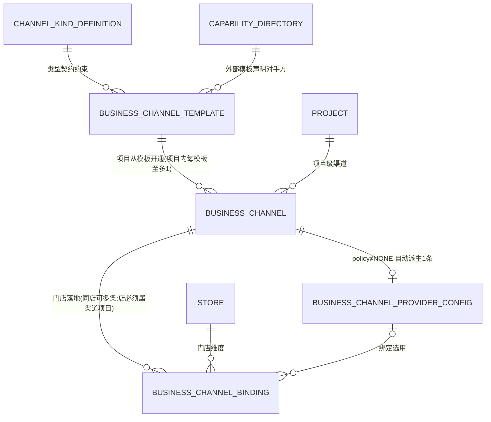

# v2s 经营渠道与外部平台协作 · 需求规格说明书

> # ⛔ 本文件已作废(SUPERSEDED)
> - **作废日期**:2026-08-18 · **裁定人**:Dexter
> - **继任文件**:`doc/review/platform/2026-08-18-v2s-external-platform-collaboration-and-business-channel-requirements-claude.md`
> - **原始材料**:`doc/review/platform/2026-08-18-v2s-external-platform-capability-and-binding-decoupling-source-claude.md`
> - **作废原因**:外部平台六类分类学改为**能力分类**(七类、非互斥、平台一对多);
>   三层结构由渠道专用改为**通用外部协作层**;经营渠道模板由**预置七条目录**改为**项目自建四维级联**;
>   R-1「同项目同模板至多一条渠道」被推翻。
> - **本文正文一律不再修改,仅作历史追溯。** 任何设计、实施或评审**不得**再引用本文结论。
>   本文与继任文件冲突时,以继任文件为准。


## 0. 文档信息

| 项 | 内容 |
|---|---|
| 状态 | **`REQUIREMENTS_FINAL`**(2026-08-13)——两个独立盲审(业务视角 1M/12S/12N、一致性视角 2M/9S/11N)的 finding 全部处置;§14 五项模型判断已由 Dexter 显式裁定(R-1/2/3/5 采纳,R-4=不阻断) |
| 权威 | 本文件是 v2s 经营渠道与外部平台协作的需求权威;v6 / v4 / all-v1 降为背景材料;**all-v1「不向外部推菜单」旧拍板被本文取代** |
| 依据 | Dexter 2026-08-13 八轮裁定(§14);两轮对抗性盲审 findings 处置 |
| 边界 | 不是实施设计、不是 Journey 批准、不是运行时授权 |
| 修订 | v1 方向稿被打回(缺模型与场景);v2 补模型场景;v3 标准需求规格结构;**v4 处置盲审 findings**:补快照字段清单、状态传递契约、发布前置、店铺占位死锁修复、组织表述纠正、语料冲突修复等 |

---

## 1. 背景与业务目标

### 1.1 背景

v2s 已具备组织(**三层组织树** 商业集团→大区→项目,加业务实体 品牌/租户/总公司,门店为独立管理路径)、商品目录、轻库存、合同等主数据域。下一步是让**消费者能够下单**——下单必须回答"从哪个入口下单、用谁的菜单、订单来源如何解释",这正是经营渠道要解决的问题。同时商场业态决定系统必然与大量外部平台协作,没有统一分类与对接架构,每接一个平台都会侵蚀主程序模型。

### 1.2 业务目标

| # | 目标 | 可检验判据 |
|---|---|---|
| G1 | 项目管理员**自助**完成渠道开通与配置 | UC-01/02 走通;入口 URL 按契约生成并可解析到正确门店/桌台(二维码物料生成登记 HANDOFF,不在本期) |
| G2 | 门店按经营需求**自助**落地与调整 | UC-03/04/05/08 由门店 scope 完成 |
| G3 | 每笔订单来源可**无歧义解释**且历史永不被污染 | FR-OS 组(含 §8.5 快照字段清单)通过 |
| G4 | 外部渠道数据准备在连接器缺席时即可完成,连接器到位**不返工** | UC-07 走通;外部渠道 fail-closed 停 DRAFT;§12 承接锚齐备 |
| G5 | 新增外部平台零主程序**代码**改动 | 加平台 = 部署适配器 + 能力目录一行 + 渠道模板一条(FR-AD-08) |
| G6 | 菜单映射语义内外统一,订单解析一条链路 | FR-MC 组通过 |

### 1.3 不追求

本期不打通任何真实外部平台 API;不做权益/团购闭环(§4.3 留未来权威依据);不追求消息中间件级吞吐。

---

## 2. 范围

### 2.1 本期范围(三步,顺序即要求)

| 步 | 内容 | 交付形态 |
|---|---|---|
| 第一步 | 创建管理项目和门店的内外部渠道 | §10 模型 + FR-CT/CH/PC/BD/OS/XS 组 + operations-admin 页面 |
| 第二步 | 内部渠道维护完整菜单(销售集合) | 菜单域自己的需求文档承载;本文冻结 §9 跨域契约 |
| 第三步 | 外部渠道两种维护方式(拉取映射/推送) | 数据模型+管理界面先行(FR-MC 组),连接器后置 |

### 2.2 明确不在本期

真实平台连接器(授权/API/回调);权益类全部;多对接方选择交互;能力目录热加载;二维码物料生成工具;配送/库存/主数据/结果分发四类协作的实施(仅定分类归属)。

### 2.3 未来迭代的承接锚

权益类以 §4.3 为权威依据;连接器迭代以 §12 为权威依据。到期不得绕开本文另起炉灶;**未来 owner 域(支付/营销/订单)设计若有更优模型,可提修订议案经 Dexter 裁决变更本文,不得默默偏离**。

---

## 3. 术语表

| 术语 | 定义 |
|---|---|
| 经营渠道 | 消费者完成下单所经过的经营入口;项目级声明+门店级落地两层 |
| 内部渠道 | 菜单与下单闭环在本系统(POS 点单、商场扫码点单、商场外卖) |
| 外部渠道 | 菜单与下单闭环在外部平台、订单同步入站履约(美团外卖、饿了么、抖音外卖、拼好饭) |
| 渠道绑定 | 门店在某渠道上的落地事实,菜单发布与订单来源的**最小锚** |
| 门店渠道名 | `storeChannelName`——订单来源/对客/小票/对账显示名,冻结进订单快照 |
| 菜单协作模式 | binding 级:`INTERNAL_PUBLISH` 发布 / `EXTERNAL_PULL_MAP` 拉取映射 / `EXTERNAL_PUSH` 推送 |
| 对接能力目录 | checked-in 契约 JSON:本部署支持的外部对手方与能力,随发布生效 |
| ProviderConfig | 项目级对接配置,接线字段自动派生,零机密 |
| 订单来源快照 | 订单域下单时按 **§8.5 字段清单**冻结的坐标,永不回改 |
| 治理信号 | 授权失效/连接器未部署/心跳丢失等运行时信号,**只展示不改业务状态** |
| 适配器 / 端口契约 | 主程序与平台间的转换进程 / 主程序发布的按能力类稳定 DTO 边界 |
| 六类 | 外部协作分类:主数据/权益/订单创建/配送/库存同步/结果同步 |
| 硬关联 / 软关联 | 权益模版与商品的两种关联(拉取手动关联 / 外部模版携带商品编码) |
| 轻库存 | 本系统以**流水账本为唯一真相**的经营库存;存在外部 ERP 对接时,ERP 可权威覆盖当前余额但必须留调用审计与流水(G-12) |

---

## 4. 业务背景知识

### 4.1 渠道的定义与判据

> **经营渠道 = 消费者完成下单所经过的经营入口。判据只有一条:菜单+下单闭环归谁。**

归我们=内部渠道;归平台=外部渠道(订单同步入站**履约生产**)。**什么不是渠道**:权益/团购平台不是订单入口(权益在订单**生成过程中**被消费、作为**支付单**落单供外部结算,是快照中的独立坐标);配送是履约服务选择;主数据/库存/结果同步是纯协作关系。

### 4.2 外部平台六类分类学

**平台与类正交**(美团横跨权益/订单/配送;权益类横跨美团/万象城/抖音),"外部系统是谁/协作哪类/落在哪个坐标"永远是三个分开的概念。

| 类 | 业务含义与已知实例 | 方向 | 时机 |
|---|---|---|---|
| 交易主数据类 | **部分**交易前主数据可由外部同步入站。**限定**:不改变既有语料裁决——商场 ERP 的门店记录**不镜像**(G-04)、外部「用户+角色」推送**不预置**(G-07);同步范围逐项按语料裁决,本分类只定归属 | 外→内 | 交易前 |
| 订单权益类 | §4.3;**外部会员/身份系统的消费者身份与权益归本类** | 读外部+核销写回+支付单落单 | 订单生成过程中 |
| 订单创建类 | 外卖平台下单入站履约——**唯一构成外部渠道的类** | 外→内 | 实时 |
| 订单配送类 | 原平台或第三方配送 | 内→外 | 生产完成后 |
| 商品库存同步类 | 本系统流水账本为唯一真相;**存在外部 ERP 对接时** ERP 可权威覆盖当前余额(留调用审计与流水,G-12) | 双向 | 周期+事件 |
| 交易结果同步类 | 一单可同步 N 个外部系统。**首个已知实例:订单上报商场 ERP 的货号映射**(货号归合同域 G-09;多份有效合同的货号选择系语料已登记待裁决项) | 内→外一对 N | 交易完成后 |

### 4.3 订单权益类(本期不做;未来迭代的权威依据)

订单生成过程中判断消费者权益:抵扣**部分金额**或抵扣/带入**某个商品**(团购:识别后自动加入购物车);权益作为**支付单**保存供外部结算。三要素:消费者身份(美团 openid ← ISV 身份+门店授权)、权益模版(← 项目+门店)、权益行(← 项目+门店+身份)。商品关联须交易前建立:硬关联或软关联。**授权粒度注记**:外部平台授权按项目、商户号还是门店粒度组织,属 `UNVERIFIED` 外部事实,连接器设计时按平台官方一手资料裁定;模型已在 binding 预留 opaque `authorizationRef`(§10.5,本期恒空),避免届时改模型。

---

## 5. 参与者

| 参与者 | 界面 | 职责 |
|---|---|---|
| 项目管理员(商场运营方) | operations-admin·项目 scope | 开通/管理项目渠道、配置自营入口、代管门店绑定 |
| 门店运营(店铺运营方) | operations-admin·门店 scope | 管理本店绑定:命名、启停、切协作模式、外部店铺坐标 |
| 平台运维(系统服务提供者) | 本域无页面(代码与部署);任务积压等运维视图属 platform-admin,随连接器迭代交付 | 维护 kind/模板/能力目录,部署适配器 |
| 菜单域/订单域/履约域 | 系统间 | 消费渠道坐标:发布目标、来源快照、入站解析 |

权限归 IAM 域。**注**:若绑定管理授予门店运营写权,渠道绑定将成为 STORE 级写目标,实施设计须同步扩展 G-05A 写目标登记。

---

## 6. 端到端业务流程

**流程一|内部渠道全链**(第一、二步)

```text
平台运维预置模板 → 项目管理员开通渠道(ENABLED) → [自营]配置入口 URL
→ 门店运营创建绑定(门店渠道名) → 启用绑定
→ 菜单域发布销售集合到 ENABLED 绑定(路由=终端投影)
→ 消费者下单 → 订单域按 §8.5 冻结来源快照
```

**流程二|外部渠道·拉取映射**(本期建数据面;连接器迭代跑通)

```text
开通外部渠道(本期停 DRAFT+治理信号) → 门店建绑定(externalShopId,模式=拉取映射)
→ [本期人工/未来拉取]外部菜单条目 → 映射到本系统商品
→ [连接器迭代]平台订单入站 → (channel, externalShopId) 解析 binding
   ├ 店级解析失败 → 缺映射治理态
   └ 行级解析(菜单条目→商品)失败 → 缺映射治理态(不丢单、不阻他单)
→ 解析成功 → 履约生产
```

**流程三|外部渠道·推送**(同上)

```text
门店绑定模式=推送 → 本系统维护销售集合 → 发布路由=推送任务(本期生成意向)
→ [连接器迭代]适配器拉取任务 → 调平台 API → 回报 → 平台订单入站解析同流程二
```

---

## 7. 用例

> 格式:参与者|前置|主流程|异常流|后置(业务目的)。

**UC-01 项目开通渠道**
项目管理员|项目存在;模板已预置|管理页展示"已开通"与"可开通模板"两区 → 选模板开通 → 生成渠道(默认码/名,可改名不可改码)→ policy≠NONE 时自动派生 ProviderConfig → 内部渠道可直接启用|**异常A**:外部模板且能力目录 `PLANNED` → 停 `DRAFT`+「连接器未部署」信号,启用不可用;**异常B**:同项目同模板已开通 → 拒绝并提示既有渠道|项目具备渠道,门店可绑定(G1)。

**UC-02 项目配置自营入口**
项目管理员|自营渠道已开通|维护入口 URL 模板(entryType 与变量组契约见 §10.5)|**异常**:变量组不满足契约 → typed 校验失败不保存|扫码 URL 能解析到正确门店/桌台(G1)。

**UC-03 门店绑定渠道**
门店运营(项目管理员可代管)|渠道存在;门店存在且**属于渠道所在项目**|创建绑定 → 门店渠道名(默认=门店名)→ 渠道有 ProviderConfig 时选择其一 → 外部填 `externalShopId`、选模式(默认按 kind/模板)→ 启用|**异常A**:渠道 `DRAFT` → 绑定只能存 DRAFT;渠道 `PAUSED`/`DISABLED` → **拒绝新建**(FR-CH-06);**异常B**:外部绑定缺 `externalShopId` → 不能启用;**异常C**:`(channel, externalShopId)` 已被**非 DISABLED** 绑定占用 → 拒绝;**异常D**:门店不属于渠道所在项目 → 拒绝|门店可被发布菜单、来源可解释(G2/G3)。

**UC-04 一店多经营点**
门店运营|同 UC-03|同店同渠道再建绑定,各自门店渠道名|异常分支「渠道规则限单条」本期 `NOT_APPLICABLE`(七模板无一限单),不入 §13 分母|发布与来源精确到档口(G3)。

**UC-05 改门店渠道名**
门店运营|绑定存在|改 `storeChannelName` → 生效于新订单与新打印|无异常分支|历史读冻结快照不变(G3)。

**UC-06 暂停与停用**
项目管理员(渠道级)/门店运营(绑定级)|对象 ENABLED|暂停 → 阻新业务进入(**分层定义见 FR-CH-06/FR-BD-07 注**),存量与历史不变;恢复 → 重新启用(**复验启用前置**);停用 → 长期关闭保留记录|**异常**:渠道暂停/停用不级联改写绑定状态;消费方按 §8.5/§9 获得的两级 status 合并判断|业务闸门分层,历史稳定(G3)。

**UC-07 项目开通外部渠道(本期形态)**
项目管理员|外部模板预置;能力目录 `PLANNED`|开通 → ProviderConfig 自动派生 → 渠道停 DRAFT+治理信号 → 门店可预建绑定(渠道 DRAFT 下绑定亦停 DRAFT)、填坐标、选模式|**异常**:任何把外部渠道转入 ENABLED 的尝试(含 PAUSED/DISABLED→ENABLED)→ fail-closed 拒绝,稳定错误码+人话说明|外部数据准备就绪,连接器到位不返工(G4)。

**UC-08 门店切换菜单协作模式**
门店运营|外部渠道绑定存在|拉取映射⇄推送 → 既有映射与发布**保留失活**(回切复原)→ 记录 modeChangedAt 与操作者|**异常**:内部渠道绑定 → 模式锁定不可切|菜单权威方向按店切换,历史快照不受影响(G2)。

**UC-09 平台上新外部平台(未来,非页面)**
平台运维|新适配器已开发|部署适配器+能力目录一行+**渠道模板一条** → 随发布生效 → 项目可开通|**异常**:适配器自报对手方不在目录 → fail-closed 拒绝|加平台零主程序代码改动(G5)。

---

## 8. 功能需求

### FR-CT|契约与目录

- **FR-CT-01** kind 值域本期恰四个:`INTERNAL_STAFF_ENTRY` / `SELF_OPERATED_CUSTOMER_ENTRY` / `SELF_OPERATED_DELIVERY` / `EXTERNAL_ORDER_PLATFORM`。kind 由契约工程管理,不得提供 CRUD。**不预留** `EXTERNAL_BENEFIT_PLATFORM`——按 §4.1 判据权益平台不是下单入口;若未来某权益平台出现平台侧闭环下单形态,按 `EXTERNAL_ORDER_PLATFORM` 接入,权益语义仍走权益迭代。
- **FR-CT-02** 每个 kind 声明:`channelClass`、`orderRole`、`menuCollaborationOptions`(内部三 kind 恒 `{INTERNAL_PUBLISH}` 锁定;外部=`{EXTERNAL_PULL_MAP, EXTERNAL_PUSH}`)、`providerConfigPolicy`(POS=NONE;自营=OPTIONAL;外部=REQUIRED_FOR_ENABLE)、`bindingRequiredFields`(外部含 `externalShopId`)、`entryTypes`(见 §10.5;仅自营扫码 kind 非空)。
- **FR-CT-03** 模板本期恰七条(§10.2);项目只能从模板开通。**拼好饭钉死为 `externalSystemCode=meituan` + `businessLineCode=PINHAOFAN`**(走美团开放平台授权;若将来证实独立 API 则升独立对手方,属能力目录变更)。
- **FR-CT-04** 对接能力目录为 checked-in 契约 JSON;**本期恰三个对手方**(meituan/eleme/douyin)全部 `PLANNED`;随发布生效,不得热加载。
- **FR-CT-05** 机器门:`template.externalSystemCode ⊆ 目录键集`;模板/目录/kind 引用完整性。
- **FR-CT-06** **模板与目录条目只增不删**:退役用标记位,且标记退役的前置是无存量渠道引用(或存量已完成迁移处置)——存量实体的投影派生根不得悬空。模板行的语义类字段(kind、externalSystemCode、businessLineCode)**不可修改**;展示类字段可改。

### FR-CH|项目渠道管理(项目管理员)

- **FR-CH-01** 管理页同时展示:已开通渠道、系统已支持未开通模板(外部含「连接器未部署」标注)。
- **FR-CH-02** 从模板开通;`channelCode`/`channelName` 取模板默认;`channelKind` 冻结;`(projectRef, channelCode)` 与 `(projectRef, templateRef)` 唯一。
- **FR-CH-03** 可改名;不得改 `channelCode`/`channelKind`/`templateRef`/`projectRef`。
- **FR-CH-04** 状态机见 §10.6;每次转移记录操作者与时间。
- **FR-CH-05** **任何进入 `ENABLED` 的转移**(DRAFT→/PAUSED→/DISABLED→)前置:外部渠道要求能力目录该对手方 `status=AVAILABLE` **且** `supportedCapabilities` 含 `ORDER`;不满足 fail-closed 拒绝(稳定错误码+人话)。
- **FR-CH-06** 渠道 `PAUSED`/`DISABLED` 阻止的「新业务」定义为:**新增绑定、向该渠道下绑定的新菜单发布、新订单来源产生**;不级联改写既有绑定状态,不回改历史快照。
- **FR-CH-07** 渠道不提供删除;停用即终态治理。

### FR-PC|对接配置(系统派生+项目管理员)

- **FR-PC-01** 开通时 `policy≠NONE` 自动创建;接线字段(`externalSystemCode`/`providerKind`/`businessLineCode`)派生,不得出现手工编排界面。
- **FR-PC-02** 仅当目录中同对手方存在多个 `supportedProviderKinds` 时,才暴露 providerKind 选择。
- **FR-PC-03** 自营 `entryConfig` 由项目管理员维护,保存前过 §10.5 契约校验(typed 失败码)。
- **FR-PC-04** 不得保存 token/密钥/raw;`authorizationRef` 只存 opaque 引用。
- **FR-PC-05** 引用目录外对手方在结构上不可能(派生保证+FR-CT-05/06 护契约与存量一致性)。
- **FR-PC-06** ProviderConfig **本期无独立状态机与暂停语义**(其启停随渠道);`providerKind` 创建后不可变,多对接方并存时的变更属未来迭代。

### FR-BD|门店绑定(门店运营;项目管理员可代管)

- **FR-BD-01** 创建绑定前置:**`storeRef` 必须属于渠道 `projectRef` 所辖项目**(经组织层级读时校验);必填 `storeChannelName`(默认=门店名);渠道有 ProviderConfig 时必须选择其一;外部渠道必填 `externalShopId`;所属渠道须非 `PAUSED`/`DISABLED`(渠道 DRAFT 下绑定只能存 DRAFT)。
- **FR-BD-02** `(businessChannelRef, externalShopId)` 在**非 `DISABLED`** 绑定间唯一——外部订单入站路由无歧义;`DISABLED` 绑定不占用坐标。
- **FR-BD-03** 同店同渠道允许多条绑定;本期无渠道限单条,不收窄通用模型。
- **FR-BD-04** `storeChannelName` 可随时改,生效于新订单/新打印,不回改历史。
- **FR-BD-05** 协作模式 binding 级;门店运营可在 kind 允许值域内切换;内部渠道锁定。
- **FR-BD-06** 模式切换保留既有映射与发布(失活可回切),记录 modeChangedAt 与操作者。**连接器迭代前须补裁的两问已登记 §12**:失活映射是否参与在途订单行解析;切至推送时是否对平台既有菜单做首次覆盖推送。
- **FR-BD-07** 状态机见 §10.6;**任何进入 `ENABLED` 的转移**复验:所属渠道 `ENABLED` + kind 强制字段齐备 + FR-BD-02 唯一性(重新启用时同样复验)。「新业务」在绑定层 = 新菜单发布与新订单来源。
- **FR-BD-08** 授权失效/外部店铺失联等一律治理信号;不得引入 `INVALID` 状态,不得自动转移。
- **FR-BD-09** 渠道绑定与门店启停(G-08)、合同衍生状态(G-09)**互不推导**;已停用门店的绑定新建/启用**已裁定为"不阻断"**(Dexter 2026-08-13,R-4),实现必须集中在一处判定点,便于将来翻转。
- **FR-BD-10** 绑定删除:**仅 `DRAFT` 且从未进入过 `ENABLED` 的绑定可删**;其余走停用保留(历史解释需要)。

### FR-OS|订单来源语义(渠道域定义,订单域消费)

- **FR-OS-01** 坐标查询按 bindingRef 返回显式投影:渠道(ref/code/name/kind/**status**) + 绑定(ref/**storeRef**/storeChannelName/storeChannelCode/externalShopId/mode/**status**) + provider(ref/providerKind/businessLineCode)。
- **FR-OS-02** 渠道域不持久拥有快照;冻结动作归订单域;**冻结字段清单见 §8.5,本表即契约**。
- **FR-OS-03** 快照必须区分:订单入口/经营渠道/门店绑定/权益来源/外部业务对象。**本期语义**:订单入口 ≡ 命中的渠道绑定(内部单=开单绑定,外部单=经 `(channel, externalShopId)` 解析的绑定);权益来源与外部业务对象字段由权益迭代定义,本期不冻结、留位不留形。
- **FR-OS-04** 改名/换绑/切模式/换 provider 不回改历史快照;打印与对账不得实时回查当前值。

### §8.5 订单来源快照冻结字段清单(契约)

| 组 | 字段 | 取值来源 |
|---|---|---|
| 渠道 | `businessChannelRef` / `channelCode` / `channelName` / `channelKind` / `channelStatus` | 下单时点渠道行 |
| 绑定 | `businessChannelBindingRef` / `storeRef` / `storeChannelName` / `storeChannelCode?` / `externalShopId?` / `menuCollaborationMode` / `bindingStatus` | 下单时点绑定行 |
| 对接 | `providerConfigRef?` / `providerKind?` / `businessLineCode?` | 下单时点 providerConfig |
| 入口 | 本期 ≡ 绑定组(不另设字段) | — |
| 权益来源/外部业务对象 | 权益迭代定义 | — |

### FR-MC|菜单协作数据面(第三步;菜单域联合)

- **FR-MC-01** 菜单条目↔商品的**映射语义唯一一套**,内外来源共用;不得在渠道域或适配器建第二套业务映射。**边界声明**:外部菜单条目是菜单域内**独立于 G-11 销售项**的新实体(销售项"商品显式编入不可换绑"的裁决不因此改变);二者关系与 G-11 语料是否需修订,由第二步菜单域需求文档显式处理并按需walk语料裁决流程。
- **FR-MC-02** 外部菜单条目=带外部标识+出处的菜单域实体;本期人工维护,连接器迭代改拉取写入,模型不变。
- **FR-MC-03** 发布模型唯一(发布/生效 → binding);路由按 binding 模式派生:PUBLISH=终端投影 / PUSH=推送任务 / PULL_MAP=不发布。
- **FR-MC-04** 推送任务本期生成意向记录(不外呼)。
- **FR-MC-05** 入站解析(未来)唯一链路:店级 `(channel, externalShopId)`→binding,行级 菜单条目→商品;**店级或行级解析失败均进「缺映射治理」态**,不丢单、不阻他单。

### FR-XS|外部主数据出处(本期预留)

- **FR-XS-01** org / catalog / store-contract / 菜单 的记录预留 external-source 出处(来源系统+外部标识+同步时间);范围受 §4.2 主数据类限定约束(不含已裁决排除项)。

### FR-AD|适配器架构(结构本期定;动态连接器迭代)

- **FR-AD-01** 主程序不得直接调用外部平台 API 或引入平台 SDK。
- **FR-AD-02** 端口契约按能力类发布入 contracts;适配器不得依赖主程序内部类、不得读主程序数据库。
- **FR-AD-03** 适配器进程按外部对手方组织;路径规范样例:应用 `apps/backend/adapters/meituan/`,内含能力模块 `order/`、`delivery/`;能力契约 `contracts/adapter-ports/<capability>.json`。机器门守护该形态。
- **FR-AD-04** 出站=主程序任务表(幂等键+binding 坐标)→适配器拉取→回报端口;主程序不知适配器地址;主程序 DB 事务内不得外呼。
- **FR-AD-05** 入站=适配器先落盘再 ack→统一模型投递端口→主程序幂等去重直接进业务表。
- **FR-AD-06** 任务表队列治理:终态留 7–30 天,按天分区 DROP PARTITION;raw 入 MinIO。
- **FR-AD-07** 静态 ISV 身份部署配置注入;动态 token 适配器 schema 加密列;主程序只持 opaque ref+治理信号。
- **FR-AD-08** **加平台 = 部署新适配器 + 能力目录一行 + 渠道模板一条**;主程序零代码(Java/TS 逻辑)改动,随下次发布生效。加能力类才改主程序。
- **FR-AD-09** 适配器自报与目录交叉核对;未声明而自报 fail-closed;心跳只做健康展示。
- **FR-AD-10** 全部新 HTTP operation 自动进 backend-acceptance 分母;设计期带 scenario 六字段,缺一 fail-closed。

---

## 9. 与菜单域的跨域契约(第二步的锚)

1. 发布/生效目标**必须**引用 `businessChannelBindingRef`(binding 粒度);`businessChannelRef` 可冗余作分类统计。
2. **发布前置**:目标绑定必须 `ENABLED` 且其渠道 `ENABLED`;渠道或绑定 `PAUSED`/`DISABLED` 时**不得新发布**(存量已生效菜单不自动撤下,是否撤下属运营动作)。
3. 路由按 binding 当前模式派生(FR-MC-03);同店同渠道多绑定时发布必须能区分到条。
4. 菜单域消费 FR-OS-01 投影中的两级 status 做上述判断。

---

## 10. 领域模型

### 10.0 关系总图与类型记法



类型记法:`标识`=系统生成不可变 UUID;`编码`=规则约束字符串、参与对账;`名称`=展示字符串;`枚举(…)`=封闭值域;`软引用`=跨域 ref+读时校验非 FK;`时间戳`=long;`JSON`=一组受契约校验的 key。

**隔离声明**:渠道三实体全部受集团空间(workspace)隔离,与仓内既有模块惯例一致。
**存储与使用分离**:存储精简(契约派生,实例只存差异);读出派生显式投影,消费方不写 `if kind==…`。**模板演进约束**见 FR-CT-06(防读投影追溯漂移)。

### 10.1 `ChannelKindDefinition`——见 FR-CT-01/02

### 10.2 `BusinessChannelTemplate`(预置目录)

| 属性 | 类型 | 必填 | 含义 |
|---|---|---|---|
| `templateCode` | 编码·全局唯一 | ✓ | `tpl_pos` / `tpl_mall_qr` / `tpl_mall_delivery` / `tpl_meituan_takeout` / `tpl_eleme_takeout` / `tpl_douyin_takeout` / `tpl_pinhaofan` |
| `displayName` | 名称 | ✓ | 「POS 点单」等 |
| `channelKind` | 枚举 | ✓ | 类型契约 |
| `externalSystemCode` | 编码→10.3 | 外部✓ | 对手方;**拼好饭=`meituan`** |
| `businessLineCode` | 编码 | 可选 | 拼好饭=`PINHAOFAN` |
| `defaultChannelCode`/`defaultChannelName` | 编码/名称 | ✓ | 开通默认 |
| `defaultMenuCollaborationMode` | 枚举 | 仅外部 | 新绑定模式默认;**内部绑定的模式恒由 kind 锁定,不取自模板** |

### 10.3 对接能力目录(checked-in JSON)

键集本期恰三:`meituan` / `eleme` / `douyin`,均 `PLANNED`。字段:`externalSystemCode`(键)/`displayName`/`supportedProviderKinds`(枚举集)/`supportedCapabilities`(枚举集 ORDER/DELIVERY/…)/`status`(PLANNED/AVAILABLE)。条目只增不删(FR-CT-06)。

### 10.4 `BusinessChannel`(PROJECT 级)

| 属性 | 类型 | 必填 | 谁设置 | 可变性 | 业务含义 |
|---|---|---|---|---|---|
| `businessChannelRef` | 标识 | ✓ | 系统 | 不可变 | 软引用与快照锚 |
| `projectRef` | 软引用→org PROJECT | ✓ | 开通时 | 不可变 | 归属项目 |
| `templateRef` | 引用 | ✓ | 开通时 | 不可变 | 开通来源;投影派生根 |
| `channelKind` | 枚举 | ✓ | 冻结自模板 | 不可变 | 类型锚 |
| `channelCode` | 编码·项目内唯一 | ✓ | 默认自模板 | 创建后不可变 | 来源/对账稳定码 |
| `channelName` | 名称 | ✓ | 默认自模板 | 可改 | 展示名;历史读快照 |
| `status` | 枚举→10.6 | ✓ | 项目管理员 | 状态机 | 项目级开放状态 |
| `createdAt`/`statusChangedAt` | 时间戳 | ✓ | 系统 | — | 审计从简 |

读投影(不存储):`channelClass`/`orderRole`/`menuCollaborationOptions`/`providerConfigPolicy`/`bindingRequiredFields`/`entryTypes`/`externalSystemCode`。

### 10.5 `BusinessChannelProviderConfig` 与 `BusinessChannelBinding`

**ProviderConfig**(自动派生;**本期无独立状态机**,启停随渠道):

| 属性 | 类型 | 必填 | 谁设置 | 可变性 | 含义 |
|---|---|---|---|---|---|
| `providerConfigRef` | 标识 | ✓ | 系统 | 不可变 | 选用与快照锚 |
| `businessChannelRef` | 引用 | ✓ | 系统 | 不可变 | 归属 |
| `externalSystemCode` | 编码 | 外部✓ | 派生 | 不可变 | 对手方 join |
| `providerKind` | 枚举(SELF_OPERATED/ISV/PLATFORM_DIRECT/DELIVERY_PROVIDER) | ✓ | 派生(多选一时管理员选) | **不可变** | 对接方式 |
| `businessLineCode` | 编码 | 可选 | 派生 | 不可变 | 业务线 |
| `displayName` | 名称 | ✓ | 默认派生 | 可改 | 展示 |
| `entryConfig` | JSON·契约校验 | 自营可选 | 项目管理员 | 可改 | 入口配置,契约见下 |
| `authorizationRef` | opaque | — | 适配器回填 | 本期恒空 | 授权摘要引用,无 token 值 |

**entryConfig 契约**(entryType 值域 × 必备变量;本期冻结):

| entryType | 适用 kind | 必备变量 | 说明 |
|---|---|---|---|
| `STORE_QR_ORDER` | SELF_OPERATED_CUSTOMER_ENTRY | `bindingRef` | 门店码点餐 |
| `TABLE_QR_ORDER` | SELF_OPERATED_CUSTOMER_ENTRY | `bindingRef`、`tableCode` | 桌码点餐;**`tableCode` 为外部输入字符串,本域不建桌台主数据**(桌台归属未来到店服务语义,届时另裁) |
| — | SELF_OPERATED_DELIVERY | — | **本期无 entryType**(顾客入口随自营小程序总入口) |

**Binding**:

| 属性 | 类型 | 必填 | 谁设置 | 可变性 | 业务含义 |
|---|---|---|---|---|---|
| `businessChannelBindingRef` | 标识 | ✓ | 系统 | 不可变 | **发布目标与订单来源最小锚** |
| `businessChannelRef` | 引用 | ✓ | 创建时 | 不可变 | 归属渠道 |
| `storeRef` | 软引用→org STORE | ✓ | 创建时 | 不可变 | 门店主体;**必须属渠道所在项目**(FR-BD-01) |
| `storeChannelName` | 名称 | ✓ | 默认=门店名 | 可改 | 门店渠道名;冻结进快照 |
| `bindingDisplayName` | 名称 | 可选 | 运营 | 可改 | 后台绑定列表识别名 |
| `storeChannelCode` | 编码 | 可选 | 运营 | **空可补设一次,设后不可变** | 门店侧对账码 |
| `menuCollaborationMode` | 枚举(3) | ✓ | 内部=kind 锁定;外部默认自模板 | 外部可切换 | 协作模式 |
| `providerConfigRef` | 引用 | 渠道有 config 时✓ | 创建时 | 可改 | 选用对接配置 |
| `externalShopId` | 编码 | 外部✓ | 门店运营 | 可改 | 外部店铺坐标;唯一性见 FR-BD-02 |
| `authorizationRef` | opaque | — | 适配器回填 | 本期恒空 | **门店级授权摘要预留**(§4.3 授权粒度注记) |
| `status` | 枚举→10.6 | ✓ | 运营 | 状态机 | 门店级启用状态 |
| `boundAt`/`statusChangedAt`/`modeChangedAt` | 时间戳 | ✓ | 系统 | — | 审计从简 |

### 10.6 状态机(channel 与 binding 同形;ProviderConfig 无独立状态机)

```text
DRAFT ──启用──▶ ENABLED ◀──恢复──▶ PAUSED
  │               │                    │
  └(仅绑定:未启用过可删)  └────停用────┴──▶ DISABLED ──重新启用──▶ ENABLED
```

| 状态 | 含义 | **不代表** |
|---|---|---|
| DRAFT | 已创建未启用;外部渠道连接器 `PLANNED` 时只能停此 | — |
| ENABLED | channel=项目开放;binding=门店启用(可发布/可产生来源) | 授权有效、菜单可售、支付可用、订单必成立、**门店处于启用状态、合同有效** |
| PAUSED | 阻新业务进入(定义见 FR-CH-06/BD-07),存量与历史不变 | 历史失效 |
| DISABLED | 停用;保留供历史解释;**不占用 externalShopId 坐标** | 记录删除 |

**转移前置统一口径:凡进入 ENABLED(无论来自哪个状态)均执行 FR-CH-05 / FR-BD-07 的全部前置复验。** 治理信号不触发任何转移。对 v6 的显式收窄:binding 删 `BOUND`/`INVALID` 两态。

---

## 11. 非功能需求

- **NFR-01 性能**:低频配置读写;全部 operation 进 backend-acceptance 结构计数预算。
- **NFR-02 容量**:任务表队列治理(FR-AD-06);渠道/绑定行数与门店同量级。
- **NFR-03 安全**:token 不落主库不过端口;适配器独立 schema 独立账号。
- **NFR-04 可观测**:correlation 贯穿;治理信号在 operations-admin 相关页可见;任务积压视图属 platform-admin、随连接器迭代交付(本期登记 HANDOFF)。
- **NFR-05 审计**:状态转移与模式切换记录操作者+时间(日志级,从简)。
- **NFR-06 一致性**:跨域软引用+读时校验;对接 at-least-once+幂等去重。
- **NFR-07 管理写并发(显式裁定)**:本期不设乐观锁,低频配置写后写覆盖;创建绑定按 `(channel, store, storeChannelName)` 重复时**告警不阻断**(多经营点合法,双击误建由运营自查)。

---

## 12. 依赖与接口

| 依赖 | 方向 | 内容 |
|---|---|---|
| org 域 | 渠道←org | `PROJECT`/`STORE` 软引用;**组织为三层树(集团→大区→项目)+业务实体(品牌/租户/总公司)+门店独立管理路径**(G-02/G-03/G-04/G-06);FR-BD-01 的门店∈项目校验依赖 org 层级查询 |
| 菜单域(第二步) | 菜单←渠道 | §9 契约(锚粒度+发布前置+路由+status 消费);FR-MC-01 的外部菜单条目与 G-11 销售项边界由菜单域需求显式处理 |
| 订单域(未来) | 订单←渠道 | FR-OS 组+§8.5 快照字段清单 |
| IAM | 渠道←IAM | 操作点授权;**绑定作为 STORE 级写目标须扩展 G-05A 登记** |
| backend-acceptance | 全部 | FR-AD-10 |
| 适配器层(连接器迭代) | 双向经端口 | FR-AD 组;**承接锚**:授权粒度裁定(§4.3 注记)、FR-BD-06 两问(失活映射与在途解析、切推送首次覆盖)、店级解析失败治理(FR-MC-05)、任务积压视图(NFR-04) |

---

## 13. 验收标准

**第一步(渠道管理)完成判据**:

1. UC-01~08 走通;异常流逐条按定义 typed 拒绝(UC-04 的限单分支本期 `NOT_APPLICABLE`,不入分母);
2. **操作类 FR**(CH/PC/BD/OS 组中含 HTTP operation 者)逐条有 backend-acceptance scenario(六字段)且四维 PASS;**契约/静态类 FR**(CT 组、AD 结构项)走机器门与结构断言,不伪装成动态场景;
3. 外部渠道 fail-closed:`PLANNED` 下**任何**进入 ENABLED 的转移被拒;
4. 红变异样例:①非 DISABLED 间 `(channel, externalShopId)` 唯一被移除→必红;②DISABLED→ENABLED 不复验唯一/前置→必红;③治理信号改写 status→必红;④`channelCode` 被更新→必红;⑤**门店∈项目校验被移除→必红**;
5. 存储零冗余:kind 派生属性不出现在表列,读投影字段齐全;
6. operations-admin 新增 CRUD 页面按既有 **G-05B crud-presentation 登记与 L2 交互证明**门链验收(机器门兜底)。

**第三步完成判据**:外部菜单条目与映射全生命周期人工可维护;推送意向随发布路由生成;UC-08 切换保留失活语义验证;店级+行级缺映射治理态数据形态就绪;全链在连接器缺席下自洽。

---

## 14. 决议记录

D-01~D-14 同前(2026-08-13 八轮裁定,含:PROJECT/STORE 锚;渠道=下单入口与内外二分及两种维护方式(取代 all-v1 旧拍板);权益延后;三步顺序;出处预留;数据先行连接器后置;模式 binding 级门店切换;映射归菜单域;发布复用;起步清单;ProviderConfig 保留+自动派生;能力目录 checked-in 随发布生效;适配器契约按能力类/进程按对手方;凭证两层与 opaque ref)。

**五项模型判断——Dexter 已于 2026-08-13 显式裁定**:

| # | 事项 | 裁定 |
|---|---|---|
| R-1 | 同项目同模板至多一条渠道(多经营点走多绑定) | **采纳** |
| R-2 | binding 四态,删 v6 `BOUND`/`INVALID`(异常走治理信号) | **采纳** |
| R-3 | 绑定管理归门店运营、项目管理员可代管;模式切换归门店运营 | **采纳** |
| R-4 | 已停用门店能否新建/启用绑定(G-08 待裁决子项) | **不阻断**;实现须集中单点判定,便于将来翻转 |
| R-5 | `TABLE_QR_ORDER` 的 `tableCode` 为外部输入字符串,本域不建桌台主数据 | **采纳** |

---

## 15. 语料纳入条目(G-13,即插即用)

> 纳入**六件同步**:① 语料文件追加 G-13 正文;② 词干索引表加行;③ 语料权威行「for G-01 to G-12 only」改为 G-13 止;④ `required-inventory.json` 断言(现 `BUSINESS_CORPUS_G01_G12_ACCEPTED`,多处硬编码)演进;⑤ assertionSources 同步;⑥ decision 文档作 sourceRef。

**词干索引行**:

```text
| G-13 | 经营渠道、渠道、内部渠道、外部渠道、渠道绑定、门店渠道名、菜单协作、拉取映射、推送、订单来源、权益、团购、适配器、对接能力目录、`BusinessChannel`、`BusinessChannelBinding`、`ProviderConfig`、`ChannelKind`、拼好饭 |
```

**G-13 正文**(散文体,与 G-01~G-12 文体一致):

```text
## G-13 经营渠道与外部平台协作

经营渠道是消费者完成下单所经过的经营入口。项目级 BusinessChannel 声明项目支持哪些
入口,门店级 BusinessChannelBinding 声明门店在哪些入口上落地,判据是菜单与下单闭环
归谁。内部渠道(POS 点单、商场扫码点单、商场外卖)读本系统数据、在本系统下单;外部
渠道(美团外卖、饿了么、抖音外卖、拼好饭)在平台侧闭环下单,订单同步入站履约生产,
其中拼好饭按美团开放平台业务线接入。外部渠道的菜单协作二选一且按绑定粒度由门店
切换:拉取映射以外部菜单为权威、映射到本系统商品;推送以本系统菜单为权威、推送到
平台。菜单条目与商品的映射语义只有一套、与菜单来源无关,外部菜单条目是菜单域内独立
于销售项的实体,销售项的商品显式编入不可换绑裁决不因此改变。订单行解析统一经菜单
条目到内部商品再到履约生产。门店渠道名是订单来源、对客展示、小票与对账的显示名,
冻结进订单快照,改名不回改历史。同店同渠道可有多条绑定,用于摊位、档口与品牌柜台。
绑定的门店必须属于渠道所在项目。外部店铺坐标在渠道内的非停用绑定间唯一。

外部平台协作分六类且平台与类正交。交易主数据类是外部同步入站的部分交易前主数据,
不改变商场 ERP 门店记录不镜像与外部用户角色推送不预置的既有裁决。订单权益类在订单
生成过程中消费权益并作为支付单落订单供外部结算,外部会员身份归本类。订单创建类是
外卖平台下单入站,是唯一构成外部渠道的类。订单配送类是履约服务选择。商品库存同步类
下本系统流水账本仍是唯一真相,存在外部 ERP 对接时 ERP 可权威覆盖当前余额但必须留
调用审计与流水。交易结果同步类一单可同步多个外部系统,首个已知实例是订单上报商场
ERP 的货号映射,货号归合同域。主程序不与外部系统直接对接,一律经适配器,契约按能力
类、进程按外部对手方。

不得推导:渠道或绑定的启用不推导总可用性,授权、菜单可售、支付、配送、订单成立、
门店启用状态与合同有效性各归其域;团购与权益平台不是订单入口,权益来源与订单入口
在快照中是分开的坐标;外部授权失效、连接器未部署、心跳丢失只是治理信号,不自动改写
渠道、绑定与对接配置状态;菜单发布目标是绑定粒度,不得只锚项目级渠道;ProviderConfig
不是外部连接对象,不保存 token、密钥与 raw,接线字段由模板与对接能力目录派生,不由
项目管理员手工编排;拉取映射下本系统菜单条目是镜像不是权威,推送下平台侧是镜像,
不得混淆;订单来源快照冻结下单当时事实,改名、换绑、切模式不回改历史;渠道不是能力
矩阵,不枚举支付方式、开票与退款能力。
```

---

## 16. 授权边界

本文冻结需求与业务语义;不授权实施、不批准页面细节、不授权运行时/数据操作。实施设计另行产出评审;新增 HTTP operation 第一天进 backend-acceptance 分母。语料纳入(§15 六件)随下一个文档包执行。§14 五项已全部裁定,本文可作为 FINAL 输入交实施设计。
