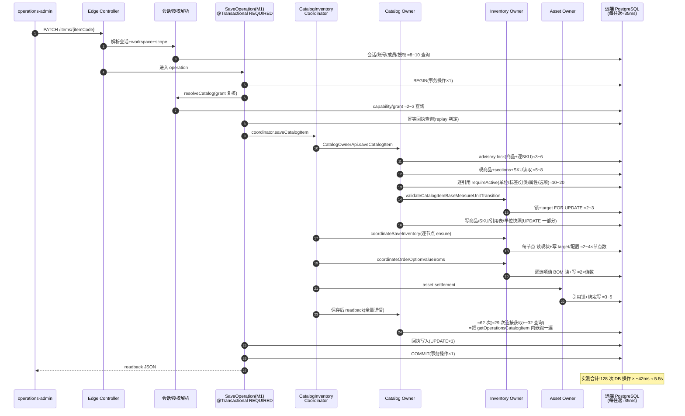

# 后台接口性能根因分析 —— 为什么历次专项优化没有用(Claude)

- 日期:2026-08-22 · 作者:Claude · 性质:分析稿,非评审、非授权
- 数据源:seed 报告 `complete-seed-62653d1f`(68 接口全量计量,business=PASS)· 08-08 问题描述与
  phase3/4 rebaseline 决策 · `r5-dev-runner.mjs` 拓扑 · 生产源码。全部数字为本会话重新提取,非转述。

---

## 1 · 三个测量事实(先于一切解释)

**事实一:全系统没有一个快接口。** 68 个被计量接口,平均耗时最小 135ms,中位数 **734ms**,
低于 100ms 的接口数 = **0**。慢不是个别接口的病,是全体一致的病 —— 这说明主因是**共享成本**,
不是某段业务逻辑。

**事实二:耗时 ≈ DB 操作数 × ~35ms,五个采样点严丝合缝。**

| 接口 | DB 操作/次 | server 均值 | 折算每操作 |
|---|---:|---:|---:|
| selectOperationsWorkspaceSessionContext | 29 | 1118ms | 38.6ms |
| selectOperationsWorkspaceSessionDataNode | 34 | 1277ms | 37.6ms |
| listOperationsCatalogUnits | 26.75 | 1021ms | 38.2ms |
| getOperationsCatalogItem | 62.5 | 1436ms | 23.0ms |
| saveOperationsCatalogItem | 128.2 | 5473ms | 42.7ms |

**事实三:35ms 的来源是拓扑,不是 Postgres。** `scripts/dev/r5-dev-runner.mjs` 第 186 行:
`ssh -N -L 25433:127.0.0.1:5432 $V2S_DEV_REMOTE_HOST` —— **应用跑在本机,数据库在远端主机,
每一条 SQL、每一次连接获取、每一次 BEGIN/COMMIT 都要过一次 SSH 隧道往返**。
08-08 的问题描述其实已经写明了这件事(「本机应用到远端数据库的受管 tunnel…平均单次约 35–40ms」),
但它从未被当作主项处理。

⇒ **性能公式:耗时 ≈ (DB 往返数) × (35ms 隧道 RTT)。** 两个因子各自都被历史决策固定住了:
往返数「不设门」,RTT 是 DEV 拓扑。所有后续分析都从这个公式出发。

---

## 2 · Top-10 耗时接口(seed 实测,按均值)

| # | 接口 | 均值 | 最大 | 调用数 | DB 操作/次 |
|---:|---|---:|---:|---:|---:|
| 1 | saveOperationsCatalogItem(商品整单保存) | **5608ms** | 8476 | 211 | **128** |
| 2 | createOperationsOrganizationStore | 1567ms | 1686 | 5 | 41 |
| 3 | getOperationsCatalogItem(商品详情读) | **1476ms** | 2004 | 209 | **62** |
| 4 | createOperationsContract | 1399ms | 1553 | 5 | 38 |
| 5 | selectOperationsWorkspaceSessionDataNode | 1315ms | 1441 | 5 | 34 |
| 6 | operationsWorkspacePasswordLogin | 1267ms | 1325 | 3 | 31 |
| 7 | createOperationsCatalogOrderOptionDefinition | 1252ms | 1493 | 4 | 30 |
| 8 | transitionOperationsOrganizationStoreStatus | 1244ms | — | 1 | 35 |
| 9 | invalidateOperationsContract | 1198ms | — | 1 | 34 |
| 10 | selectOperationsWorkspaceSessionContext | 1148ms | — | 1 | 29 |

两个刺眼的分解(seed 报告原始计数):
- **商品详情读**:每次 **28.7 次连接获取 + 31.7 条 QUERY + 2 次事务操作** ——
  一次只读详情,竟然获取二十九次数据库连接。这是读管线由 ~30 个互不复用连接的独立小查询拼成的直接证据。
- **商品保存**:每次 1 连接 + 2 事务 + **112 条 QUERY + 13 条 UPDATE**。

---

## 3 · 三个问题的正面回答

### 3.1 「是不是没按设计规范实施?」—— 大体按了,而且**正因为按了**

抽查过的实现基本符合后台规范:owner 不跨 schema、typed command、receipt/CAS、审计、双 owner 复核、
保存后全量 readback —— 每一样都是规范要求的。**地板(29–43 次往返)恰恰是规范性动作的总和**:
会话解析 + scope 复核 + grant 复核 + 幂等回执查/写 + 审计 + 事务操作,叠加起来
每个写请求还没碰业务就先花了 ~25 次往返 ≈ **0.9 秒**。
确有零散不合规(逐 ref `requireActive` 循环、我在单位批抓过的两处 N+1),但它们是边际项,不是主项。

### 3.2 「是不是接口设计有问题?」—— 两个聚合接口是,其余不是

- `getOperationsCatalogItem` 把商品的十几个 section(基础/分类/标签/单位/SKU/属性/选项/BOM/
  套餐/生产标签/治理/媒体)each 一到多条查询地拼出来 → 62 往返。
- `saveOperationsCatalogItem` 的成本 ≈ 写入(~64)+ **保存后从零重查一遍完整详情(~62)** ——
  回读是把读接口整个内嵌了一次。
这两个是**设计选择**造成的,可改(见 §6),但注意:它们只解释 Top1/Top3;
第 2、4~10 名全是普通单实体命令,它们慢是地板 × RTT。

### 3.3 「是不是架构注定复杂逻辑低效?」—— 不是

owner 分 schema、跨 owner 走 typed API 的代价是「顺序组合」——比单库大 join 多花约 2 倍往返,
这是买正确性的钱,买得起。**灾难来自两个可移除的乘数**:35ms 隧道 RTT(环境)×
往返数无门失控(治理)。同一套架构在 app 与 DB 同侧(RTT≈0.5ms)时,
128 往返的保存 ≈ 0.3~0.6s,62 往返的详情 ≈ 0.1~0.2s —— 不舒服,但不是灾难。

---

## 4 · 为什么历次专项优化没有用(四条,全部可证)

1. **主项(RTT)从来不在优化范围。** 08-08 问题描述明确记录了 35–40ms/次与 tunnel 拓扑,
   但两轮专项(08-08 重构、08-09 phase3/4 rebaseline)全部在「减少往返数」这一侧做功,
   每省 10 次往返只省 0.35s —— 而地板+聚合有上百次。
2. **优化圈的范围太窄。** phase4 的 read budget(BP-U05)只给 **5 个** task-read operation 设了
   「每 owner projection ≤2 段」预算,其余 14 个 operation 保留原状;地板(会话/scope/grant/回执)
   从未进入任何一轮的分母。
3. **计数明确不设门,于是一边优化一边回涨。** 现行裁定是「另打印**不设门**的 DB 调用数」。
   结果:08-08 基线「正常写 26–44 次」→ 今天简单写 29–43 次,**没降**;
   商品详情读从当年裁定「7–10 条才是问题」涨到 **62**;单位列表在两次 seed 之间从 13 涨到 26.75
   (单位/属性/选项三个功能批各自把查询加了回来,没有任何东西拦)。
4. **收口没有对比数字。** 08-08 问题描述 §5 要求「同一 workload 下前后对比 HTTP p50/p95、DB count」,
   08-10 的 final closure 文档里**没有任何前后对比数字** —— 无法证明收益的优化,事实上就没有收益。

一句话:**历次专项在错误的因子上做边际改进,而正确的两个因子(RTT、计数门)一个被当环境接受,
一个被裁定不设门。**

---

## 5 · Top1 举例:saveOperationsCatalogItem 全链时序

层次:Edge Controller → 会话/授权解析 → M1 Operation(事务边界+幂等)→ Coordinator →
Catalog owner → Inventory owner → Asset owner → 远端 PostgreSQL。
每跨一次「→PG」箭头 ≈ 35ms。分段计数:1/2/13 为实测(CONNECTION/TRANSACTION/UPDATE),
QUERY 112 的分段归属为静态推算(标 ≈)。

要点:**回读段(≈62)与授权地板(≈12)合计约占 74/128** —— 一大半成本花在
「重新证明刚写的东西」与「重新证明你是谁」上,业务写入本身只占一小半。

---

## 6 · 根本解(按杠杆大小排序)

### L1 · 消灭 35ms:让应用和数据库同侧 【环境,一次动作,收益 ~8×】
把 DEV 的应用进程搬到数据库所在的远端主机上跑(现有 `r5-dev-runner` 已经会 ssh 到该主机,
把 start 改为远端起 app、本机只 tunnel **HTTP 一个端口**),或反向把 PG 挪到本机。
每语句 35ms→<1ms,**保存 5.6s→约 0.4s,详情 1.5s→约 0.15s,什么代码都不用改**。
浏览器→app 的 HTTP 只过一次隧道,不受语句数放大。⚠️ 这是环境动作,`DEXTER_DECISION`。

### L2 · 给 DB 往返数设回归门 【治理,一句裁定,防止一切回涨】
计数采集早已存在(seed/acceptance 都打印),缺的只是断言。建议:每个 operation 在 acceptance
里断言「DB 操作数 ≤ 声明预算」,预算写进契约生成源。⚠️ 这需要推翻现行「不设门」裁定,`DEXTER_DECISION`。
没有这道门,L3~L5 的成果会像 phase3/4 一样在三个功能批内被吃光 —— **这是历史已经证明过一次的**。

### L3 · 读管线重建:详情 62→≤10 【你问的「跨域 join」的正确形态】
charter 现行裁决本来就允许:「**任务型 read 可在事务外使用明确受控的跨 schema read 组件**」;
禁止的只是**写事务内**跨 schema JOIN。所以答案是:**读侧可以 join,写侧不动**。
把 `getOperationsCatalogItem` 重建为一个只读投影组件:每 owner 一条批量查询(IN 全部 section),
或一条跨 schema 只读 join —— 62 次往返、29 次连接获取 → **一次连接、≤10 条查询**。

### L4 · 地板收缩:每请求固定 25~30 → ≤6
- 会话+scope+grant 解析:IAM 自己 schema 内合并成 1~2 条 join(同 schema join 完全合法);
- 回执查+写、审计:并入主事务同批次;
- 连接获取:一个请求一个连接(29 次获取是形态病,不是必需)。

### L5 · save 回读复用:128→~60
保存事务里刚写完的行,直接投影成 readback,不再从零重查 62 次。
CAS/回执/审计全保留 —— 这不是砍正确性,是不做两遍。

### 明确不建议的两个方向
- **减少事务使用**:实测 TRANSACTION 操作仅 2 次/请求(~70ms),且既有裁定已确认
  「事务包装只决定连接数」——事务不是成本主项,砍它只买风险不买速度。
- **推翻 owner/schema 架构**:架构税(顺序组合 ≈2×)在两个乘数修掉之后完全可承受;
  为省它引入跨 owner 写耦合,是把已花钱买到的边界退货。

### 执行顺序建议
L1 + L2 先行(一个环境动作 + 一句裁定,零代码风险);随后 L3/L4/L5 做**一个**专项,
入口就用 08-08 问题描述 §5 已写好的对比纪律 —— 同 workload 前后对比 p50/p95 与分段计数,
**这次把对比数字真正写进收口文档**。

---

## 7 · 边界与未验证

- 35ms/往返由五点回归 + 拓扑证据推定,未做 ping/单语句显微测量(隧道 RTT 的直接测量属 DEV 操作,未授权);
- 时序图 QUERY 分段为静态推算(总数 112 为实测);
- 本文不构成任何实施授权;L1/L2 需 Dexter 裁定,L3~L5 需正常详设流程。
